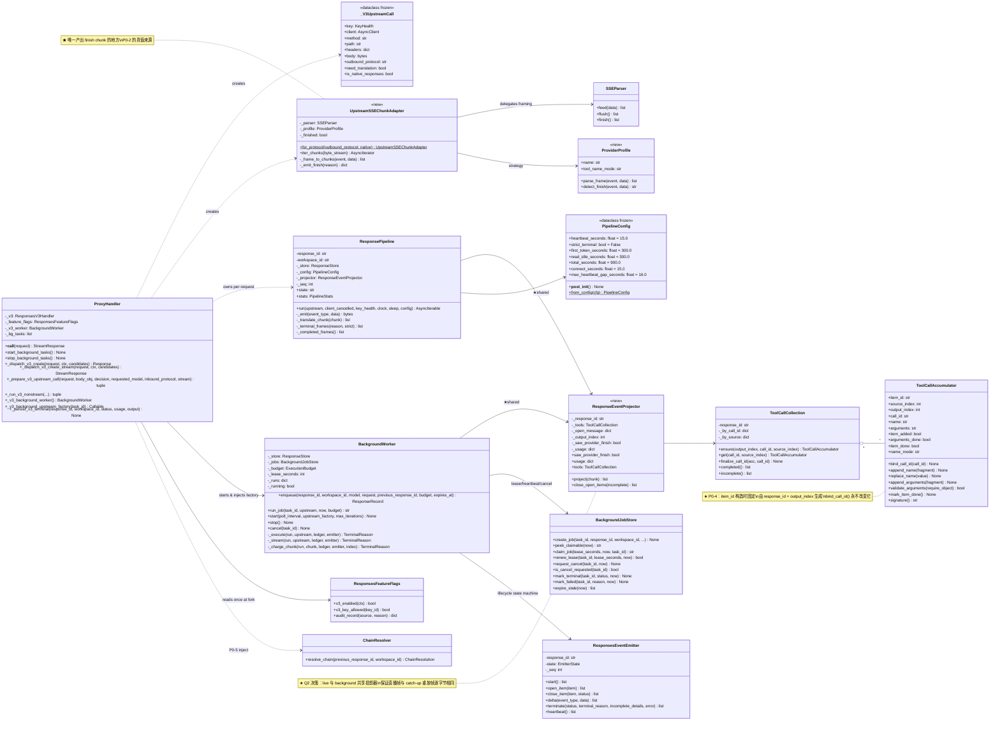
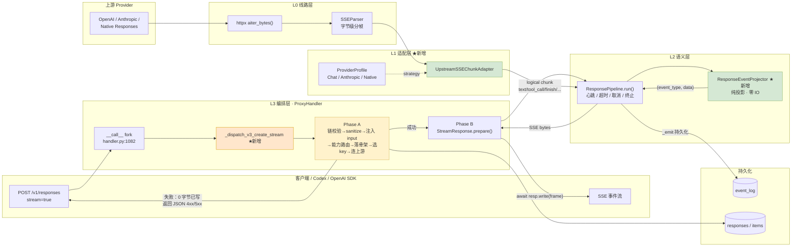
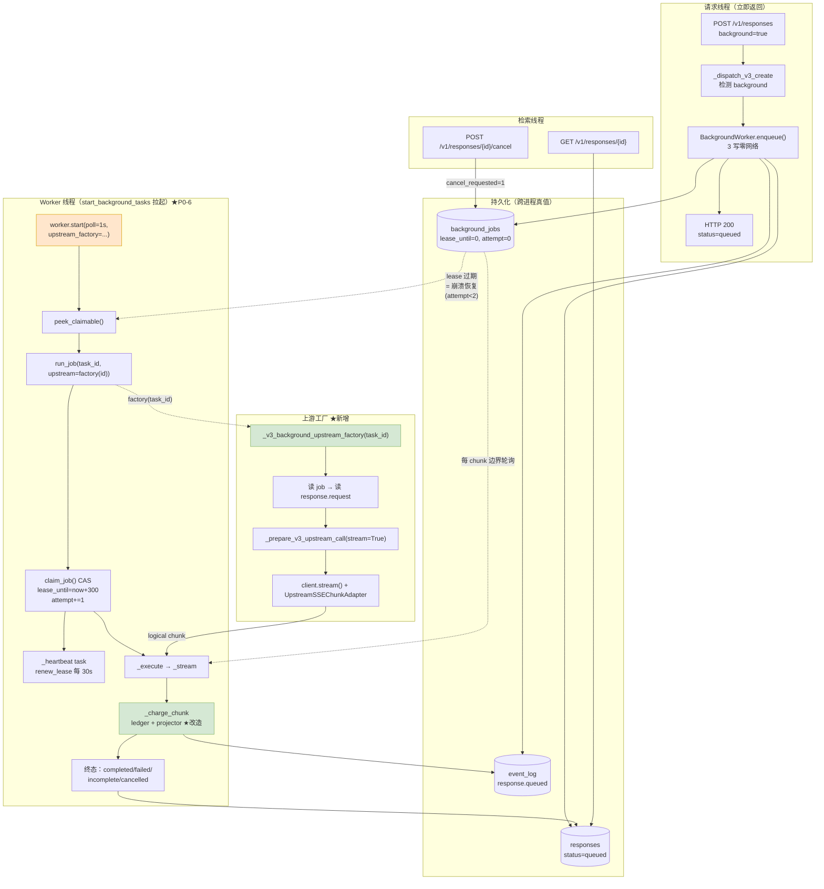
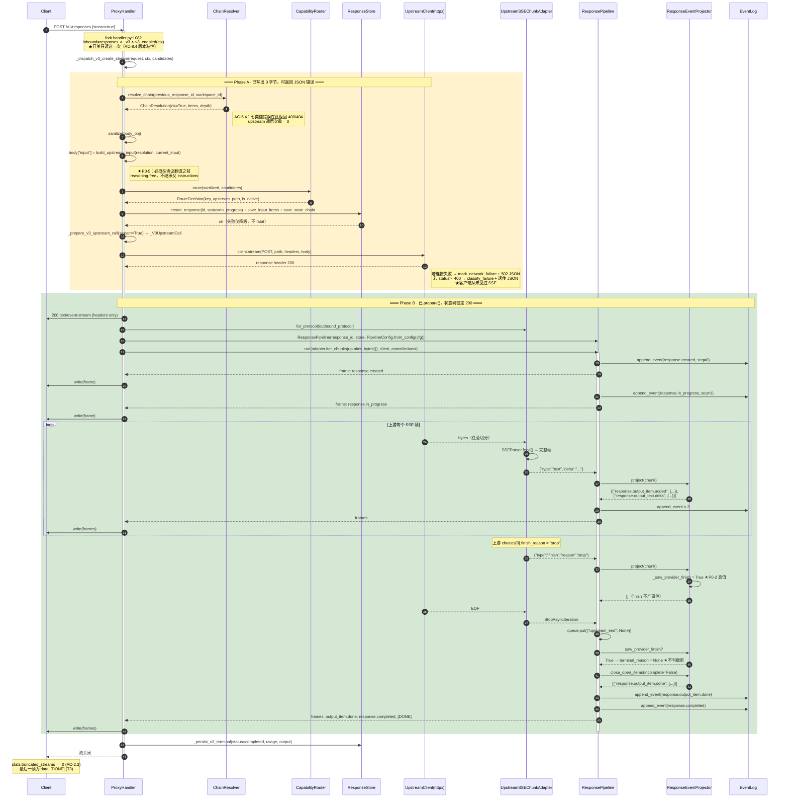
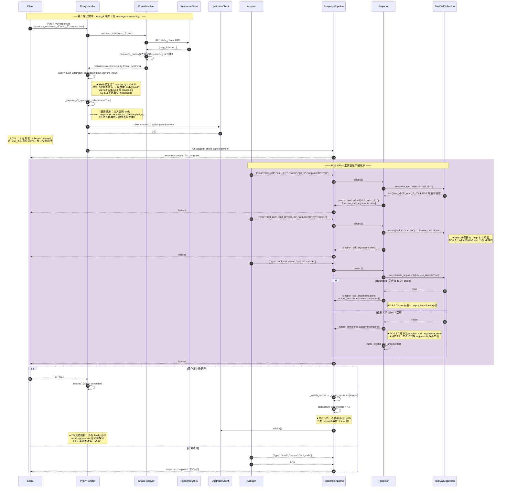
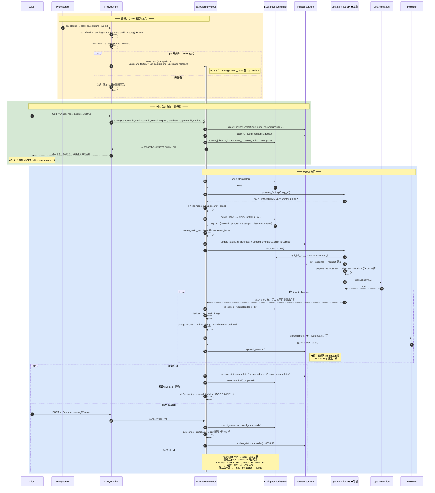
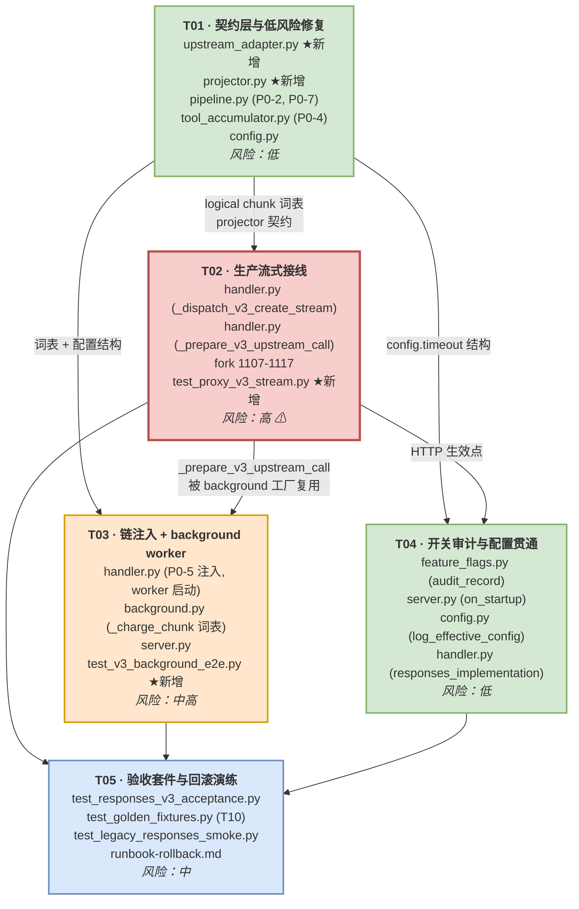

# zhongzhuan · OpenAI Responses v3 正式落地（GA）系统架构设计与任务分解

| 项 | 值 |
| --- | --- |
| 文档编号 | ARCH-RSPV3-GA-001 |
| 作者 | 高见远（Gao，架构师） |
| 上游输入 | `docs/prd-responses-v3-ga.md`、`docs/zhongzhuan OpenAI Responses v3 正式实施与修复规范 c6e2f62fcd8e49239e2af152d3e43dbe.md` |
| 覆盖范围 | P0-1 ~ P0-8 全部；验收 T1 ~ T10 |
| 变更性质 | 中大型**增量接线**（非重写）。v3 模块已实现约 85%，缺的是「生产路径接线」与 4 处语义 bug |

---

## 0. 决策摘要（先给结论）

主理人要求拍板的三个问题，结论如下，理由见 §1.4 / §1.5 / §1.6。

| # | 问题 | **决策** | 一句话理由 |
| --- | --- | --- | --- |
| **Q1** | 生产流式路径如何安全替换 | **在 fork（`handler.py:1107`）处 `stream=true` 改调新增 `_dispatch_v3_create_stream`；采用「两阶段提交」——Phase A（未写任何字节，可返回 JSON 错误）完成链校验/能力路由/骨架落库/选 key/连上游并读到响应头，Phase B（已 `prepare()`）才由 `ResponsePipeline` 独占写 SSE。key 选择与协议翻译由抽出的纯函数 `_prepare_v3_upstream_call()` 与非流式共享，不重复首帧** | 「写出第一个字节」是不可回退点，必须把所有可失败决策压到它之前 |
| **Q2** | BackgroundWorker 启动点与生命周期 | **在 `ProxyHandler.start_background_tasks()` 中，v3 开关开启且 store 存在时 `asyncio.create_task(worker.start(poll_interval=1.0, upstream_factory=self._v3_background_upstream_factory))`；worker 保留自己的 `_stream` 循环（承载 lease/heartbeat/budget/cancel），但把 `_charge_chunk` 的测试词表升级为统一 logical chunk 词表，并与 `ResponsePipeline` 共享新抽出的纯投影器 `ResponseEventProjector` —— 共享投影语义，不共享 run loop** | live stream 需要「写 socket + 心跳」，background 需要「lease + 预算」，两者的 loop 无法合并；但两者**产出的事件字节必须逐字节相同**（T24 catch-up 要求），所以必须共享投影器 |
| **Q3** | 是否保留 legacy Responses translator 作 v2 回滚目标 | **保留，不删除。** `ResponsesTurnBridge` / `ResponsesStreamTranslator` 冻结在 `_stream_proxy` 调用链内，v2 仅冒烟级覆盖；用一条 CI 断言强制「v3 代码禁止 import v2 translator，v2 代码禁止 import `responses_v3.*`」。退役条件写死为三条硬指标（§1.6） | 规范 §1.2 要求 v2 可全局回滚；删掉回滚目标 = 回滚开关变成装饰品 |

**最大风险点（一句话）**：`ResponsePipeline.run()` 是 async generator，而 aiohttp 的 `StreamResponse.write()` 在客户端断连时抛异常 —— **generator 内部的 `finally` 清理块与 aiohttp 的连接异常存在交叉取消竞态**，处理不当会导致上游 httpx 连接泄漏 + key 健康度被错误惩罚（违反 R-P1-25）。这是 T02 的核心攻坚点，详见 §5.4 与 §9.6。

---

## Part A：系统设计

## 1. 实现方案（Implementation Approach）

### 1.1 现状盘点：已有什么 / 缺什么

我逐文件读完了全部 13 个必读文件，现状与主理人的侦察结论一致，补充精确行号：

| 能力 | 模块 | 实现度 | 生产可达 |
| --- | --- | --- | --- |
| SSE 生命周期状态机 | `proxy/protocol/responses_emitter.py::ResponsesEventEmitter` | ✅ 完整（INIT→…→COMPLETED，非法跃迁拒绝，exactly-once `[DONE]`） | ❌ 零生产 import |
| 流式管线 | `responses_v3/pipeline.py::ResponsePipeline` | ✅ 完整（心跳/取消/四类超时/双模终止/event_log 持久化） | ❌ 零生产 import |
| 工具分片累积 | `proxy/protocol/tool_accumulator.py` | ⚠️ 缺 `item_id` 字段（P0-4） | ✅ 被 pipeline 用 |
| 字节级 SSE 分帧 | `proxy/protocol/sse_parser.py::SSEParser` | ✅ 完整、分片无关、不抛异常 | ✅ 被 v2 用 |
| 链解析 | `responses_v3/chain.py::build_upstream_input` | ✅ 完整（reasoning-free、不继承 instructions） | ❌ 生产零调用（P0-5） |
| background 状态机 | `store/background_jobs.py::BackgroundJobStore` | ✅ 完整（CAS claim / lease / heartbeat / 有界恢复 `MAX_RECOVERY_ATTEMPTS=2` / reaper 内联在 miss 路径） | ✅ |
| background worker | `responses_v3/background.py::BackgroundWorker` | ⚠️ 骨架真实，`_stream`/`_charge_chunk` 是 HONEST STUB（测试词表） | ❌ 从不启动（P0-6） |
| 上游 HTTP | `upstream/client.py::UpstreamClient` | ✅ `request()` / `stream()` 分层 timeout | ✅ |
| 非流式 v3 create | `handler.py::_dispatch_v3_create` + `_run_v3_nonstream` | ✅ 真实上游、能力路由、健康度、粘性 | ✅ |
| 流式 v3 create | — | ❌ **不存在**，fork 处直接回落 JSON skeleton（P0-1） | ❌ |
| 开关审计 | `config/config.py::log_effective_config` | ✅ 函数存在 | ❌ 启动期不调用（P0-8） |

**结论：这是一次「接线 + 4 处语义修复」，不是重写。** 新增代码量预估 < 900 行（含测试外 ~450 行），改动代码量 < 300 行。

### 1.2 核心技术难点

| # | 难点 | 本质 | 对策 |
| --- | --- | --- | --- |
| D1 | **不可回退点**：SSE 第一帧一旦写出，HTTP 状态码就锁死为 200，任何后续失败都只能变成 SSE 内的 terminal 事件，无法再返回 400/503 | HTTP 协议本身的约束 | **两阶段提交**：把「链校验 / 能力路由 / 骨架落库 / 选 key / 连上游 / 读上游响应头」全部压到 `prepare()` 之前（§5.2） |
| D2 | **两个上游方言 → 一个下游方言**：上游可能是 OpenAI Chat SSE、Anthropic Messages SSE、原生 Responses SSE，下游必须是 Responses SSE | 协议扇入 | 新增 **logical chunk 适配层**（§3），三种上游都归一到同一套 7 类 chunk |
| D3 | **正常 EOF vs 异常 EOF 无法从连接层区分**：TCP 关闭对两者一模一样 | 只能靠**应用层完成信号** | 适配器**必须**产出 `finish` chunk；pipeline 用 `saw_provider_finish` 而不是 `produced` 判定（P0-2，§5.3） |
| D4 | **live stream 与 background 必须产出逐字节相同的事件** | T24 catch-up 用 event_log 重放，重放帧必须与直播帧一致 | 抽出**纯投影器** `ResponseEventProjector`，两条路径共用（Q2 决策） |
| D5 | **async generator × aiohttp 断连的取消竞态** | `ResponsePipeline.run()` 的 `finally` 里要 cancel 3 个 producer task 并 close upstream；如果 `resp.write()` 先抛，generator 会被 `aclose()` 从外部驱动，此时 event loop 可能已在处理 `ConnectionResetError` | 用**显式 `client_cancelled: asyncio.Event`** 桥接（pipeline 已支持），外层用 `try/finally` 保证 `agen.aclose()` 必被 await（§5.4） |
| D6 | **工具身份稳定性**：call_id 可能在 arguments 分片之后才到达 | 当前 `make_function_call_item_id(call_id)` 是从晚到值派生 | `item_id` 在 `ToolCallAccumulator` 构造时由 `response_id + output_index` 固定（P0-4，§4.3） |

### 1.3 框架与依赖选型

**结论：不引入任何新的重依赖。** 现有栈完全够用。

| 关注点 | 选型 | 理由 |
| --- | --- | --- |
| 异步运行时 | `asyncio`（stdlib） | 已在用；pipeline 的 queue/task 模型已建成 |
| 下游 HTTP Server | `aiohttp.web`（已有） | `web.StreamResponse` 是现成的 SSE 写出面，`_stream_proxy` 已验证过该模式 |
| 上游 HTTP Client | `httpx`（已有，封装为 `UpstreamClient`） | `client.stream()` 已返回 `AsyncIterator[httpx.Response]`，分层 timeout 已实现 |
| SSE 分帧 | `proxy/protocol/sse_parser.py::SSEParser`（已有） | 字节级、分片无关、不抛异常。**复用它是 T4（随机分片）验收能过的前提** |
| 持久化 | `store/` 现有 SQLite/TiDB 抽象 | 无需变更 DDL（`background_jobs` v004 已够用） |
| 新增依赖 | **无** | 见 §8 |

**架构模式**：分层管道（Layered Pipeline）+ 端口适配器（Ports & Adapters）。

```
┌──────────────────────────────────────────────────────────────────┐
│  L4  Transport      aiohttp StreamResponse  /  aiohttp JSON      │
├──────────────────────────────────────────────────────────────────┤
│  L3  Orchestration  ProxyHandler._dispatch_v3_create_stream      │
│                     BackgroundWorker.run_job                     │
├──────────────────────────────────────────────────────────────────┤
│  L2  Semantics      ResponsePipeline (live)  |  BudgetLedger     │
│                     └────── ResponseEventProjector ──────┘ ★共享 │
├──────────────────────────────────────────────────────────────────┤
│  L1  Adapter        UpstreamSSEChunkAdapter  ★新增               │
│                     (Chat SSE / Anthropic SSE / Native → chunk)  │
├──────────────────────────────────────────────────────────────────┤
│  L0  Wire           SSEParser  +  httpx.Response.aiter_bytes()   │
└──────────────────────────────────────────────────────────────────┘
```

**关键不变量**：L1 以上完全不认识 HTTP；L2 完全不认识客户端 socket；L2 的投影器完全不认识 IO（纯函数）。这三条让单测可以不起服务器。

### 1.4 【Q1 决策】生产流式路径的安全替换方案

#### 决策

1. **fork 点最小改动**。`handler.py:1107-1117` 改为：

```python
# 之前
if not (body_obj and body_obj.get("stream")):
    return await self._dispatch_v3_create(request, ctx, v3_candidates)
return await self._dispatch_v3(request, ctx)      # ← JSON skeleton，P0-1 根因

# 之后
if body_obj and body_obj.get("stream"):
    return await self._dispatch_v3_create_stream(request, ctx, v3_candidates)
return await self._dispatch_v3_create(request, ctx, v3_candidates)
```

2. **两阶段提交**是本方案的核心（见 §5.2 时序图）：

| 阶段 | 边界 | 已写出字节 | 失败时的动作 |
| --- | --- | --- | --- |
| **Phase A** | 从进入函数到 `client.stream()` 拿到上游 response header 且 `status < 400` | **0 字节** | `return web.json_response(payload, status=4xx/5xx)` —— 客户端拿到标准 JSON 错误 |
| **Phase B** | `await resp.prepare(request)` 之后 | ≥ 1 字节 | 只能在 SSE 内以 terminal 事件 + `[DONE]` 收尾，HTTP 状态码已锁 200 |

Phase A 必须完成的清单（**顺序不可交换**）：

```
A1. previous_response_id 链校验（resolve_chain）      → 失败 = 400/404      [AC-5.4: upstream 调用次数必须为 0]
A2. request sanitize                                   → 未知参数按铁律 4 处理
A3. build_upstream_input 注入 body["input"]            → P0-5，必须在 A4 翻译之前
A4. capability route（含 hosted tool executor 检查）   → 失败 = 400/503
A5. store=true 时落骨架行 + input_items + state_chain  → 失败仅降级（不 fatal）
A6. _prepare_v3_upstream_call()：选 key / 翻译 / 造 header / 造 body
A7. client.stream(...) 建连并读 response header
    ├─ 连接异常   → mark_network_failure(key) + 502 JSON
    └─ status>=400 → classify_failure(key) + 透传上游错误 JSON
────────────────── 以上任意失败，客户端从未见过 SSE ──────────────────
A8. resp = web.StreamResponse(200, Content-Type: text/event-stream); await resp.prepare(request)
```

3. **共享逻辑的抽法（主理人追问的关键点）**。从 `_run_v3_nonstream` 中抽出**纯计算部分**为独立方法，流式/非流式共用：

```python
@dataclass(frozen=True)
class _V3UpstreamCall:
    """一次上游调用的全部决策结果（不含 IO）。"""
    key: KeyHealth
    client: Any                    # httpx.AsyncClient
    method: str
    path: str                      # /v1/chat/completions | /v1/messages | /v1/responses
    headers: dict[str, str]
    body: bytes
    outbound_protocol: str         # openai | anthropic | responses
    need_translation: bool
    is_native_responses: bool

async def _prepare_v3_upstream_call(
    self, *, request, body_obj, decision, requested_model, inbound_protocol, stream: bool
) -> tuple[_V3UpstreamCall | None, web.Response | None]:
    """选 key、限流闸、翻译请求、构造 header/body。
    返回 (call, None) 或 (None, error_response)。**不发起任何网络 IO。**"""
```

- `_run_v3_nonstream` 改为：`call, err = await self._prepare_v3_upstream_call(..., stream=False)` → `client.request(...)`。
- `_dispatch_v3_create_stream` 用：`call, err = await self._prepare_v3_upstream_call(..., stream=True)` → `client.stream(...)`。
- 唯一差异由 `stream: bool` 参数控制：非流式在翻译后 `translated_req.pop("stream", None)`，流式则 `translated_req["stream"] = True`（Anthropic 同理）。

> **为什么不重复首帧**：`response.created` / `response.in_progress` 的**唯一产出者**是 `ResponsePipeline.run()`（pipeline.py:468-475）。`_prepare_v3_upstream_call` 不产任何帧，`_dispatch_v3_create_stream` 也不手写任何帧 —— 它只做 `async for frame in pipeline.run(adapter): await resp.write(frame)`。**这在结构上就杜绝了重复首帧**，并直接满足 AC-1.4（lifecycle 事件类型出现次数 ≤ 1）。

4. **旧 translator 的处置**：`ResponsesStreamTranslator` / `ResponsesTurnBridge` / `CompositeStreamTranslator` **一行不改、一行不删**，继续服务 `_stream_proxy`（v2 legacy）。v3 路径**禁止 import**（CI 断言守护，§1.6）。

5. **版本粘性（AC-8.4）**：开关在 fork 处**只读一次**（`self._feature_flags.v3_enabled(ctx)`，已是现状）。进入 `_dispatch_v3_create_stream` 后，即使运行期开关翻转，本请求仍以 v3 收尾 —— 因为不存在任何中途重读开关的代码路径。这是**结构性保证**，我会为它加一条断言测试而不是加一段防御代码。

#### 被否决的替代方案

| 方案 | 否决理由 |
| --- | --- |
| 在 `_dispatch_v3_create` 内部用 `if is_stream` 分支 | 该函数已 140 行且返回类型是 `web.Response`；流式返回 `web.StreamResponse`，混在一起会让返回类型退化成 `Union`，且 Phase A/B 边界在阅读上消失 —— 这正是 D1 最容易出错的地方 |
| 先 `prepare()` 再连上游，失败时发 `response.failed` | 违反 AC-1.1 的精神：一个「上游根本没连上 / 能力路由 400」的请求会拿到 HTTP 200 + SSE 错误，SDK 的错误处理路径完全失效 |
| 让 `ResponsesEventEmitter` 而非 `ResponsePipeline` 当事件所有者 | Emitter 是无 IO 的状态机，不含心跳/超时/取消/持久化；pipeline 已包含全部四项。让 emitter 当所有者要在 handler 里重写 pipeline 的 run loop，是纯粹的重复 |

### 1.5 【Q2 决策】BackgroundWorker 启动点与执行源注入

#### 决策

**启动点**：`ProxyHandler.start_background_tasks()`（`handler.py:962-970`）新增第三个 task：

```python
async def start_background_tasks(self) -> None:
    self._bg_tasks.append(asyncio.create_task(self._sticky_cleanup_loop()))
    self._bg_tasks.append(asyncio.create_task(self._health_snapshot_loop()))
    # P0-6: v3 background worker（开关开启 + store 就绪时才启动）
    worker = self._v3_background_worker()          # None 表示未就绪
    if worker is not None:
        self._v3_worker = worker
        self._bg_tasks.append(
            asyncio.create_task(
                worker.start(
                    poll_interval=self._cfg.responses_bridge.background.poll_interval,
                    upstream_factory=self._v3_background_upstream_factory,
                )
            )
        )
        _lg.info("[v3] background worker started (poll=%.1fs)", ...)
```

`stop_background_tasks()` 对称地 `worker.stop()` 再 cancel task。AC-6.5（断言 worker 处于运行态）由 `self._v3_worker._running` + `self._bg_tasks` 长度共同满足。

**执行源注入**：`upstream_factory: Callable[[str], Any]`，返回**零参可调用**而非已启动的 generator：

```python
def _v3_background_upstream_factory(self, task_id: str) -> Callable[[], AsyncIterable[dict]]:
    """返回一个「每次调用都重新建流」的工厂。

    必须返回 callable 而不是 generator —— background.py::_stream:356
    (`source = upstream() if callable(upstream) else upstream`) 依赖这一点
    才能在 recovery（attempt 2）时拿到全新的流。已启动的 async generator
    无法重入。
    """
    async def _open() -> AsyncIterable[dict]:
        job = await self._v3_job_store().get_job_any_tenant(task_id) or {}
        rec = await self._v3_response_store().get_response(
            str(job.get("response_id") or task_id),
            workspace_id=str(job.get("workspace_id") or ""),
        )
        body_obj = dict(rec.request or {})
        body_obj["stream"] = True                       # background 内部一律走流式上游
        # 与 P0-1 完全同构：同一个 sanitize → chain 注入 → capability route → prepare
        call, err = await self._prepare_v3_upstream_call_for_background(body_obj)
        if err is not None:
            raise UpstreamUnavailable(err)              # run_job 的 except 会归因为 failed
        async with call.client.stream(call.method, call.path,
                                      headers=call.headers, content=call.body) as up:
            adapter = UpstreamSSEChunkAdapter.for_protocol(call.outbound_protocol)
            async for chunk in adapter.iter_chunks(up.aiter_bytes()):
                yield chunk
    return _open
```

**P0-6 的关键取舍：worker 复用 `_stream` 循环，但不复用 `ResponsePipeline.run()`。**

| 维度 | live stream (`ResponsePipeline.run`) | background (`BackgroundWorker._stream`) |
| --- | --- | --- |
| 输出目的地 | 客户端 socket（`resp.write`） | 仅 event_log（无客户端） |
| 心跳 | 必须（防中间设备断连） | **无意义**（没有连接要保活） |
| lease / heartbeat | 无意义 | 必须（进程崩溃恢复） |
| 预算账本 `BudgetLedger` | 不适用 | 必须（`charge_round` / `charge_tool_call` / `check_wall_time`） |
| 取消检查 | `asyncio.Event`（客户端断连） | DB 轮询 `is_cancel_requested`（跨进程） |
| 超时 | 四层（first_token/read_idle/total/connect） | wall clock 预算 |

两个 loop 的职责**交集为空**，强行合并会得到一个到处是 `if background:` 的怪物。但两者**产出的事件必须逐字节相同**（否则 T24 catch-up 重放的帧与直播帧不一致）。

**解法：抽出 `ResponseEventProjector`（纯投影器）。** 把 `pipeline.py::_translate_chunk`（177-333 行）中「chunk → 事件 dict 列表」的逻辑原样搬到新模块 `responses_v3/projector.py`，剥离掉 `await self._emit(...)`（IO）这一层：

```python
class ResponseEventProjector:
    """logical chunk → Responses 事件（纯函数，零 IO、零 await）。

    ResponsePipeline 与 BackgroundWorker 共用它，这使得
    「直播帧」与「event_log 重放帧」逐字节相同成为代码的性质，
    而不是注释里的承诺（同 sse_frame() 的 R-P1-36 论证）。
    """
    def __init__(self, response_id: str) -> None: ...
    def project(self, chunk: Any) -> list[tuple[str, dict[str, Any]]]:
        """返回 [(event_type, data), ...]；不分配 sequence_number。"""
    def close_open_items(self, *, incomplete: bool) -> list[tuple[str, dict]]: ...
    @property
    def saw_provider_finish(self) -> bool: ...        # ← P0-2 的真值来源
    @property
    def tools(self) -> ToolCallCollection: ...
```

改造后：
- `ResponsePipeline._translate_chunk` = `for et, d in projector.project(chunk): frames.append(await self._emit(et, d))`（约 8 行，原 156 行删除）。
- `BackgroundWorker._charge_chunk` = `ledger.charge_*(chunk)` + `for et, d in projector.project(chunk): await store.append_event(...)`（替换掉当前的 HONEST STUB 测试词表）。

> **`_charge_chunk` 词表迁移对照**：现有 `tool_round` → 由适配器在 provider 每轮工具边界产出（不变，仍走 `ledger.charge_round()`）；`tool_call` → 统一为 §3 词表的 `tool_call`，`arguments` 语义不变；`tool_result` → 保留为 background 专有 chunk（live stream 不会出现，因为 hosted tool 执行只发生在 worker 内）。测试词表与生产词表就此合并为一套。

### 1.6 【Q3 决策】legacy translator 的保留与退役

#### 决策：**保留**。

规范 §1.2 要求 `ZHONGZHUAN_RESPONSES_BRIDGE_V3=0` 能让**所有**新入站 Responses 请求走 v2（AC-8.3）。删掉 v2 实现 = 回滚开关变成一个只会返回 501 的装饰品。在 GA 首月这是不可接受的运维风险。

#### 代码重复的边界（明确划线，避免"保留"变成"两套都在改"）

| 规则 | 内容 | 强制手段 |
| --- | --- | --- |
| R1 | v2 冻结：`responses_bridge.py` / `ResponsesStreamTranslator` 只接受**安全性修复**，不接受功能演进 | Code review + `CODEOWNERS` |
| R2 | v3 代码**禁止** import `ResponsesTurnBridge` / `ResponsesStreamTranslator` | CI grep 断言 |
| R3 | v2 代码**禁止** import `zhongzhuan.responses_v3.*` | CI grep 断言 |
| R4 | 共享层只有一处：`proxy/protocol/`（`sse_parser` / `responses_models` / `tool_accumulator`）。改动此层必须同时跑 v2 golden fixture（T10） | `tests/test_golden_fixtures.py` |

CI 断言（放进 `tests/test_layering.py`）：

```python
def test_v3_does_not_import_legacy_translator():
    for p in Path("src/zhongzhuan/responses_v3").rglob("*.py"):
        src = p.read_text("utf-8")
        assert "ResponsesTurnBridge" not in src, p
        assert "ResponsesStreamTranslator" not in src, p

def test_legacy_does_not_import_v3():
    legacy = ["src/zhongzhuan/proxy/protocol/responses_bridge.py",
              "src/zhongzhuan/proxy/protocol/responses_stream_translator.py"]
    for p in legacy:
        if Path(p).exists():
            assert "responses_v3" not in Path(p).read_text("utf-8"), p
```

#### 退役条件（三条硬指标，全部满足才可删）

| # | 条件 | 度量 |
| --- | --- | --- |
| E1 | v3 GA 后**连续 30 天**，`record_v3_fallback` 计数为 0（不含 `all_keys_excluded` 这类 rollout 原因） | 指标看板 |
| E2 | 验收 T1~T10 在 CI 上**连续 30 天**全绿，无 flaky | CI 历史 |
| E3 | 至少发生过 1 次**真实生产回滚演练**并成功恢复（演练即 T05 的一部分） | 演练报告 |

在此之前，v2 只需维持**冒烟级覆盖**：`tests/test_legacy_responses_smoke.py`（1 条非流式 + 1 条流式，断言最后一帧是 `[DONE]`），不要求与 v3 的行为等价。

---

## 2. 文件清单（File List）

### 2.1 新增文件

| 相对路径 | 职责 | 预估行数 | 归属任务 |
| --- | --- | --- | --- |
| `src/zhongzhuan/responses_v3/projector.py` | `ResponseEventProjector`：logical chunk → Responses 事件（纯函数）。从 `pipeline.py::_translate_chunk` 抽出，pipeline 与 worker 共用 | ~210 | T01 |
| `src/zhongzhuan/responses_v3/upstream_adapter.py` | `UpstreamSSEChunkAdapter` + 三个 provider profile：上游字节流 → logical chunk。**唯一产出 `finish` chunk 的地方** | ~280 | T01 |
| `tests/test_v3_projector.py` | 投影器单测（含 P0-3 顺序断言、P0-4 item_id 稳定性、并行工具交错属性测试 ≥100 组） | ~260 | T01 |
| `tests/test_v3_upstream_adapter.py` | 适配器单测：三方言 × 7 个 EOF 场景 × 随机字节分片（T4/T6） | ~320 | T01 |
| `tests/test_proxy_v3_stream.py` | **生产 HTTP 层**流式集成测试（T1/T3/T5/T6/T7 的 e2e 部分） | ~380 | T02 |
| `tests/test_v3_background_e2e.py` | background create/retrieve/cancel/重启恢复（T8） | ~300 | T03 |
| `tests/test_layering.py` | Q3 的 R2/R3 分层断言 | ~40 | T01 |
| `tests/test_v3_switch_audit.py` | P0-8 开关审计 + 版本粘性（AC-8.1~8.5） | ~180 | T04 |

> **模块归属决策**：适配器与投影器放 `responses_v3/` 而**不是** `proxy/protocol/`。理由：`proxy/protocol/` 是 v2/v3 共享层，把 v3 专属词表放进去会让 v2 也「可以」import，直接冲垮 §1.6 的 R2/R3 边界。`responses_v3/` 是 v3 私有域，边界清晰。

### 2.2 修改文件

| 相对路径 | 改动内容 | P0 | 风险 |
| --- | --- | --- | --- |
| `src/zhongzhuan/proxy/handler.py` | ① fork 1107-1117 改调 `_dispatch_v3_create_stream`；② 新增 `_dispatch_v3_create_stream`（~130 行）；③ 抽出 `_prepare_v3_upstream_call`（从 `_run_v3_nonstream` 507-582 抽出）；④ `_dispatch_v3_create` 的 426-431 改为真正注入 `build_upstream_input`；⑤ `start_background_tasks` 启动 worker；⑥ 新增 `_v3_background_upstream_factory`；⑦ 请求日志加 `responses_implementation` 字段 | 1,5,6,8 | **高** |
| `src/zhongzhuan/responses_v3/pipeline.py` | ① `_translate_chunk` 改为委托 `ResponseEventProjector`；② `upstream_end` 判定改用 `projector.saw_provider_finish`（570-573）；③ `PipelineConfig` 默认值改 300/300/900 并加 `__post_init__` 钳制；④ 新增 `PipelineConfig.from_config(cfg)` | 2,7 | 中 |
| `src/zhongzhuan/proxy/protocol/tool_accumulator.py` | `ToolCallAccumulator` 新增 `item_id: str` 字段；`ToolCallCollection.ensure()` 在创建时固定 `item_id`；`bind_call_id()` 不再影响 `item_id` | 4 | 低 |
| `src/zhongzhuan/responses_v3/background.py` | ① `_charge_chunk` 词表升级为 §3 词表并委托 projector；② `_execute` 用 projector 实例贯穿；③ `_stream` 的 EOF 判定同步 P0-2 语义 | 6,2 | 中 |
| `src/zhongzhuan/config/config.py` | `ResponsesBridgeConfig` 新增 `timeout`（connect/first_token/read_idle/total/heartbeat）与 `background`（enabled/poll_interval/lease_seconds）子结构 | 7,6 | 低 |
| `src/zhongzhuan/proxy/server.py` | `on_startup` 中在 `start_background_tasks()` **之前**调用 v3 开关审计 | 8 | 低 |
| `src/zhongzhuan/proxy/feature_flags.py` | 新增 `audit_record()`：返回 `{operator, timestamp, reason, effective_version, source}` 结构化 dict | 8 | 低 |
| `tests/test_proxy_v3_create.py` | 回归保护，**不得修改断言**（AC-1.5 要求它全绿） | — | — |

---

## 3. logical chunk 词汇表契约（核心交付物）

> 这是 `ResponsePipeline`、`BackgroundWorker`、`ResponseEventProjector` 三者之间的**唯一**共享语言。定义在 `responses_v3/upstream_adapter.py` 顶部，以 `TypedDict` 表达。

### 3.1 词表（7 类）

| `type` | 必填字段 | 可选字段 | 语义 | 投影为 |
| --- | --- | --- | --- | --- |
| `text` | `delta: str` | — | 助手可见文本增量 | `response.output_item.added`(首次) + `response.output_text.delta` |
| `reasoning` | `delta: str` | — | 推理增量。**铁律 1：只出不进** —— 投影为下游事件，但**永不**写入 `input_items`，`build_upstream_input` 也永不回读 | `response.reasoning_summary_text.delta` |
| `tool_call` | `call_id: str`<br>`name: str`<br>`arguments: str` | `source_index: int` | 一次工具调用的**分片**。`arguments` 是增量片段，可为空串。`call_id` 允许为空（晚到） | `response.output_item.added`(首次) + `response.function_call_arguments.delta` |
| `tool_call_done` | `call_id: str` | `arguments: str` | 该工具调用的**明确结束信号**。收到后才做 JSON 严格校验（P0-3） | 校验通过 → `function_call_arguments.done` + `output_item.done(completed)`；否则**仅** `output_item.done(incomplete)` |
| `tool_result` | `call_id: str`<br>`output: str` | `error: str` | hosted tool 执行结果。**只在 background worker 内出现**，live stream 永不产出 | `response.output_item.added/done`(type=`function_call_output`) |
| `usage` | — | `input_tokens: int`<br>`output_tokens: int` | token 计量尾包 | 不产事件，累积到 terminal 事件的 `usage` 字段 |
| **`finish`** | `reason: str` | — | **上游明确完成信号。P0-2 的唯一真值来源。** `reason ∈ {stop, length, tool_calls, content_filter, native_terminal, done_sentinel}` | 不产事件；置位 `projector.saw_provider_finish = True` |

`bytes` 类型的 chunk 保持现有 native passthrough 语义（`pipeline.py:190-191`）——原样透传，不经投影器。

### 3.2 `finish` 的产出规则（P0-2 的实现契约）

适配器**必须**在下列时刻产出 `finish`，这是 AC-2.2 七个场景能过的唯一依据：

| 上游方言 | 触发条件 | `reason` |
| --- | --- | --- |
| OpenAI Chat SSE | 任一 `choices[i].finish_reason` 非 null | 该 `finish_reason` 原值 |
| OpenAI Chat SSE | 收到 `data: [DONE]` 哨兵 | `done_sentinel` |
| Anthropic Messages SSE | `event: message_stop` | `native_terminal` |
| Anthropic Messages SSE | `event: message_delta` 携带 `delta.stop_reason` | 该 `stop_reason` 原值 |
| 原生 Responses SSE | `event: response.completed` / `response.failed` / `response.incomplete` | `native_terminal` |
| 原生 Responses SSE | `data: [DONE]` | `done_sentinel` |

**反面契约（同样重要）**：`finish` 产出后适配器**不再产出任何 chunk**；若上游在 `finish` 后仍有数据（除 `usage` 外），记 warning 并丢弃。这防止「completed 之后还有 delta」这类非法序列（emitter 会拒绝，但我们不应依赖下游兜底）。

### 3.3 AC-2.2 七场景 → 词表映射（验收对照表）

| # | 场景 | 适配器产出序列 | `saw_provider_finish` | 终态 |
| --- | --- | --- | --- | --- |
| ① | 正常文本 + `finish_reason` | `text*`, `finish(stop)` | ✅ | `completed` |
| ② | 正常 tool call + finish | `tool_call*`, `tool_call_done`, `finish(tool_calls)` | ✅ | `completed` |
| ③ | usage-only 尾包 | `text*`, `finish(stop)`, `usage` | ✅ | `completed` |
| ④ | `[DONE]` 后 EOF | `text*`, `finish(done_sentinel)` | ✅ | `completed` |
| ⑤ | 无完成信号的 EOF | `text*`, （直接 EOF） | ❌ | `upstream_truncated` |
| ⑥ | 首 token 前断流 | （无 chunk，抛 `ConnectionError`） | ❌ | `upstream_connect` |
| ⑦ | native terminal 后 EOF | `bytes*`, `finish(native_terminal)` | ✅ | `completed` |

`PipelineStats.truncated_streams` 在 ①②③④⑦ 中为 0（AC-2.3）——因为 `_terminal_frames()` 根本不会被调用。

### 3.4 适配器的字节级契约（T4 的前提）

```python
class UpstreamSSEChunkAdapter:
    """上游字节流 → logical chunk。分片无关、不抛异常、无状态泄漏。"""

    @classmethod
    def for_protocol(cls, outbound_protocol: str, *, native: bool = False)
        -> "UpstreamSSEChunkAdapter": ...

    async def iter_chunks(self, byte_stream: AsyncIterable[bytes]) -> AsyncIterator[dict]:
        """把任意切分的字节流转成 chunk 序列。

        不变量（对应 T4）：
          I1  对同一逻辑输入，任意字节切分方式产出的 chunk 序列**完全相同**；
          I2  多字节 UTF-8 字符跨分片边界不产生 mojibake（SSEParser 已保证）；
          I3  永不抛异常 —— 解析失败记 warning 并跳过该帧；
              传输层异常向上冒泡由 pipeline 归因（不在这里吞掉）；
          I4  产出 `finish` 后不再产出除 `usage` 外的任何 chunk。
        """
```

内部实现直接复用 `SSEParser`（`feed()` / `flush()` / `finish()`），**不自己写分帧逻辑** —— 这是 I1/I2 免费获得的原因。

---

## 4. 数据结构与接口（Data Structures and Interfaces）



### 4.1 新增关键签名

```python
# ── src/zhongzhuan/proxy/handler.py ─────────────────────────────────────────

async def _dispatch_v3_create_stream(
    self,
    request: web.Request,
    ctx,
    candidates: list[KeyHealth],
) -> web.StreamResponse | web.Response:
    """执行一次真实的 v3 流式 create（P0-1）。

    两阶段提交：
      Phase A —— 未写出任何字节，任何失败都返回标准 JSON 错误；
      Phase B —— 已 prepare()，唯一事件所有者是 ResponsePipeline。

    返回类型是 Union：Phase A 失败返回 web.Response（JSON），
    Phase B 返回 web.StreamResponse。aiohttp 两者都接受。
    """

async def _prepare_v3_upstream_call(
    self,
    *,
    request: web.Request,
    body_obj: dict,
    decision,
    requested_model: str,
    inbound_protocol: str,
    stream: bool,
) -> tuple["_V3UpstreamCall | None", "web.Response | None"]:
    """选 key / 限流闸 / 协议翻译 / 构造 header+body。**零网络 IO。**

    从 _run_v3_nonstream:507-582 抽出，流式与非流式共享。
    `stream` 只影响一件事：翻译后 body 中 stream 字段的取值。
    """

def _v3_background_worker(self) -> "BackgroundWorker | None":
    """构造（并缓存）v3 background worker；未就绪时返回 None。"""

def _v3_background_upstream_factory(self, task_id: str) -> Callable[[], AsyncIterable[dict]]:
    """为一个 job 构造「每次调用重新建流」的上游工厂（P0-6）。"""


# ── src/zhongzhuan/responses_v3/upstream_adapter.py（新增）────────────────────

CHUNK_TYPES: frozenset[str] = frozenset({
    "text", "reasoning", "tool_call", "tool_call_done",
    "tool_result", "usage", "finish",
})

FINISH_REASONS: frozenset[str] = frozenset({
    "stop", "length", "tool_calls", "content_filter",
    "native_terminal", "done_sentinel",
})

class ProviderProfile(Protocol):
    name: str
    tool_name_mode: str                       # "append" | "replace"（AC-4.4）
    def parse_frame(self, event: str, data: str) -> list[dict]: ...
    def detect_finish(self, event: str, data: str) -> str: ...

class OpenAIChatProfile:   ...   # choices[].delta / finish_reason / [DONE]
class AnthropicProfile:    ...   # content_block_delta / message_delta / message_stop
class NativeResponsesProfile: ...# 原样 bytes 透传 + terminal 事件探测

class UpstreamSSEChunkAdapter:
    @classmethod
    def for_protocol(cls, outbound_protocol: str, *, native: bool = False) -> "UpstreamSSEChunkAdapter": ...
    async def iter_chunks(self, byte_stream: AsyncIterable[bytes]) -> AsyncIterator[dict]: ...


# ── src/zhongzhuan/responses_v3/projector.py（新增）──────────────────────────

class ResponseEventProjector:
    def __init__(self, response_id: str) -> None: ...
    def project(self, chunk: Any) -> list[tuple[str, dict[str, Any]]]: ...
    def close_open_items(self, *, incomplete: bool) -> list[tuple[str, dict[str, Any]]]: ...
    @property
    def saw_provider_finish(self) -> bool: ...
    @property
    def usage(self) -> dict[str, int]: ...
    @property
    def tools(self) -> ToolCallCollection: ...


# ── src/zhongzhuan/proxy/protocol/tool_accumulator.py（修改）─────────────────

@dataclass
class ToolCallAccumulator:
    item_id: str = ""          # ★P0-4 新增：构造时固定，bind_call_id 永不改变
    source_index: int = -1
    output_index: int = 0
    call_id: str = ""
    # ...（其余字段不变）

# ToolCallCollection.ensure() 内：
#   acc.item_id = make_function_call_item_id_stable(self.response_id, output_index)
#   → f"fc_{response_id}_{output_index}"


# ── src/zhongzhuan/responses_v3/pipeline.py（修改）───────────────────────────

@dataclass(frozen=True)
class PipelineConfig:
    heartbeat_seconds: float = 15.0
    strict_terminal: bool = False
    first_token_seconds: float = 300.0     # ★P0-7 was 600
    read_idle_seconds: float = 300.0       # ★P0-7 was 600
    total_seconds: float = 900.0           # ★P0-7 was 1800（铁律5 硬上限）
    connect_seconds: float = 15.0
    max_heartbeat_gap_seconds: float = 16.0

    def __post_init__(self) -> None:
        """AC-7.2 / AC-7.3：钳制 + 警告（选"钳制"而非"报错"，理由见 §9.4）。"""
        object.__setattr__(self, "first_token_seconds", max(300.0, self.first_token_seconds))
        object.__setattr__(self, "read_idle_seconds",   max(300.0, self.read_idle_seconds))
        object.__setattr__(self, "total_seconds",       min(900.0, self.total_seconds))

    @classmethod
    def from_config(cls, cfg) -> "PipelineConfig":
        """AC-7.4：生效值来源于统一配置层 responses_bridge.timeout.*。"""
```

### 4.2 P0-2 修复点（精确 diff 语义）

```python
# pipeline.py:570-573  修改前
elif kind == "upstream_end":
    if produced:
        terminal_reason = TerminalReason.UPSTREAM_TRUNCATED
    break

# 修改后
elif kind == "upstream_end":
    # P0-2：正常 EOF 的判据是**上游给过明确完成信号**，而不是「产出过 chunk」。
    # 产出过 chunk 恰恰是最常见的正常完成场景 —— 原判据把它误判成截断。
    if not self._projector.saw_provider_finish:
        terminal_reason = (
            TerminalReason.UPSTREAM_TRUNCATED if produced
            else TerminalReason.UPSTREAM_CONNECT     # 场景⑥：首 token 前断流
        )
    break
```

### 4.3 P0-4 修复点

```python
# tool_accumulator.py::ToolCallCollection.ensure()  修改后
def ensure(self, *, output_index: int, call_id: str = "", source_index: int | None = None):
    acc = self.get(call_id=call_id, source_index=source_index)
    if acc is None:
        acc = ToolCallAccumulator(
            item_id=make_function_call_item_id_stable(self.response_id, output_index),  # ★固定
            source_index=-1 if source_index is None else int(source_index),
            output_index=output_index,
        )
        ...
    if call_id and not acc.call_id:
        self.finalize_call_id(acc, call_id)   # 只改 call_id，item_id 不动
    return acc
```

投影器中所有 `make_function_call_item_id(acc.call_id)` 的调用点（pipeline.py:246 / 276 / 296 / 319）统一改为 `acc.item_id`。这一处改动同时满足 AC-4.1 与 AC-4.2。

---

## 5. 程序调用时序图（Program Call Flow）

### 5.1 数据流总览：v3 stream=true 端到端



### 5.2 数据流总览：v3 background=true 端到端



### 5.3 时序图 ①：P0-2 —— v3 流式 create 正常完成（覆盖 T1/T3/T6 场景①）



### 5.4 时序图 ②：P0-5 —— 多轮链注入 + P0-3 工具收尾 + 客户端取消



### 5.5 时序图 ③：P0-6 —— background 真实 worker（含崩溃恢复与取消）



---

## 6. Anything UNCLEAR（待明确事项）

以下仅列**我无法自行拍板、需要主理人或用户决断**的点。其余我已在文档中直接决策。

| # | 事项 | 我的倾向 | 为何需要你决断 |
| --- | --- | --- | --- |
| **U1** | **`strict_terminal` 的 GA 默认值**。当前默认 `False`（兼容模式：截断也发 `response.completed` + `incomplete_details`）。规范 Q2 允许两种。但 AC-3.2 要求非法工具参数场景「response 终态为 `failed` 或 `incomplete`」——这与 `strict_terminal=False` **直接冲突**（兼容模式下会是 `completed`） | 建议：**保持 `strict_terminal=False` 作为全局默认，但对 `invalid_tool_arguments` 强制 strict**（工具参数非法是语义错误，不是传输截断，不该被兼容模式洗白） | 这是**产品语义决策**，影响 SDK 客户端的错误处理路径；且 AC-3.2 与 Q2 的措辞存在矛盾，需要主理人或 PM（Alice）裁定以哪个为准 |
| **U2** | **`background=true` 与 `stream=true` 同时出现时的行为**。OpenAI 官方语义是 background 请求可以用 `stream=true` 获得实时流，也可断开后用 catch-up 重连 | 建议 **GA 首版拒绝该组合**（400 `unsupported_parameter_combination`），P1 再补 catch-up 流 | PRD 未定义此组合；实现 catch-up 直播（event_log 边写边读 + `starting_after`）是独立的中等工作量，会撑破「5 个任务」上限 |
| **U3** | **hosted tool 在 background worker 内的执行来源**。`_charge_chunk` 的 `tool_result` chunk 需要有人真的去执行工具。`responses_v3/hosted_tools.py` 存在，但它与 worker 的接线不在 P0-1~P0-8 的任何一条里 | 建议 **GA 首版 worker 只做「单轮上游流式转发 + 持久化」，不执行 hosted tool**；`tool_round`/`tool_result` 保留词表位但生产不产出 | 涉及范围扩张。若要求 background 支持多轮工具循环，工作量约等于再加一个 T03 |
| **U4** | **运行期开关切换的管理端入口**（AC-8.2）。当前只有环境变量入口，没有管理 API | 建议 GA 首版**只实现启动期审计（AC-8.1）**，AC-8.2 标记为「管理端上线后交付」 | 管理端是否在 GA 范围内，我不掌握 |
| **U5** | **T2「OpenAI Python/TypeScript SDK contract 测试」的执行环境**。这需要在 CI 里跑真实 SDK 对代理发请求 | 建议用 `openai-python` 的 `base_url` 指向本地 proxy + mock upstream，纳入 T05 | 需要确认 CI 是否允许安装 `openai` SDK 作为 test-only 依赖（这会是本次唯一的新增依赖，见 §8） |

---

## Part B：任务分解

## 7. 依赖包列表（Required Packages）

**生产依赖：无新增。**

| 包 | 版本 | 用途 | 状态 |
| --- | --- | --- | --- |
| `aiohttp` | 已有 | 下游 HTTP/SSE 服务端 | 已在 `pyproject.toml` |
| `httpx` | 已有 | 上游 HTTP 客户端 | 已在 `pyproject.toml` |
| `pytest` / `pytest-asyncio` | 已有 | 测试 | 已有 |

**测试依赖：1 项待批（对应 U5）**

```
- openai>=1.40.0    # test-only；仅 T05 的 SDK contract 测试（T2 验收）使用
                    # 若不批准，T2 降级为「手写 SDK 兼容性断言」
```

---

## 8. 任务列表（按依赖排序）

> 遵循硬性上限：**5 个任务**。每个任务 ≥ 3 个相关文件。配置类改动集中，不分散。

### T01 · 契约层与低风险语义修复（**先行，解除所有下游阻塞**）

| 项 | 内容 |
| --- | --- |
| **Task ID** | T01 |
| **Task Name** | 建立 logical chunk 契约层 + 修复 P0-2/P0-4/P0-7/铁律5 |
| **优先级** | **P0** |
| **依赖** | 无 |
| **P0 映射** | P0-2、P0-4、P0-7（+ P0-3 的投影器侧） |
| **验收映射** | T4、T6（单测层）、T9（AC-7.1~7.3） |
| **风险** | **低**（纯新增 + 局部改值，无生产路径变更） |

**Source Files**

| 文件 | 动作 |
| --- | --- |
| `src/zhongzhuan/responses_v3/upstream_adapter.py` | 新增：词表常量、`ProviderProfile`×3、`UpstreamSSEChunkAdapter` |
| `src/zhongzhuan/responses_v3/projector.py` | 新增：`ResponseEventProjector`（从 `pipeline._translate_chunk` 抽出，剥离 IO） |
| `src/zhongzhuan/responses_v3/pipeline.py` | 改：`_translate_chunk` 委托 projector；`upstream_end` 用 `saw_provider_finish`（P0-2）；`PipelineConfig` 默认值 300/300/900 + `__post_init__` 钳制 + `from_config`（P0-7） |
| `src/zhongzhuan/proxy/protocol/tool_accumulator.py` | 改：新增 `item_id` 字段；`ensure()` 构造时固定；`bind_call_id` 不改 `item_id`（P0-4） |
| `src/zhongzhuan/proxy/protocol/responses_models.py` | 改：新增 `make_function_call_item_id_stable(response_id, output_index)` |
| `src/zhongzhuan/config/config.py` | 改：`ResponsesBridgeConfig` 增 `timeout` / `background` 子结构 |
| `tests/test_v3_projector.py` | 新增 |
| `tests/test_v3_upstream_adapter.py` | 新增（7 EOF 场景 × 3 方言 × 随机分片 ≥100 组） |
| `tests/test_layering.py` | 新增（Q3 的 R2/R3 断言） |

**完成判据**：`test_v3_upstream_adapter.py` 覆盖 AC-2.2 全部 7 场景；`test_v3_projector.py` 覆盖 AC-3.1~3.4 + AC-4.1~4.6；`PipelineConfig()` 默认值等于 AC-7.1；**现有全部测试保持绿**（尤其 `test_proxy_v3_create.py`）。

---

### T02 · 生产流式路径接线（**最高风险，单独成任务**）

| 项 | 内容 |
| --- | --- |
| **Task ID** | T02 |
| **Task Name** | `_dispatch_v3_create_stream` 两阶段提交 + fork 切换 |
| **优先级** | **P0** |
| **依赖** | T01 |
| **P0 映射** | P0-1、P0-3（e2e 侧）、P0-7（AC-7.4/7.5） |
| **验收映射** | T1、T3、T5、T6（HTTP 层）、T9 |
| **风险** | **高** —— 见 §9.6 的 async generator × aiohttp 取消竞态 |

**Source Files**

| 文件 | 动作 |
| --- | --- |
| `src/zhongzhuan/proxy/handler.py` | 改：① 抽出 `_prepare_v3_upstream_call`（从 `_run_v3_nonstream:507-582`）；② `_run_v3_nonstream` 改用它；③ 新增 `_dispatch_v3_create_stream`；④ fork `1107-1117` 切换；⑤ 删除 `_dispatch_v3_create:482-486` 的 defensive fallback |
| `src/zhongzhuan/responses_v3/pipeline.py` | 改：确认 `run()` 的 `finally` 在外部 `aclose()` 驱动下也能完整清理（可能需加 `_closing` 幂等守卫） |
| `tests/test_proxy_v3_stream.py` | 新增：AC-1.1~1.5、AC-2.4、AC-3.5、AC-7.4/7.5 |
| `tests/support/mock_responses_upstream.py` | 改：新增流式 SSE 场景构造器（正常 finish / 无 finish EOF / 首 token 前断流 / 截断 tool arguments / 慢流触发心跳） |
| `tests/test_proxy_v3_create.py` | 验证不回归（**不改断言**，AC-1.5） |

**完成判据**：真实 HTTP `POST /v1/responses {stream:true}` 返回 `Content-Type: text/event-stream`，最后一帧 `data: [DONE]`；任一 lifecycle 事件类型出现次数 ≤ 1（AC-1.4）；Phase A 失败返回 JSON 且响应体中不含 `event:` 字样。

---

### T03 · 链注入与 background worker 上线

| 项 | 内容 |
| --- | --- |
| **Task ID** | T03 |
| **Task Name** | `build_upstream_input` 生产注入 + BackgroundWorker 启动与真实执行源 |
| **优先级** | **P0** |
| **依赖** | T01（词表/投影器），T02（`_prepare_v3_upstream_call`） |
| **P0 映射** | P0-5、P0-6 |
| **验收映射** | T7、T8、T9（预算/取消） |
| **风险** | **中高** —— 跨进程 lease 语义 + 恢复恰好一次 |

**Source Files**

| 文件 | 动作 |
| --- | --- |
| `src/zhongzhuan/proxy/handler.py` | 改：① `_dispatch_v3_create:426-431` 真正注入 `build_upstream_input`（流式/非流式共用，放在 `_prepare_v3_upstream_call` 之前）；② `start_background_tasks` 启动 worker；③ `stop_background_tasks` 对称停止；④ 新增 `_v3_background_worker` / `_v3_background_upstream_factory` |
| `src/zhongzhuan/responses_v3/background.py` | 改：`_charge_chunk` 词表升级为 §3 统一词表并委托 projector；`_execute` 贯穿 projector 实例；`_stream` EOF 判定同步 P0-2 |
| `src/zhongzhuan/responses_v3/chain.py` | 验证：`build_upstream_input` 无需改动（已实现），补 docstring 标注生产调用点 |
| `src/zhongzhuan/proxy/server.py` | 改：确认 `on_startup` 顺序（审计 → worker） |
| `tests/test_v3_background_e2e.py` | 新增：AC-6.1~6.6（含 kill 模拟：手动过期 lease + 重新 poll） |
| `tests/test_proxy_v3_stream.py` | 追加：AC-5.1~5.5（spy 断言 outbound payload） |

**完成判据**：spy 捕获的真实 outbound payload 含父轮可见 items 且零 `reasoning`（AC-5.1/5.2）；`background=true` 返回 `queued` 并可立即 retrieve；lease 过期后**恰好恢复一次**，第二次崩溃变 `failed`。

---

### T04 · 开关审计、配置贯通与可观测

| 项 | 内容 |
| --- | --- |
| **Task ID** | T04 |
| **Task Name** | v3 开关审计日志 + 超时配置贯通 + 请求级实现标记 |
| **优先级** | **P0** |
| **依赖** | T01（配置结构），T02（HTTP 生效点） |
| **P0 映射** | P0-8、P0-7（AC-7.4） |
| **验收映射** | 规范 §1.2、T1、T9 |
| **风险** | **低** |

**Source Files**

| 文件 | 动作 |
| --- | --- |
| `src/zhongzhuan/proxy/feature_flags.py` | 改：新增 `audit_record(source, reason)` 返回结构化 dict（`operator`/`timestamp`/`reason`/`effective_version`/`source`） |
| `src/zhongzhuan/proxy/server.py` | 改：`on_startup` 第一步写审计行（AC-8.1） |
| `src/zhongzhuan/config/config.py` | 改：`log_effective_config` 追加 v3 开关段；补 `responses_bridge.timeout.*` 的默认值与校验 |
| `src/zhongzhuan/proxy/handler.py` | 改：请求日志加 `responses_implementation=v3\|v2_emergency`（AC-8.5）；`PipelineConfig.from_config(self._cfg)` 接线（AC-7.4） |
| `tests/test_v3_switch_audit.py` | 新增：AC-8.1、AC-8.3、AC-8.4（流式进行中翻转开关，断言仍以 v3 收尾）、AC-8.5 |

**完成判据**：启动日志含完整五字段审计行；`ZHONGZHUAN_RESPONSES_BRIDGE_V3=0` 时所有新入站走 v2；进行中的 v3 流在开关翻转后仍以 v3 事件收尾。

---

### T05 · 验收套件、回归护栏与回滚演练

| 项 | 内容 |
| --- | --- |
| **Task ID** | T05 |
| **Task Name** | T1~T10 验收套件收口 + golden fixture 护栏 + v2 回滚演练 |
| **优先级** | **P1**（但 GA 放行的必要条件） |
| **依赖** | T02、T03、T04 |
| **验收映射** | T1~T10 全部 |
| **风险** | **中** —— T10 golden fixture 字节级不变是本次改动的最强约束 |

**Source Files**

| 文件 | 动作 |
| --- | --- |
| `tests/test_responses_v3_acceptance.py` | 新增：T1~T10 的顶层验收矩阵（逐条 assert，带 T 编号标记） |
| `tests/test_golden_fixtures.py` | 改/新增：Chat→Chat、Chat↔Anthropic 字节级输出快照（T10，护住 `proxy/protocol/` 共享层） |
| `tests/test_legacy_responses_smoke.py` | 新增：v2 冒烟（1 非流式 + 1 流式），回滚目标可用性护栏 |
| `tests/test_sdk_contract.py` | 新增：OpenAI SDK contract（T2，依赖 U5 决断；未批准则降级为手写断言） |
| `docs/runbook-responses-v3-rollback.md` | 新增：回滚演练手册（切开关 → 验证 → 恢复），执行一次并记录（对应退役条件 E3） |

**完成判据**：T1~T10 全绿；golden fixture 零字节差异；回滚演练报告归档。

---

## 9. 共享知识与约定（Shared Knowledge）

工程师实现前**必须**先读这一节。

### 9.1 事件所有权（最重要的一条）

> **v3 流式路径中，SSE 帧的唯一产出者是 `ResponsePipeline`。**
> `_dispatch_v3_create_stream` 只做 `async for frame in pipeline.run(...): await resp.write(frame)`。
> **不允许**在 handler 里手写任何 `event: ...` 或 `data: ...`。
> 这不是风格偏好 —— 它是 AC-1.4（lifecycle 事件 ≤ 1 次）能通过的结构性保证。

### 9.2 两阶段提交的红线

```
prepare() 之前：允许 return web.json_response(...)     ← 一切可失败的决策都放这里
prepare() 之后：只允许 SSE terminal 事件 + [DONE]      ← 状态码已锁 200
```

Code review 检查点：`_dispatch_v3_create_stream` 中 `await resp.prepare(request)` **之后**不得出现任何 `return web.json_response`。

### 9.3 item_id 固定格式（P0-4 契约）

| 类型 | 格式 | 生成时机 |
| --- | --- | --- |
| message | `msg_{response_id}_{output_index}` | 首个 text delta（现状不变，`make_message_item_id`） |
| function_call | `fc_{response_id}_{output_index}` | `ToolCallCollection.ensure()` 首次创建 accumulator 时 |
| function_call_output | `fco_{response_id}_{output_index}` | background worker 产出 `tool_result` 时 |

**旧格式 `fc_{call_id}` 停止使用。** 迁移影响：正在流式中的旧格式 id 不会跨进程复现（id 只在单次响应内有意义），无需数据迁移。

### 9.4 超时与铁律 5（P0-7 契约）

| 层 | 默认值 | 边界 | 越界处理 |
| --- | --- | --- | --- |
| `connect_seconds` | 15 | — | — |
| `first_token_seconds` | 300 | 下限 300 | **钳制到 300** + warning |
| `read_idle_seconds` | 300 | 下限 300 | **钳制到 300** + warning |
| `total_seconds` | 900 | **上限 900**（铁律 5） | **钳制到 900** + warning |
| `heartbeat_seconds` | 15 | 上限 16（AC-7.1/max_gap） | 钳制 |

**AC-7.2 的「报错 vs 钳制」我选钳制。** 理由：启动期 `raise` 会让一个配置笔误直接打挂整个代理进程，而超时值偏离并不影响正确性（只影响体验）。钳制 + WARNING 日志既满足铁律 5 的硬约束，又不制造新的可用性故障模式。此决策在 `PipelineConfig.__post_init__` 中固化并测试。

### 9.5 `finish` 是 P0-2 的唯一真值

```
saw_provider_finish == True   → EOF 判 completed，truncated_streams 不增
saw_provider_finish == False  → produced ? UPSTREAM_TRUNCATED : UPSTREAM_CONNECT
```

**禁止**用 `produced`、`len(frames) > 0`、`chunk_count` 等任何间接指标判定正常完成。适配器是唯一有资格说「上游说它讲完了」的组件。

### 9.6 async generator × aiohttp 断连的正确写法（T02 的核心）

```python
# ✅ 正确：显式 aclose，保证 pipeline 的 finally 一定跑到
agen = pipeline.run(adapter.iter_chunks(up.aiter_bytes()), client_cancelled=cancelled)
try:
    async for frame in agen:
        try:
            await resp.write(frame)
        except (ConnectionResetError, ConnectionError, OSError):
            cancelled.set()          # 通知 pipeline：客户端走了
            break                    # 不 raise —— 断连不是错误
finally:
    await agen.aclose()              # ★必须 await：驱动 pipeline 的 finally
                                     #   cancel 3 个 producer task + _close_upstream
                                     #   漏掉这一句 = httpx 连接泄漏

# ❌ 错误：直接 async for 而不持有 agen 引用
async for frame in pipeline.run(...):    # break 时 generator 只被 GC 回收
    await resp.write(frame)              # 清理时机不确定，连接泄漏
```

配套约束：
- 客户端断连**绝不**调用 `mark_network_failure(key)`（R-P1-25）。`pipeline.run(key_health=...)` 参数存在但 pipeline 从不改它 —— handler 也不许改。
- `client_cancelled` 用 `asyncio.Event`，由 handler 创建、pipeline 只读。

### 9.7 P0-5 的执行顺序（不可交换）

```
resolve_chain  →  sanitize  →  build_upstream_input 注入 body["input"]
               →  capability route  →  协议翻译（Responses→Chat/Anthropic）
               →  发起上游请求
```

**注入必须在翻译之前**：翻译器 `convert_responses_request_to_chatcompletions` 读的是 `body["input"]`，注入晚一步则父轮历史丢失。**链校验必须在一切网络 IO 之前**（AC-5.4 用 spy 断言 upstream 调用次数为 0）。

### 9.8 background 上游工厂必须返回 callable

`background.py::_stream:356` 是 `source = upstream() if callable(upstream) else upstream`。恢复（attempt 2）时会重新调用 `upstream_factory(task_id)` 之外的同一个对象 —— **已启动的 async generator 无法重入**。因此 `_v3_background_upstream_factory` 返回的必须是零参 callable，不是 generator 对象。

### 9.9 v2 / v3 边界

| 目录 | 归属 | 禁止 |
| --- | --- | --- |
| `src/zhongzhuan/responses_v3/**` | v3 私有 | 禁止 import `ResponsesTurnBridge` / `ResponsesStreamTranslator` |
| `proxy/protocol/responses_bridge.py`、`responses_stream_translator.py` | v2 冻结 | 禁止 import `zhongzhuan.responses_v3.*` |
| `proxy/protocol/`（其余：`sse_parser` / `responses_models` / `tool_accumulator` / `responses_emitter` / `responses_errors`） | **共享** | 改动必须同时跑 T10 golden fixture |

由 `tests/test_layering.py` 强制。

### 9.10 事件持久化格式

- live stream：`ResponsePipeline._emit()` → `store.event_log.append_event(response_id, event_type, data, workspace_id, seq)`
- background：`store.append_event(response_id, event_type, data)`
- **两者写入的 `data` 必须由同一个 `ResponseEventProjector.project()` 产出**，否则 catch-up 重放与直播不一致（R-P1-36）。
- `sequence_number` 由各自的 seq 计数器分配；重放时按 `seq` 排序。

### 9.11 铁律速查

| 铁律 | 内容 | 本次落地点 |
| --- | --- | --- |
| 1 | reasoning 只出不进 | `chain.normalize_history` 丢弃（已有）+ AC-5.2 字符串级断言 |
| 2 | 工具完整才完成 | `validate_arguments(require_object=True)` 通过才发 `.done`（§5.4） |
| 3 | SSE 生命周期完整且唯一 | `created`/`in_progress` 在连上游后立即发；`[DONE]` exactly-once；单一所有者（§9.1） |
| 4 | 未知参数处理 | `_request_sanitizer.sanitize()`（已有） |
| 5 | 长推理有限终止 | `total_seconds ≤ 900` 硬钳制 + 四层超时分类（§9.4） |

---

## 10. 任务依赖图（Task Dependency Graph）



**关键路径**：`T01 → T02 → T03 → T05`。T04 可与 T03 并行。

**P0 → 任务映射完整性核对**

| P0 | 任务 | 覆盖 |
| --- | --- | --- |
| P0-1 真实 stream SSE | T02 | ✅ |
| P0-2 正常/异常 EOF | T01（判定）+ T02（e2e）+ T03（background 侧） | ✅ |
| P0-3 工具验证顺序 | T01（投影器）+ T02（AC-3.5 e2e） | ✅ |
| P0-4 稳定 item_id | T01 | ✅ |
| P0-5 chain 注入 | T03 | ✅ |
| P0-6 background worker | T03 | ✅ |
| P0-7 超时铁律5 | T01（默认值）+ T04（配置贯通 AC-7.4） | ✅ |
| P0-8 开关审计 | T04 | ✅ |
| T1~T10 验收 | T05 收口 | ✅ |

---

## 11. 风险登记册

| # | 风险 | 等级 | 影响 | 缓解 |
| --- | --- | --- | --- | --- |
| **R1** | **async generator × aiohttp 取消竞态**（§9.6）：`resp.write()` 抛异常时 pipeline 的 `finally` 未被驱动 → httpx 连接泄漏 + producer task 悬挂 | 🔴 **最高** | 生产环境连接池耗尽，全量 5xx | ① 强制 `try/finally: await agen.aclose()` 写法；② 专项测试：客户端中途 RST，断言 `up.is_closed` 且无 pending task；③ 压测 1000 次断连后检查连接池计数 |
| **R2** | `_prepare_v3_upstream_call` 抽取时改变非流式行为 → `test_proxy_v3_create.py` 回归 | 🟠 高 | 现有非流式功能退化 | 抽取时**严格保持逐行等价**（只搬运不重构）；`test_proxy_v3_create.py` 断言一字不改（AC-1.5） |
| **R3** | P0-5 注入后上游 token 数暴涨（父轮历史全量带上）→ 触发上游 context length 错误 | 🟠 高 | 多轮对话在第 3~4 轮开始报错 | `build_upstream_input` 已有 items>2000 / tokens>200000 上限（AC-5.4）；补一条「注入后 body 体积」的指标埋点 |
| **R4** | background worker 与 live stream 争抢同一个 key 的限流窗口 | 🟡 中 | 前台请求被后台任务饿死 | worker 的 `_prepare_v3_upstream_call` 走同一套 `key.window.allow()`；GA 首版接受此行为，P1 再引入优先级队列 |
| **R5** | projector 抽取导致事件字节变化 → T10 golden fixture 失败 | 🟡 中 | 回归 | 抽取时**只搬运不改字段顺序**；`json.dumps` 参数保持 `ensure_ascii=False`（与 `sse_frame()` 一致） |
| **R6** | U1（`strict_terminal` 与 AC-3.2 的矛盾）未决 → T05 验收卡住 | 🟡 中 | 交付延期 | **需主理人在 T02 开工前给出裁定** |
| **R7** | background 恢复语义在 TiDB 后端与 SQLite 不一致（CAS 依赖 `asyncio.Lock` + SQL guard） | 🟢 低 | 多进程部署时可能重复 claim | `background_jobs.py` 的 SQL guard 已再述完整前置条件；补一条双进程并发 claim 测试 |

---

## 附录 A · 关键代码位置索引

| 内容 | 位置 |
| --- | --- |
| v2/v3 fork 点 | `src/zhongzhuan/proxy/handler.py:1082-1117` |
| P0-1 根因（stream→skeleton） | `src/zhongzhuan/proxy/handler.py:1107-1117` |
| P0-2 根因（produced 误判） | `src/zhongzhuan/responses_v3/pipeline.py:570-573` |
| P0-4 根因（缺 item_id） | `src/zhongzhuan/proxy/protocol/tool_accumulator.py:36-53` |
| P0-5 根因（故意不注入） | `src/zhongzhuan/proxy/handler.py:426-431` |
| P0-6 根因（worker 不启动） | `src/zhongzhuan/proxy/handler.py:962-970` |
| P0-7 根因（600/600/1800） | `src/zhongzhuan/responses_v3/pipeline.py:86-93` |
| P0-8 根因（审计不调用） | `src/zhongzhuan/config/config.py` `log_effective_config` |
| 非流式上游链（抽取源） | `src/zhongzhuan/proxy/handler.py:488-669` |
| pipeline run loop | `src/zhongzhuan/responses_v3/pipeline.py:446-593` |
| `_translate_chunk`（抽取源） | `src/zhongzhuan/responses_v3/pipeline.py:177-333` |
| background `_charge_chunk` STUB | `src/zhongzhuan/responses_v3/background.py:378-430` |
| background worker 启动循环 | `src/zhongzhuan/responses_v3/background.py:629-662` |
| lease / CAS / 有界恢复 | `src/zhongzhuan/store/background_jobs.py:146-230` |
| `build_upstream_input` | `src/zhongzhuan/responses_v3/chain.py:307-322` |
| `SSEParser` | `src/zhongzhuan/proxy/protocol/sse_parser.py` |
| `ResponsesEventEmitter` | `src/zhongzhuan/proxy/protocol/responses_emitter.py:72-341` |
| legacy v2 流式（保留） | `src/zhongzhuan/proxy/handler.py:1482-1841` |

---

*文档结束 · ARCH-RSPV3-GA-001 · 高见远（Gao）*
