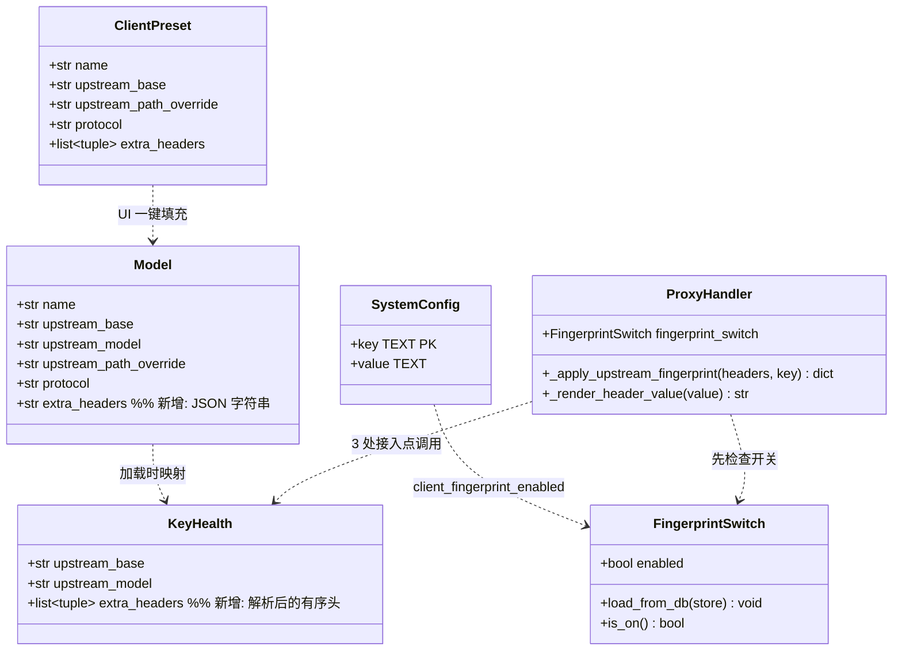
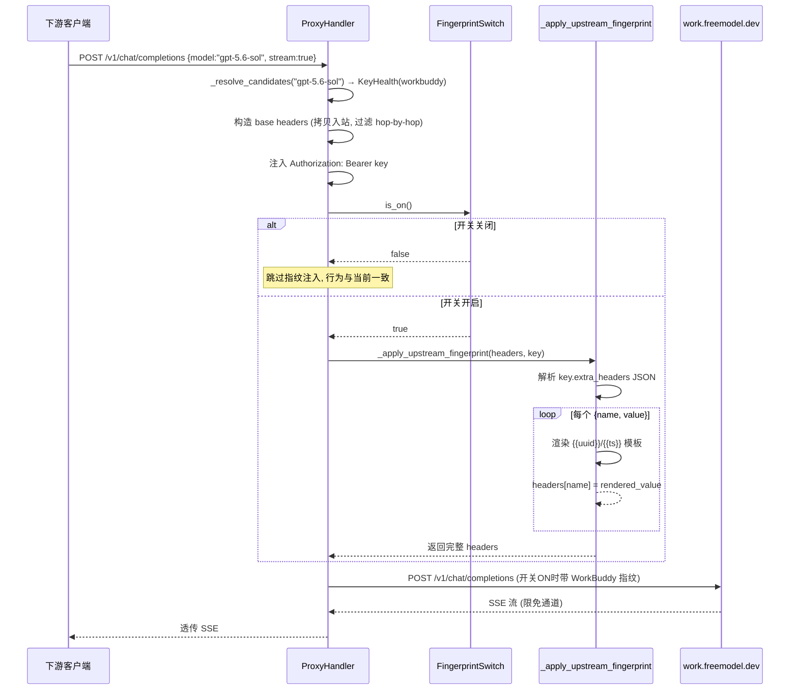

# 上游客户端指纹模拟方案（WorkBuddy 限免渠道）

> 工作流：部分 SOP（架构师输出） · 状态：待评审
> 关联：freemodel.dev WorkBuddy 限免调用，PowerShell 实测可达

## TL;DR

给中转项目增加 **后台全局开关** + **per-model 自定义上游请求头**（含动态变量）能力，并内置 **WorkBuddy 客户端预设**。开关默认关闭，开启后配置了 `extra_headers` 的模型才会注入客户端指纹头；配置一个模型即可一键接入 `https://work.freemodel.dev` 的 WorkBuddy 限免通道，对上游伪装成 WorkBuddy 客户端指纹，对下游仍暴露标准 OpenAI/Anthropic/Responses 接口。

**两层开关**（后台设置页统一管理）：
- **全局开关** `client_fingerprint_enabled`（system_config 持久化，默认 `false`）：关闭时所有 model 的 `extra_headers` 字段被忽略，行为与当前完全一致（回归零影响）。
- **per-model 配置** `models.extra_headers`（JSON）：只有全局开关 ON 时才生效。

---

## 1. 背景与现状

### 1.1 现有上游接入机制

| 层 | 文件 | 作用 |
|---|---|---|
| 数据 | [store/models.py](file:///f:/xiangmu/zhongzhuan/src/zhongzhuan/store/models.py) · `Model` dataclass + `models` 表 | 模型级配置：`upstream_base`/`upstream_model`/`upstream_path_override`/`protocol`/`is_fallback`/`aliases`/`capabilities`/`upstream_mode` |
| 运行时 | [proxy/ratelimit.py](file:///f:/xiangmu/zhongzhuan/src/zhongzhuan/proxy/ratelimit.py) · `KeyHealth` | 运行时 key 健康状态，从 `Model`+`api_keys` 加载 |
| 加载 | [__main__.py](file:///f:/xiangmu/zhongzhuan/src/zhongzhuan/__main__.py) `_load_keys_from_store` | DB → `KeyHealth` 的唯一映射点 |
| 转发 | [proxy/handler.py](file:///f:/xiangmu/zhongzhuan/src/zhongzhuan/proxy/handler.py) `ProxyHandler` | 3 处构造上游 headers |

### 1.2 当前 headers 构造逻辑（3 处接入点）

1. `_prepare_v3_upstream_call`（Responses v3 create，[handler.py:916](file:///f:/xiangmu/zhongzhuan/src/zhongzhuan/proxy/handler.py#L916)）
2. `__call__` 非流式路径（[handler.py:1772](file:///f:/xiangmu/zhongzhuan/src/zhongzhuan/proxy/handler.py#L1772)）
3. `_stream_proxy` 流式路径（[handler.py:2208](file:///f:/xiangmu/zhongzhuan/src/zhongzhuan/proxy/handler.py#L2208)）

三处都做同一件事：从入站 request 拷贝 headers（过滤 hop-by-hop）→ 注入 `Authorization: Bearer {key.api_key}`（或 `x-api-key`+`anthropic-version`）→ 流式追加 `Accept-Encoding: identity`。

**缺口**：没有任何机制让某个 model 的上游请求携带自定义指纹头。WorkBuddy 限免通道正是靠 `User-Agent: WorkBuddy/...` + `X-Client-Name: workbuddy` 等头识别"客户端身份"，缺这些头即走付费/拒绝。

### 1.3 WorkBuddy 实测指纹（用户 PowerShell 验证）

| Header | 值 | 性质 |
|---|---|---|
| `User-Agent` | `WorkBuddy/1.0.0 (Windows NT 10.0; Win64; x64)` | 静态 |
| `X-Client-Name` | `workbuddy` | 静态 |
| `X-Client-Version` | `1.0.0` | 静态 |
| `X-Request-ID` | 每次新 UUID | **动态** |
| `Accept` | `text/event-stream` | 静态 |
| `Cache-Control` | `no-cache` | 静态 |

上游：`https://work.freemodel.dev`，路径 `/v1/chat/completions`，model 如 `gpt-5.6-sol`，key 字面量 `key`（免鉴权占位）。

---

## 2. 产品目标与用户故事

### 产品目标
1. **可选**：后台全局开关，默认关闭，关闭时零影响；开启后才生效。
2. **通用**：任何 model 都能配置自定义上游请求头，不止 WorkBuddy。
3. **动态**：支持 `{{uuid}}`/`{{ts}}` 等模板变量，满足"每次请求新 ID"类指纹。
4. **开箱即用**：内置 WorkBuddy 预设，管理端一键填充，零手工填头。

### 用户故事
1. 作为运维，我想在后台设置页一键开关"客户端指纹模拟"功能，关闭时所有现有模型行为不变。
2. 作为中转用户，我想（在开关开启后）新建一个模型指向 `work.freemodel.dev`，选择"WorkBuddy 预设"后自动填好指纹头，保存即可用。
3. 作为中转用户，我想在 `/v1/chat/completions` 用 `gpt-5.6-sol` 调用，中转自动带上 WorkBuddy 指纹，返回限免结果。
4. 作为中转用户，我想把 WorkBuddy 渠道和付费渠道放进同一个分组做 failover，限免挂了自动切付费。
5. 作为运维，我想能自定义任意上游指纹头（如未来接其他限免客户端），不限于预设。

### 需求池
| 优先级 | 需求 |
|---|---|
| **P0** | **全局开关** `client_fingerprint_enabled`（system_config 持久化，默认 false）+ 启动时从 DB 覆盖内存 + 后台设置页 UI 开关 |
| **P0** | per-model `extra_headers` 字段 + DB 迁移 + 3 处接入点注入（**先检查全局开关**）+ 模板变量渲染 |
| **P0** | WorkBuddy 预设 + 管理端"客户端预设"下拉一键填充 |
| **P0** | 管理端 UI 编辑/展示 extra_headers（开关关闭时只读提示"功能未启用"） |
| **P1** | `X-Request-ID` 复用入站请求 ID（而非总生成新 UUID），便于链路追踪 |
| **P1** | per-model `extra_body` 字段（合并到请求体，如强制 `stream_options.include_usage`） |
| **P2** | 预设可由 system_config 持久化自定义（用户自加预设） |

### 待确认问题
1. WorkBuddy 的 key 是否恒为 `key`？还是每个用户有独立 key？（影响是否需要加密存储——当前 api_keys 表已加密，无差别）
2. 是否需要为 WorkBuddy 渠道单独限速？（freemodel.dev 限免可能有 RPM 上限，建议配 `rpm_limit`）
3. 全局开关默认值：默认 `false`（保守，需用户显式开启）还是 `true`（开箱即用）？**方案默认 `false`**，待确认。

---

## 3. 架构设计

### 3.1 实现方案与选型理由

**方案：全局开关（system_config）+ model 级 `extra_headers`（JSON）+ 内置预设 + 模板渲染**

- **为什么用全局开关 + per-model 配置两层**：全局开关满足"可选功能"诉求（默认关闭、后台一键切换、零回归风险）；per-model 配置承载具体指纹。开关层不持有指纹数据，只做 enable/disable，与现有 `fallback_enabled` 同构。
- **为什么开关放 system_config 而非 config.yaml**：复用 [api_fallback.py](file:///f:/xiangmu/zhongzhuan/src/zhongzhuan/admin/api_fallback.py) 的现成范式——DB 持久化 + 后台热改 + proxy reload 通知，无需重启；config.yaml 改完要重启，体验差。
- **为什么放 model 级而非 key 级**：指纹是"上游服务身份"，与 model 的 `upstream_base` 同属一个上游配置维度；同一 model 的多个 key 共享指纹。与现有 `upstream_path_override`/`protocol` 同级，架构一致性最高。
- **为什么用 JSON 数组而非 JSON 对象**：同一 header 可能出现多次（虽罕见），数组 `[{name,value}]` 更通用；渲染时按顺序注入，后者覆盖前者。
- **为什么内置预设而非新建 DB 表**：预设是少量、稳定的常量，硬编码在 `proxy/client_presets.py` 零维护成本；P2 再考虑 `system_config` 持久化用户自定义预设。
- **为什么支持模板变量**：`X-Request-ID` 这类"每次新值"是 WorkBuddy 实测的真实指纹，不支持动态则指纹失真可能被识别。

### 3.2 数据模型扩展

新增迁移 `store/migrations/v009_client_fingerprint.py`：

```python
SQLITE_DDL = (
    "ALTER TABLE models ADD COLUMN extra_headers TEXT NOT NULL DEFAULT ''",
    # P1: "ALTER TABLE models ADD COLUMN extra_body TEXT NOT NULL DEFAULT ''",
)
MYSQL_DDL = (
    "ALTER TABLE models ADD COLUMN extra_headers VARCHAR(2048) NOT NULL DEFAULT ''",
)
MIGRATION = Migration(version=9, name="client_fingerprint",
                      sqlite_sql=SQLITE_DDL, mysql_sql=MYSQL_DDL,
                      baseline_probe=None)  # 纯加列，baseline 走 v001 白名单
```

`extra_headers` 存 JSON 字符串：`'[{"name":"User-Agent","value":"WorkBuddy/1.0.0"},{"name":"X-Request-ID","value":"{{uuid}}"}]'`

**全局开关**复用现有 `system_config` 表（无需迁移），key = `client_fingerprint_enabled`，value = `"0"`/`"1"`，默认 `"0"`。

### 3.3 类图



### 3.4 核心时序图（以流式 chat/completions 为例）



### 3.5 模板变量规范

| 变量 | 渲染结果 | 用途 |
|---|---|---|
| `{{uuid}}` | 新生成 UUID4 | `X-Request-ID` |
| `{{ts}}` | 当前 unix 时间戳 | 防缓存 |
| `{{ts_ms}}` | 毫秒时间戳 | 同上 |
| `{{random:N}}` | N 位随机 hex | 一次性 token |
| `{{inbound:request-id}}` | 复用入站请求头 `X-Request-ID`（P1） | 链路追踪 |

渲染器实现为单文件纯函数 `proxy/header_templates.py::render(value: str, request: web.Request | None) -> str`，无网络/无状态。

### 3.6 接入点改造（关键）

新增 `ProxyHandler._apply_upstream_fingerprint(headers, key, request=None) -> dict`：

```python
def _apply_upstream_fingerprint(self, headers, key, request=None):
    """注入 model 配置的 extra_headers（含模板渲染）。后注入者覆盖先注入者。

    先检查全局开关 self._fingerprint_switch.is_on()，关闭时直接返回 headers
    不做任何注入（回归零影响）。
    """
    if not self._fingerprint_switch.is_on():
        return headers
    extra = getattr(key, "extra_headers", None)
    if not extra:
        return headers
    from ..proxy.header_templates import render
    for name, value in extra:  # extra 已是 list[tuple[str,str]]
        headers[name] = render(value, request)
    return headers
```

3 处接入点各加**一行**调用（在 Authorization 注入之后）：

| 接入点 | 位置 | 插入点 |
|---|---|---|
| `_prepare_v3_upstream_call` | [handler.py:1036](file:///f:/xiangmu/zhongzhuan/src/zhongzhuan/proxy/handler.py#L1036) 附近 | `if key.upstream_path_override:` 之前 |
| `__call__` 非流式 | [handler.py:1907](file:///f:/xiangmu/zhongzhuan/src/zhongzhuan/proxy/handler.py#L1907) 附近 | `upstream_path_override` 处理之前 |
| `_stream_proxy` | [handler.py:2264](file:///f:/xiangmu/zhongzhuan/src/zhongzhuan/proxy/handler.py#L2264) 附近 | `upstream_path_override` 处理之前 |

**注意**：`extra_headers` 中若含 `Authorization`，会覆盖已注入的 `Bearer {key}` —— 这是预期行为（某些限免上游用自定义 auth 头）。`Content-Length` 不在 extra_headers 范围，仍由 body 长度决定。

### 3.7 全局开关层

新建 `src/zhongzhuan/proxy/fingerprint_switch.py`：

```python
"""客户端指纹模拟全局开关。复用 system_config 表持久化，默认关闭。"""

from __future__ import annotations

_KEY = "client_fingerprint_enabled"

class FingerprintSwitch:
    def __init__(self) -> None:
        self.enabled: bool = False  # 默认关闭

    async def load_from_db(self, store) -> None:
        """启动时从 system_config 加载持久化值。无行 = 默认关闭。"""
        try:
            row = await store.fetchone(
                "SELECT value FROM system_config WHERE `key`=?", (_KEY,)
            )
            if row:
                self.enabled = row[0] == "1"
        except Exception:
            pass  # 表不存在或为空，保持默认关闭

    def is_on(self) -> bool:
        return self.enabled

    async def set_enabled(self, store, enabled: bool) -> None:
        """后台修改开关：持久化 + 更新内存。调用方负责 notify_proxy_reload。"""
        await store.execute("DELETE FROM system_config WHERE `key`=?", (_KEY,))
        await store.execute(
            "INSERT INTO system_config(`key`, value) VALUES(?, ?)",
            (_KEY, "1" if enabled else "0"),
        )
        self.enabled = enabled
```

**启动注入**（[__main__.py](file:///f:/xiangmu/zhongzhuan/src/zhongzhuan/__main__.py)）：在 `_load_keys_from_store` 之前创建 `FingerprintSwitch`，调用 `load_from_db(store)`，传入 `ProxyHandler` 构造函数。proxy reload 时（admin 改开关后）重新创建 switch 并热替换。

**admin API**（新建 `admin/api_client_fingerprint.py`，复用 [api_fallback.py](file:///f:/xiangmu/zhongzhuan/src/zhongzhuan/admin/api_fallback.py) 范式）：
- `GET /api/client-fingerprint/status` → `{enabled, presets: [...]}`
- `PUT /api/client-fingerprint/config` → body `{enabled: bool}`，持久化 + 更新内存 + `notify_proxy_reload()`

### 3.8 客户端预设模块

新建 `src/zhongzhuan/proxy/client_presets.py`：

```python
"""内置上游客户端指纹预设。"""

WORKBUDDY_PRESET = {
    "name": "workbuddy",
    "label": "WorkBuddy (freemodel.dev 限免)",
    "upstream_base": "https://work.freemodel.dev",
    "upstream_path_override": "/v1/chat/completions",
    "protocol": "openai",
    "extra_headers": [
        {"name": "User-Agent", "value": "WorkBuddy/1.0.0 (Windows NT 10.0; Win64; x64)"},
        {"name": "X-Client-Name", "value": "workbuddy"},
        {"name": "X-Client-Version", "value": "1.0.0"},
        {"name": "X-Request-ID", "value": "{{uuid}}"},
        {"name": "Accept", "value": "text/event-stream"},
        {"name": "Cache-Control", "value": "no-cache"},
    ],
}

CLIENT_PRESETS = {WORKBUDDY_PRESET["name"]: WORKBUDDY_PRESET}
```

管理端预设列表通过 `GET /api/client-fingerprint/status` 一起返回（避免新增独立路由）；UI 在模型编辑表单加"客户端预设"下拉，选中后用 JS 把预设字段填入对应输入框（`upstream_base`/`upstream_path_override`/`protocol`/`extra_headers`）。

### 3.9 完整文件列表（相对路径）

| 文件 | 动作 | 说明 |
|---|---|---|
| `src/zhongzhuan/store/migrations/v009_client_fingerprint.py` | 新建 | DB 迁移：`models.extra_headers` |
| `src/zhongzhuan/store/migrations/__init__.py` | 编辑 | 注册 v009 |
| `src/zhongzhuan/store/models.py` | 编辑 | `Model.extra_headers` 字段 + `_COLS` + `_row` + CRUD |
| `src/zhongzhuan/proxy/ratelimit.py` | 编辑 | `KeyHealth.extra_headers` 字段 |
| `src/zhongzhuan/proxy/fingerprint_switch.py` | 新建 | 全局开关（system_config 持久化） |
| `src/zhongzhuan/__main__.py` | 编辑 | 创建 switch + load_from_db + 传入 ProxyHandler + `_load_keys_from_store` 映射 extra_headers |
| `src/zhongzhuan/proxy/header_templates.py` | 新建 | 模板渲染纯函数 |
| `src/zhongzhuan/proxy/client_presets.py` | 新建 | 内置预设 |
| `src/zhongzhuan/proxy/handler.py` | 编辑 | 持有 `_fingerprint_switch` + `_apply_upstream_fingerprint`（先查开关）+ 3 处接入点 |
| `src/zhongzhuan/admin/api_models.py` | 编辑 | `_to_dict`/create/update 读写 extra_headers |
| `src/zhongzhuan/admin/api_client_fingerprint.py` | 新建 | `GET /status` + `PUT /config`（开关 + 预设列表） |
| `src/zhongzhuan/admin/server.py` | 编辑 | 注册 client-fingerprint 路由 |
| `src/zhongzhuan/admin/ui.py` | 编辑 | 设置页加开关 + 模型表单加预设下拉 + extra_headers 编辑器 |
| `tests/test_client_fingerprint.py` | 新建 | 单测 + 集成测试（含开关 ON/OFF 两条路径） |

---

## 4. 任务分解（按依赖排序）

| # | 任务 | 涉及文件（≥3） | 依赖 |
|---|---|---|---|
| T0 | **全局开关基础**：FingerprintSwitch + 启动加载 + admin API + proxy reload 接线 | fingerprint_switch.py, api_client_fingerprint.py, admin/server.py, __main__.py | — |
| T1 | **per-model 配置基础**：DB 迁移 v009 + Model 字段 + CRUD | v009_client_fingerprint.py, migrations/__init__.py, store/models.py | — |
| T2 | 运行时承载：KeyHealth 字段 + 加载链映射 + JSON 解析 | ratelimit.py, __main__.py, store/models.py | T1 |
| T3 | 指纹注入核心：模板渲染器 + `_apply_upstream_fingerprint`（含开关检查）+ 3 接入点 | header_templates.py, handler.py, ratelimit.py | T0,T2 |
| T4 | 客户端预设：预设模块 + 预设列表 API（合并到 /status） | client_presets.py, api_client_fingerprint.py, admin/server.py | T1 |
| T5 | 管理端 UI：设置页开关 + 模型表单预设下拉 + extra_headers 编辑器 | admin/ui.py, api_models.py, api_client_fingerprint.py | T0,T4 |
| T6 | 测试：开关 ON/OFF / 模板渲染 / 注入 / 预设填充 / 端到端流式 | test_client_fingerprint.py, tests/conftest.py, tests/mock_upstream.py | T3,T5 |
| T7 | 文档：README 补 WorkBuddy 接入说明 + 本方案标注已实施 | README.md, docs/plan-upstream-client-fingerprint.md | T6 |

---

## 5. 配置样例（实施完成后用户操作步骤）

1. 启动服务（自动跑 v009 迁移；`client_fingerprint_enabled` 默认未写入 DB = 关闭）
2. 管理后台 → **设置页** → 找到"客户端指纹模拟"开关 → **开启** → 保存（热生效，无需重启）
3. 管理后台 → 模型管理 → 新建模型
   - 名称：`gpt-5.6-sol`
   - 客户端预设：选 `WorkBuddy (freemodel.dev 限免)` → 自动填充：
     - 上游地址：`https://work.freemodel.dev`
     - 上游完整地址覆盖：`/v1/chat/completions`
     - 上游协议：`openai`
     - 自定义请求头：6 条 WorkBuddy 指纹
   - 上游模型名：`gpt-5.6-sol`
4. 给该模型添加 API Key：label=`workbuddy-free`，key 值=`key`
5. （可选）设置 `rpm_limit` 防止触发限免上限
6. 保存 → 下游用 `gpt-5.6-sol` 调用 `http://127.0.0.1:8088/v1/chat/completions` 即走 WorkBuddy 限免

**关闭功能**：设置页关掉开关即可，所有 model 的 extra_headers 立即停止注入，无需删 model 配置。

---

## 6. 风险与对策

| 风险 | 对策 |
|---|---|
| freemodel.dev 改指纹识别规则 | 预设字段可在 UI 手工修改，无需改代码 |
| `X-Request-ID` 重复导致被识别 | `{{uuid}}` 每请求新生成；P1 支持复用入站 ID |
| extra_headers 误覆盖 `Content-Length` 导致请求失败 | 渲染时跳过 `content-length`/`transfer-encoding` 等 hop-by-hop 名 |
| 限免上游限速/熔断 | 复用现有 `classify_failure` + 多 key 重试 + 分组 failover（已具备） |
| JSON 配置写错 | 管理端提交时校验 JSON 合法性；非法时 400 提示 |
| 开关关闭但 model 仍配了 extra_headers | 不影响：`_apply_upstream_fingerprint` 先查开关，关闭时直接 return；model 配置保留不丢失，开关再开即生效 |

---

## 7. 验收标准

1. **开关默认关闭**：全新部署/升级后，不开启开关时所有请求行为与升级前完全一致（抓包确认无指纹头注入）。
2. **开关开启 + 配置 WorkBuddy 模型后**，`POST /v1/chat/completions` 请求实际打到 `work.freemodel.dev`，抓包确认携带 6 条指纹头，`X-Request-ID` 每次不同。
3. **开关热切换**：后台开关 OFF→ON 或 ON→OFF 后，下一个请求立即按新状态执行，无需重启服务。
4. 流式与非流式均工作，返回限免模型内容。
5. 未配置 extra_headers 的模型行为完全不变（即使开关 ON）。
6. 管理端预设下拉一键填充正确，保存后重新打开编辑能看到已存配置；开关 OFF 时 extra_headers 编辑器显示"功能未启用"提示但仍可编辑保存。
7. `pytest tests/test_client_fingerprint.py` 全通过（含开关 ON/OFF 两条测试路径）；全量回归零新增失败。

---

## 8. 下一步建议

1. 评审本方案，确认 P0/P1 范围与待确认问题（特别是开关默认值 false 是否 OK）。
2. 确认后按 T0→T7 顺序实现（工程师一轮写完所有文件）。
3. WorkBuddy 的 key 是否恒为 `key` 请确认；若需用户独立 key，流程不变（api_keys 表已支持加密存储任意 key）。
