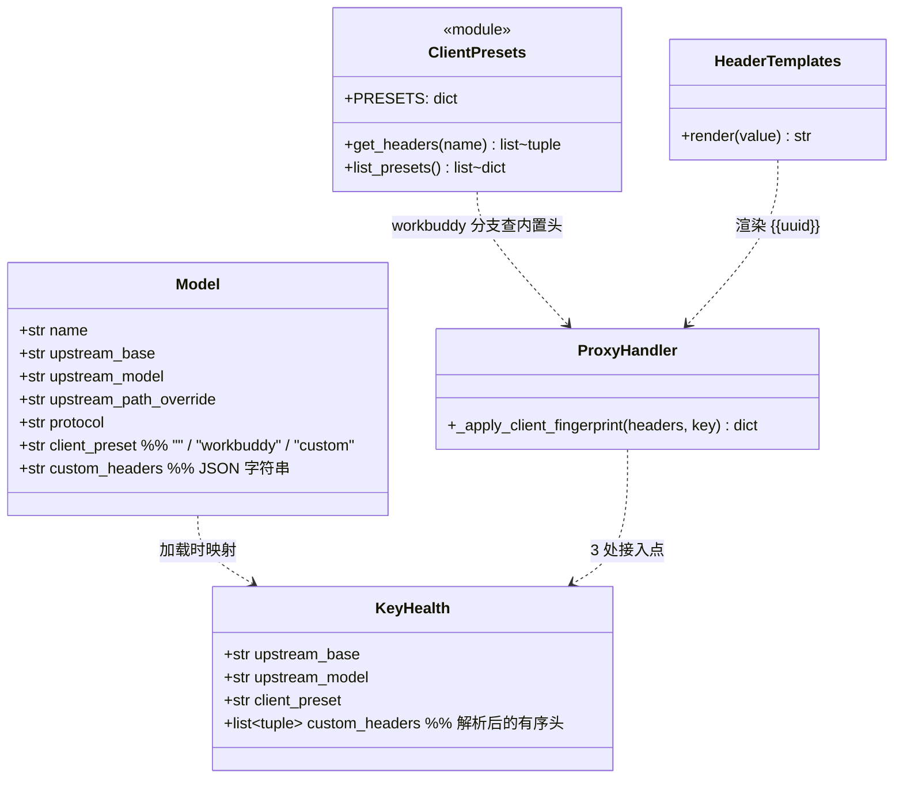
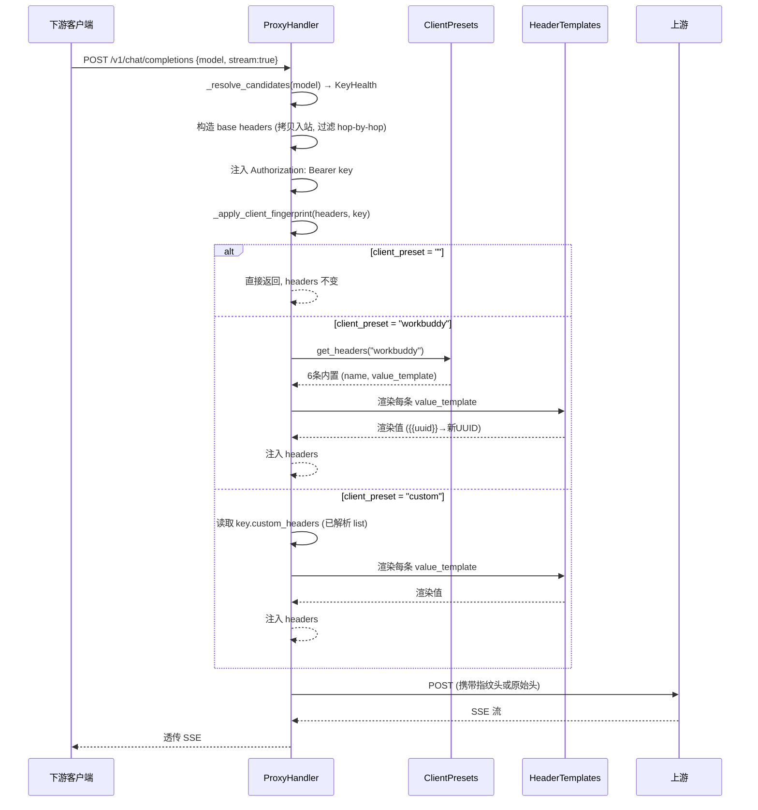

# 上游客户端指纹模拟方案（WorkBuddy 限免渠道）

> 工作流：部分 SOP（架构师输出） · 状态：待评审
> 关联：freemodel.dev WorkBuddy 限免调用，PowerShell 实测可达

## TL;DR

在**每个模型**的配置中增加一个"客户端模拟"下拉字段，默认"不模拟"（行为零变化）。下拉选项顺序为：**不模拟 → 内置预设（按添加顺序）→ 自定义**，"自定义"永远固定在最后一位。选预设则自动注入对应指纹头，选"自定义"则用户自己填写任意请求头键值对（支持 `{{uuid}}` 动态变量），对上游伪装成指定客户端，对下游仍暴露标准 OpenAI/Anthropic/Responses 接口。

---

## 1. 背景与现状

### 1.1 现有上游接入机制

| 层 | 文件 | 作用 |
|---|---|---|
| 数据 | [store/models.py](file:///f:/xiangmu/zhongzhuan/src/zhongzhuan/store/models.py) · `Model` dataclass + `models` 表 | 模型级配置：`upstream_base`/`upstream_model`/`upstream_path_override`/`protocol`/`is_fallback`/`aliases`/`capabilities`/`upstream_mode` |
| 运行时 | [proxy/ratelimit.py](file:///f:/xiangmu/zhongzhuan/src/zhongzhuan/proxy/ratelimit.py) · `KeyHealth` | 运行时 key 健康状态，从 `Model`+`api_keys` 加载 |
| 加载 | [__main__.py](file:///f:/xiangmu/zhongzhuan/src/zhongzhuan/__main__.py) `_load_keys_from_store` | DB → `KeyHealth` 的唯一映射点 |
| 转发 | [proxy/handler.py](file:///f:/xiangmu/zhongzhuan/src/zhongzhuan/proxy/handler.py) `ProxyHandler` | 3 处构造上游 headers |

### 1.2 当前 headers 构造逻辑（3 处接入点）

1. `_prepare_v3_upstream_call`（Responses v3 create）
2. `__call__` 非流式路径
3. `_stream_proxy` 流式路径

三处都做同一件事：从入站 request 拷贝 headers（过滤 hop-by-hop）→ 注入 `Authorization: Bearer {key.api_key}`（或 `x-api-key`+`anthropic-version`）→ 流式追加 `Accept-Encoding: identity`。

**缺口**：没有机制让某个 model 的上游请求携带自定义客户端指纹头。WorkBuddy 限免通道靠 `User-Agent: WorkBuddy/...` + `X-Client-Name: workbuddy` 等头识别"客户端身份"，缺这些头即走付费/拒绝。

### 1.3 WorkBuddy 实测指纹（用户 PowerShell 验证）

| Header | 值 | 性质 |
|---|---|---|
| `User-Agent` | `WorkBuddy/1.0.0 (Windows NT 10.0; Win64; x64)` | 静态 |
| `X-Client-Name` | `workbuddy` | 静态 |
| `X-Client-Version` | `1.0.0` | 静态 |
| `X-Request-ID` | 每次新 UUID | **动态** |
| `Accept` | `text/event-stream` | 静态 |
| `Cache-Control` | `no-cache` | 静态 |

上游：`https://work.freemodel.dev`，路径 `/v1/chat/completions`，model 如 `gpt-5.6-sol`，key 字面量 `key`。

---

## 2. 产品目标与用户故事

### 产品目标
1. **按模型可选**：每个模型独立选择是否模拟、模拟哪个客户端，默认不模拟（零影响）。
2. **零配置使用预设**：选 WorkBuddy 即自动注入全部 6 条指纹，用户不用手工填头。
3. **自定义能力**：选"自定义"可填写任意请求头键值对，支持 `{{uuid}}` 动态变量，覆盖未来未知限免客户端。
4. **可扩展**：未来新增预设只需在 PRESETS 字典加一条，"自定义"永远在最后。

### 用户故事
1. 作为运维，我新建模型时在"客户端模拟"下拉选 `WorkBuddy`，填好上游地址和 key 即可用，其他模型完全不受影响。
2. 作为中转用户，我用 `gpt-5.6-sol` 调 `/v1/chat/completions`，中转自动带上 WorkBuddy 指纹，返回限免结果。
3. 作为运维，我发现了新的限免客户端，选"自定义"自己添加指纹头，无需等代码更新。
4. 作为运维，我编辑模型把"客户端模拟"改回"不模拟"，该模型立即恢复普通请求头，指纹头不再注入。
5. 作为运维，我把 WorkBuddy 渠道和付费渠道放进同一分组做 failover，限免挂了自动切付费（现有能力，无需改动）。

### 需求池
| 优先级 | 需求 |
|---|---|
| **P0** | `models` 表加 `client_preset` + `custom_headers` 两列 + DB 迁移 |
| **P0** | 内置 WorkBuddy 预设（6 条指纹头，含 `{{uuid}}` 模板） |
| **P0** | 模板渲染器（`{{uuid}}`） |
| **P0** | `_apply_client_fingerprint` + 3 处接入点（preset 空跳过 / workbuddy 用内置 / custom 用用户自定义） |
| **P0** | 管理端 UI：模型编辑表单"客户端模拟"下拉（自定义永远在最下）+ 自定义键值对编辑器 + 模型列表标签 |
| **P0** | API 校验：preset 白名单 + custom_headers JSON 合法 + 禁止受控头 |
| **P1** | 选预设后"智能填充"按钮：一键填好 `upstream_base`+`upstream_path_override`+`protocol` |
| **P1** | 更多模板变量：`{{ts}}`、`{{ts_ms}}`、`{{random:N}}` |
| **P2** | 更多预设（发现其他限免客户端时加进 PRESETS 字典，自动排在自定义前面） |

### 下拉选项顺序约定（重要）

下拉选项固定按以下顺序排列，**"自定义"永远在最后一位**：

```
[0] 不模拟（默认）
[1] WorkBuddy (freemodel.dev 限免)
[2] ... 未来新增的内置预设按添加顺序排列 ...
[N] 自定义（永远最后一位）
```

实现方式：
- 后端 `list_presets()` 返回预设列表时，"自定义"不作为预设条目返回，由前端硬编码追加在末尾
- 未来新增预设只需在 `PRESETS` 字典添加，前端从 API 拉取后动态生成中间选项，最后硬编码追加"自定义"选项
- 禁止任何新预设排在"自定义"之后

### 待确认问题
1. WorkBuddy 的 key 是否恒为字面量 `key`？还是每个用户有独立 key？（不影响架构，api_keys 表已加密存储任意 key）
2. 是否需要为 WorkBuddy 渠道配 `rpm_limit` 防限免限速？（用户在 UI 自行设置，无需代码支持）
3. 自定义头是否允许覆盖 `Authorization`？P0 先禁止（防止误操作导致鉴权失败），P1 可考虑放开。

---

## 3. 架构设计

### 3.1 实现方案与选型理由

**方案：model 级 `client_preset` + `custom_headers` 两列 + 内置预设字典 + 模板渲染**

- **为什么不做全局开关**：功能是 per-model 行为，开关粒度在模型本身。用户建一个 WorkBuddy 模型、其他模型不选，就是"按模型开关"，比全局开关更精细且无需额外 UI。
- **为什么预设+自定义双模式**：预设覆盖已知限免客户端（零配置），自定义覆盖未来未知客户端（无需改代码）。两者共享模板渲染和注入逻辑。
- **为什么用字符串预设名而非枚举表**：`client_preset = ""` 不模拟 / `"workbuddy"` 预设 / `"custom"` 自定义，未来加 `"other_client"` 直接扩展 PRESETS 字典，无需加列/加表。
- **为什么"自定义"硬编码在前端末尾而非后端返回**：保证顺序契约——后端返回的预设列表永远是中间选项，前端统一在最后追加"自定义"，新增预设不会打乱顺序。
- **为什么预设硬编码而非 DB 表**：预设是少量稳定常量，硬编码零维护成本；P2 要用户自加预设时再考虑持久化。
- **为什么支持模板变量**：`X-Request-ID` 是 WorkBuddy 实测的动态指纹，自定义用户也可能需要动态值，统一走渲染器。

### 3.2 数据模型扩展

新增迁移 `store/migrations/v009_client_fingerprint.py`：

```python
SQLITE_DDL = (
    "ALTER TABLE models ADD COLUMN client_preset TEXT NOT NULL DEFAULT ''",
    "ALTER TABLE models ADD COLUMN custom_headers TEXT NOT NULL DEFAULT ''",
)
MYSQL_DDL = (
    "ALTER TABLE models ADD COLUMN client_preset VARCHAR(64) NOT NULL DEFAULT ''",
    "ALTER TABLE models ADD COLUMN custom_headers VARCHAR(4096) NOT NULL DEFAULT ''",
)
MIGRATION = Migration(version=9, name="client_fingerprint",
                      sqlite_sql=SQLITE_DDL, mysql_sql=MYSQL_DDL,
                      baseline_probe=None)
```

`client_preset` 取值：
- `""`（空，默认）= 不模拟
- `"workbuddy"` = WorkBuddy 预设
- `"custom"` = 自定义

`custom_headers`：JSON 数组字符串，仅当 `client_preset="custom"` 时生效。格式：
```json
[{"name":"X-Client-Name","value":"myclient"},{"name":"X-Request-ID","value":"{{uuid}}"}]
```

选 WorkBuddy 时 `custom_headers` 字段不使用但保留值（方便来回切换不丢失用户之前填的自定义头）。选"不模拟"时两个字段都不生效。

### 3.3 类图



### 3.4 核心时序图（流式 chat/completions）



### 3.5 模板变量规范（P0）

| 变量 | 渲染结果 | 用途 |
|---|---|---|
| `{{uuid}}` | 新生成 UUID4 | `X-Request-ID` 等需要每请求唯一的头 |

P1 再扩展 `{{ts}}`/`{{ts_ms}}`/`{{random:N}}`。

渲染器为单文件纯函数 `proxy/header_templates.py::render(value: str) -> str`，无网络/无状态，找不到模板变量的占位符原样保留（不报错）。

### 3.6 预设模块

新建 `src/zhongzhuan/proxy/client_presets.py`：

```python
"""内置上游客户端指纹预设。

约定：
- 预设 key 即 models.client_preset 的存值（"" 和 "custom" 除外）
- 空字符串 "" 表示不模拟，"custom" 表示自定义，均不在 PRESETS 字典中
- list_presets() 只返回内置预设，不包含"不模拟"和"自定义"——
  前端负责在列表头部加"不模拟"、尾部加"自定义"
"""
from __future__ import annotations

PRESETS: dict[str, dict] = {
    "workbuddy": {
        "label": "WorkBuddy (freemodel.dev 限免)",
        "headers": [
            ("User-Agent", "WorkBuddy/1.0.0 (Windows NT 10.0; Win64; x64)"),
            ("X-Client-Name", "workbuddy"),
            ("X-Client-Version", "1.0.0"),
            ("X-Request-ID", "{{uuid}}"),
            ("Accept", "text/event-stream"),
            ("Cache-Control", "no-cache"),
        ],
    },
}

# 受控头黑名单：自定义模式下禁止设置这些头，防止误操作覆盖关键头
_FORBIDDEN_HEADERS = frozenset({
    "content-length", "transfer-encoding", "host", "connection",
    "authorization",  # P0 禁止覆盖 Authorization，走 key 注入逻辑
})


def get_headers(preset_name: str) -> list[tuple[str, str]]:
    """返回预设的 (name, value_template) 列表；预设不存在返回空列表。"""
    preset = PRESETS.get(preset_name)
    if not preset:
        return []
    return list(preset["headers"])


def list_presets() -> list[dict]:
    """返回内置预设列表 [{key, label}]，按字典插入顺序排列。
    前端需自行在头部加"不模拟"、尾部加"自定义"。"""
    return [{"key": k, "label": v["label"]} for k, v in PRESETS.items()]


def validate_custom_header_name(name: str) -> str | None:
    """校验自定义头名称。返回错误消息，合法返回 None。"""
    if not name or not name.strip():
        return "Header 名称不能为空"
    lower = name.strip().lower()
    if lower in _FORBIDDEN_HEADERS:
        return f"不允许设置受控头: {name}"
    if len(name) > 128:
        return "Header 名称过长（最多128字符）"
    return None
```

**未来新增预设**：在 `PRESETS` 字典中添加即可，如：
```python
PRESETS["another_client"] = {
    "label": "AnotherClient (xxx 限免)",
    "headers": [...],
},
```
新预设自动出现在下拉列表中"自定义"之前，无需改动前端结构。

### 3.7 接入点改造

新增 `ProxyHandler._apply_client_fingerprint(self, headers, key) -> dict`：

```python
def _apply_client_fingerprint(self, headers, key):
    """根据 client_preset 注入指纹头（含模板渲染）。"""
    preset_name = getattr(key, "client_preset", "") or ""
    if not preset_name:
        return headers

    # 确定头列表来源
    if preset_name == "custom":
        headers_list = getattr(key, "custom_headers", None) or []
    else:
        from ..proxy.client_presets import get_headers
        headers_list = get_headers(preset_name)

    if not headers_list:
        return headers

    from ..proxy.header_templates import render
    for name, value_tpl in headers_list:
        if name:  # 防御：跳过空 name
            headers[name] = render(value_tpl)
    return headers
```

3 处接入点各加一行调用（在 Authorization 注入之后）：

| 接入点 | 插入位置 |
|---|---|
| `_prepare_v3_upstream_call` | Authorization 注入完成、`upstream_path_override` 处理之前 |
| `__call__` 非流式 | Authorization 注入完成、`upstream_path_override` 处理之前 |
| `_stream_proxy` | Authorization 注入完成、`upstream_path_override` 处理之前 |

### 3.8 管理端 UI

**模型编辑弹窗**加一组控件：

1. **"客户端模拟"标签 + 下拉 `<select>`**：
   ```
   [不模拟 ▾]
   ├─ 不模拟（默认）
   ├─ WorkBuddy (freemodel.dev 限免)
   └─ 自定义（永远最后）
   ```
   - 前端渲染逻辑：
     1. 首项硬编码 `<option value="">不模拟</option>`
     2. 中间项从 API `list_presets()` 动态生成
     3. 末项硬编码 `<option value="custom">自定义</option>`

2. **条件展示区域**（根据下拉选择切换）：
   - 选"不模拟"：不展示额外区域
   - 选"WorkBuddy"：展示只读提示文字 `"将自动注入 6 条 WorkBuddy 指纹头（User-Agent、X-Client-Name、X-Client-Version、X-Request-ID、Accept、Cache-Control）"`
   - 选"自定义"：展开键值对编辑器
     - 表头：`Header 名称` | `Header 值` | `操作`
     - 初始两行空输入（name 空行提交时过滤）
     - 每行右侧"删除"按钮；底部"+ 添加 Header"按钮
     - 值输入框下方灰色提示：`"支持模板变量：{{uuid}}（每请求生成新 UUID）"`
     - name 输入框前端实时校验：禁止输入受控头（content-length/host/authorization 等），输入时即提示

**模型列表**：在模型名旁加标签 badge：
- `client_preset=""` → 不显示
- `client_preset="workbuddy"` → 蓝色 badge "模拟 WorkBuddy"
- `client_preset="custom"` → 紫色 badge "自定义模拟"

**管理 API**：
- 新增 `GET /api/models/client-preset-options` → 返回 `{presets: [{key,label}], custom_option: {key:"custom", label:"自定义"}}`（前端也可硬编码，但提供 API 更规范）
- model CRUD（create/update/get/list）读写 `client_preset` 和 `custom_headers` 两个字段
- create/update 校验：
  - `client_preset` 必须是 `""` / `"workbuddy"` / `"custom"` 之一（未来新增预设自动通过 PRESETS 白名单）
  - `client_preset="custom"` 时 `custom_headers` 必须是合法 JSON 数组，每项含 `name`（非空字符串）和 `value`（可为空字符串），且 name 不在受控头黑名单
  - JSON 解析失败返回 400

### 3.9 完整文件列表（相对路径）

| 文件 | 动作 | 说明 |
|---|---|---|
| `src/zhongzhuan/store/migrations/v009_client_fingerprint.py` | 新建 | DB 迁移：`client_preset` + `custom_headers` |
| `src/zhongzhuan/store/migrations/__init__.py` | 编辑 | 注册 v009 |
| `src/zhongzhuan/store/models.py` | 编辑 | `Model.client_preset` + `custom_headers` 字段 + `_COLS` + `_row` + CRUD |
| `src/zhongzhuan/proxy/ratelimit.py` | 编辑 | `KeyHealth.client_preset` + `custom_headers` 字段 |
| `src/zhongzhuan/__main__.py` | 编辑 | `_load_keys_from_store` 映射两个字段（custom_headers JSON 解析） |
| `src/zhongzhuan/proxy/client_presets.py` | 新建 | 内置预设字典 + `get_headers()` + `list_presets()` + `validate_custom_header_name()` |
| `src/zhongzhuan/proxy/header_templates.py` | 新建 | `{{uuid}}` 模板渲染 |
| `src/zhongzhuan/proxy/handler.py` | 编辑 | `_apply_client_fingerprint`（三分支）+ 3 处接入点 |
| `src/zhongzhuan/admin/api_models.py` | 编辑 | CRUD 读写两个字段 + 值校验 + 新增 preset-options 端点 |
| `src/zhongzhuan/admin/server.py` | 编辑 | 注册 preset-options 路由 |
| `src/zhongzhuan/admin/ui.py` | 编辑 | 模型表单：下拉（自定义在尾）+ 条件编辑器 + 列表标签 |
| `tests/test_client_fingerprint.py` | 新建 | 单测 + 集成测试 |

**合计**：新建 4 个文件，编辑 8 个文件，共 12 个文件。

---

## 4. 任务分解（按依赖排序）

| # | 任务 | 涉及文件 | 依赖 |
|---|---|---|---|
| T1 | **DB 迁移 + Model 字段 + CRUD** | v009_client_fingerprint.py, migrations/__init__.py, store/models.py | — |
| T2 | **运行时承载**：KeyHealth 字段 + 加载链映射（含 custom_headers JSON 解析容错） | ratelimit.py, __main__.py, store/models.py | T1 |
| T3 | **核心注入**：预设模块（含黑名单校验）+ 模板渲染 + `_apply_client_fingerprint`（三分支）+ 3 接入点 | client_presets.py, header_templates.py, handler.py | T2 |
| T4 | **管理端**：API 读写+校验+preset-options + UI 下拉（自定义在尾）+ 键值对编辑器+列表标签 | api_models.py, admin/server.py, admin/ui.py | T1,T3 |
| T5 | **测试**：不模拟零影响 / workbuddy 注入6条头含动态UUID / custom 注入用户自定义头 / 受控头拒绝 / JSON非法400 / 流式+非流式 / 关闭恢复 | test_client_fingerprint.py, tests/conftest.py | T3,T4 |

---

## 5. 配置样例（实施完成后用户操作步骤）

### 场景 A：WorkBuddy 限免（推荐）

1. 启动服务（自动跑 v009 迁移）
2. 管理后台 → 模型管理 → 新建模型：
   - 名称：`gpt-5.6-sol`
   - 上游地址：`https://work.freemodel.dev`
   - 上游路径覆盖：`/v1/chat/completions`
   - 上游协议：`openai`
   - 上游模型名：`gpt-5.6-sol`
   - **客户端模拟：选 `WorkBuddy (freemodel.dev 限免)`** → 自动展示"将注入 6 条指纹头"提示
3. 给该模型添加 API Key：label=`workbuddy-free`，key=`key`
4. 保存 → 下游用 `gpt-5.6-sol` 调用 `/v1/chat/completions` 即走 WorkBuddy 限免

### 场景 B：自定义客户端

1. 新建模型，填好上游地址/路径/协议/模型名/key
2. **客户端模拟：选 `自定义`**（下拉最底部）
3. 在展开的键值对编辑器中添加头：
   - `User-Agent` = `SomeClient/2.0`
   - `X-Client-Name` = `someclient`
   - `X-Trace-ID` = `{{uuid}}`
4. 保存即用

### 停止模拟

编辑模型，把"客户端模拟"改回"不模拟"，保存即生效（之前填的 custom_headers 值保留，下次选自定义还在）。

---

## 6. 风险与对策

| 风险 | 对策 |
|---|---|
| freemodel.dev 改指纹识别规则 | 更新 `client_presets.py` 中 WorkBuddy 预设值即可，无需改架构；或用户改用"自定义"自行调整 |
| `X-Request-ID` 重复导致被识别 | `{{uuid}}` 每请求新生成；P1 支持复用入站 ID |
| 预设头/自定义头覆盖关键头导致请求失败 | P0 黑名单禁止 `Content-Length`/`Host`/`Authorization` 等受控头；预设中不放受控头 |
| 限免上游限速/熔断 | 复用现有 `classify_failure` + 多 key 重试 + 分组 failover |
| 用户提交非法 custom_headers JSON | API 层解析校验，非法返回 400 + 明确错误信息 |
| client_preset="" 的模型回归 | `_apply_client_fingerprint` 空值直接 return，headers 零修改，与升级前完全一致 |
| custom_headers JSON 解析失败（加载链） | `_load_keys_from_store` 中 try/except，解析失败记 warning，置空列表（该模型退化为不模拟） |
| 未来新增预设顺序错乱 | `list_presets()` 按字典插入顺序返回，前端硬编码"自定义"在尾，新增预设自动排在自定义前面 |

---

## 7. 验收标准

1. **默认零影响**：升级后不配置 `client_preset` 的模型，抓包确认请求头与升级前完全一致，无额外头注入。
2. **WorkBuddy 预设生效**：配置 `client_preset=workbuddy` 的模型，请求打到 `work.freemodel.dev`，抓包确认携带 6 条指纹头，`X-Request-ID` 每次不同。
3. **自定义生效**：配置 `client_preset=custom` + custom_headers，抓包确认携带用户自定义头，`{{uuid}}` 每次渲染为新 UUID。
4. **下拉顺序**：选项顺序为"不模拟 → WorkBuddy → 自定义"，自定义在最底部。
5. **受控头拒绝**：API 提交 custom_headers 含 `Authorization`/`Host` 等返回 400。
6. **非法 JSON 拒绝**：API 提交 custom_headers 为非法 JSON 返回 400。
7. **流式与非流式均工作**，返回模型内容。
8. **热关闭**：编辑模型改回"不模拟"后，下一个请求即不注入指纹头，无需重启。
9. **管理端 UI**：下拉默认"不模拟"，选中后条件区域正确切换；自定义键值对可增删行；模型列表显示对应标签。
10. **切换不丢值**：WorkBuddy ↔ 自定义来回切换，custom_headers 值保留不丢失。
11. `pytest tests/test_client_fingerprint.py` 全通过；全量回归零新增失败。

---

## 8. 下一步建议

1. 评审本方案，确认 P0 范围与待确认问题（特别是自定义头是否禁止覆盖 Authorization）。
2. 确认后按 T1→T5 顺序实现（工程师一轮写完所有文件）。
3. WorkBuddy 的 key 是否恒为 `key` 请确认；若需用户独立 key，流程不变（api_keys 表已支持加密存储任意 key）。
