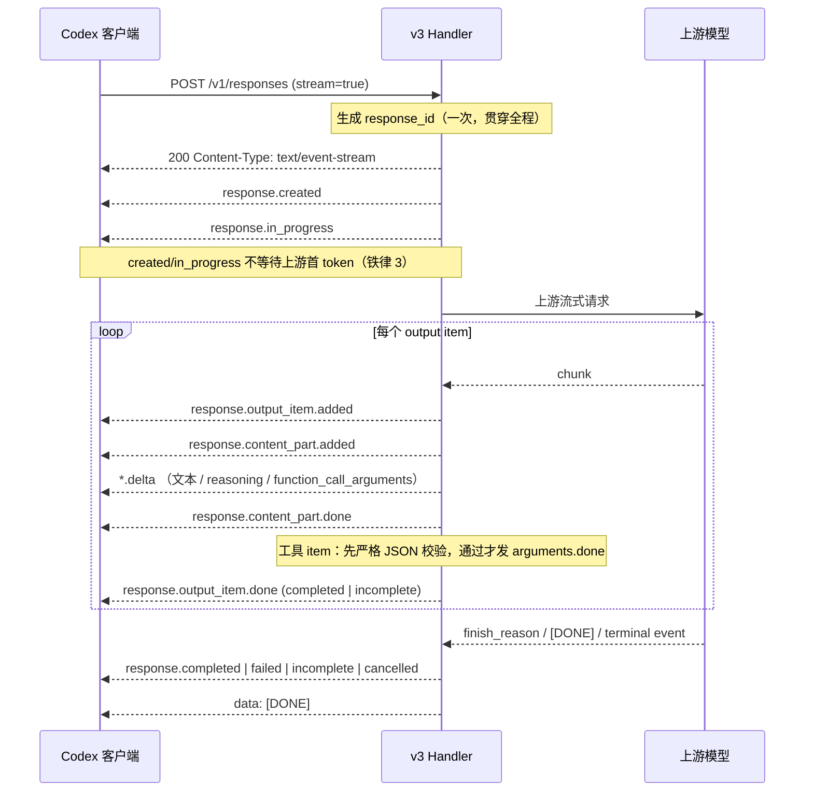
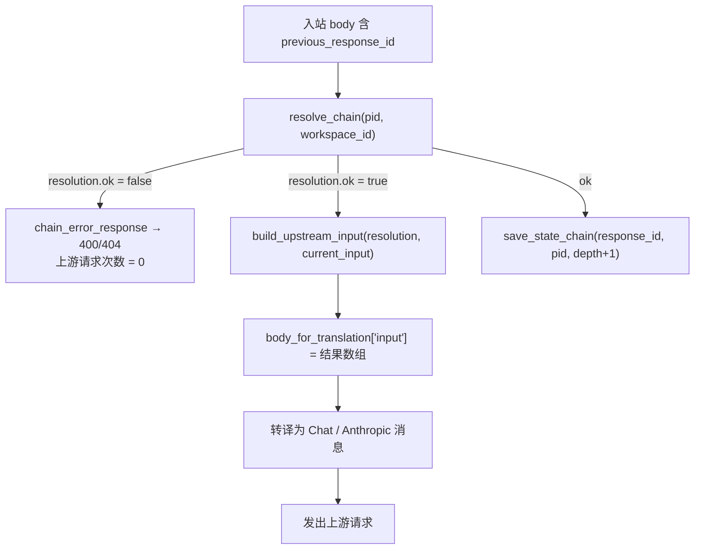
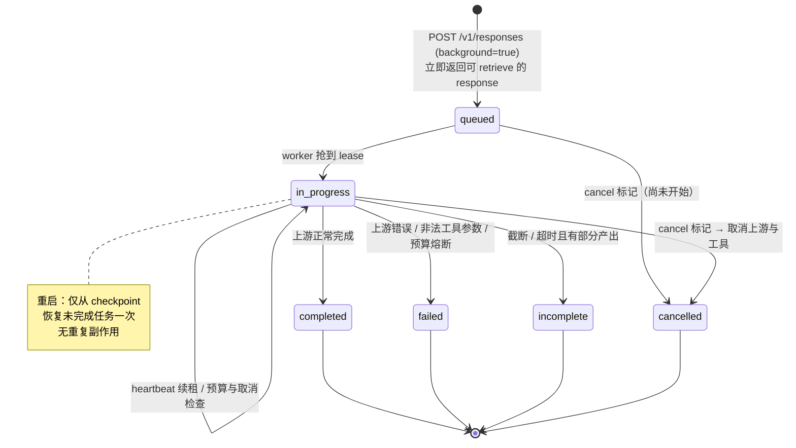

# PRD：OpenAI Responses v3 正式可用（GA）

## 0. 项目信息

| 项 | 值 |
| --- | --- |
| Language | 中文 |
| Programming Language | Python（既有工程，无技术栈变更） |
| Project Name | `zhongzhuan_responses_v3_ga` |
| 权威需求源 | `docs/zhongzhuan OpenAI Responses v3 正式实施与修复规范 c6e2f62fcd8e49239e2af152d3e43dbe.md` |
| 本文定位 | 需求与验收标准。**不含架构方案、不含代码设计**，实现方式由架构师决定 |
| 原始需求复述 | 让 `POST /v1/responses` 的 v3 实现从"模块已写好但生产路径未接线"变为"真正落地、通过规范全部 P0 与 7.1 测试"，成为 Codex/ChatGPTWork 的正式默认实现 |

### 0.1 现状一句话

v3 的**零件齐全**（`ResponsePipeline`、`ResponsesEventEmitter`、`ChainResolver.build_upstream_input`、`BackgroundWorker`、`CapabilityRouter`、`ExecutionBudget` 均已实现且大多符合规范），但**生产装配线断了**：`handler.py` 在 `stream=true` 时把请求路由到 JSON skeleton，历史链不注入上游，background worker 从不启动。本 PRD 的全部价值在于**接线 + 修正 4 处与规范相反的行为**，而不是重写。

### 0.2 验收编号约定

规范 §7.1 的 10 个强制测试 checkbox 在本文记作 **T1–T10**：

| 编号 | 规范 §7.1 checkbox |
| --- | --- |
| T1 | Codex 真实 `POST /v1/responses` 非流式和流式均进入 v3 |
| T2 | OpenAI Python/TypeScript SDK Responses contract 测试通过 |
| T3 | 流式真实 HTTP 输出严格满足完整 lifecycle，最后一帧为 `[DONE]` |
| T4 | 随机字节分片下文本、Unicode、tool name、call ID、arguments 语义不变 |
| T5 | 非法/截断 tool arguments 永不产生 `.done` 或 runnable call |
| T6 | 正常 EOF 不成为 truncated；异常断流具备正确 terminal reason |
| T7 | 多轮 `previous_response_id` 已注入真实 upstream payload，且 reasoning 永不出现 |
| T8 | background create/retrieve/cancel/restart 恢复通过 |
| T9 | 自引用、链环、重复工具签名、工具失败、超时、预算耗尽均有限终止 |
| T10 | Chat → Chat、Chat ↔ Anthropic golden fixture 字节级输出无变化 |

---

## 1. 产品目标

> **让 Responses v3 通过规范全部 P0 项与 §7.1 强制测试，成为 Codex/ChatGPTWork 的正式默认实现。**

拆解为 3 个正交目标：

1. **G1 · 协议真实性**：`POST /v1/responses` 在 `stream=true` 下输出真实 SSE 而非 JSON skeleton，生命周期完整且唯一，终态可信（正常完成不被误判为截断，残缺工具参数不被 `.done`）。
2. **G2 · 语义完整性**：`previous_response_id` 的历史真正进入上游 payload，`background=true` 真正异步执行，二者都不再是"字段回显"。
3. **G3 · 可回滚可观测**：v3 是默认实现，v2 仅作全局紧急回滚目标；每次开关切换有审计记录，每条请求有规范 §6 要求的结构化日志与指标。

---

## 2. 用户故事

### Codex / ChatGPTWork 客户端

- **US-1**：作为 Codex 客户端，我发起 `POST /v1/responses` 且 `stream=true` 时，我要收到 `Content-Type: text/event-stream` 的真实增量事件流并以 `data: [DONE]` 收尾，这样我的流式 UI 能逐字渲染，而不是长时间空白后拿到一个 `in_progress` 的 JSON 对象。
- **US-2**：作为 Codex 客户端，当模型返回工具调用时，我要么拿到 `arguments` 为合法 JSON object 的 completed function_call item，要么拿到明确 `incomplete` 的 item 和可诊断的终止原因，这样我不会执行一个参数残缺的工具。

### 多轮对话用户

- **US-3**：作为使用 `previous_response_id` 续接对话的用户，我要模型真的记得上一轮说过什么，而不是 API 层面看起来续接、模型实际失忆。
- **US-4**：作为提交长任务的用户，我用 `background=true` 创建后要能立即拿到一个可 `retrieve` 的 response，随后轮询看到 `queued → in_progress → completed`，并且能在中途 `cancel` 真正停止上游消耗。

### 运维

- **US-5**：作为运维，当 v3 出现线上事故时，我要能通过 `ZHONGZHUAN_RESPONSES_BRIDGE_V3=0` 一次性把**所有新入站** Responses 流量切回 v2，且已经开始写出 body/SSE 的请求不跨版本迁移，这样回滚行为可预测。
- **US-6**：作为运维，我要每次开关切换（含启动期生效值）都留下审计记录（操作者/时间/原因/生效版本），并能从指标看到截断率、首 token、工具 JSON 失败率，这样我有客观的 NO-GO 依据。

---

## 3. 需求池

> 优先级定义：**P0 = 发布阻断（未完成则不得作为默认实现）**；**P1 = 应当具备**；**P2 = 锦上添花**。
> 每条验收标准均为可执行断言，测试形态默认为**生产 HTTP 层**（经 aiohttp app / test client 发起真实请求），而非仅单测内部模块。

### 3.1 P0（发布阻断，必须全部完成）—— 共 8 条

---

#### P0-1 · 把真实 `stream=true` 接入 v3 生产路径

**现状**：`handler.py:1107-1117` 在 `stream=true` 时显式路由到 `_dispatch_v3`（resource skeleton），返回 JSON。`ResponsePipeline`（`responses_v3/pipeline.py`）与 `ResponsesEventEmitter`（`proxy/protocol/responses_emitter.py`）从未被生产代码 import。

**需求**：v3 handler **must** 成为流式 Responses 请求的唯一编排者，从上游流一路贯通到客户端写入。

**验收标准**：

| # | 断言 | 映射 |
| --- | --- | --- |
| AC-1.1 | 生产 HTTP 请求 `POST /v1/responses` + `stream=true`，响应头 `Content-Type` **必须**为 `text/event-stream`，且响应体不是单个 JSON 对象 | T1 T3 |
| AC-1.2 | 存在一条测试断言"生产模块图中 `handler` 可达 `ResponsePipeline` 与 `ResponsesEventEmitter`"（如 import 图断言或对 pipeline 的 spy 被调用） | T1 |
| AC-1.3 | 同一次请求中，`response.created` 里的 `response.id` 与后续所有事件、terminal 事件、随后 `GET /v1/responses/{id}` 返回的 id **必须**一致 | T3 |
| AC-1.4 | 全链路只有一个 lifecycle 事件所有者：不得出现 `ResponsePipeline` 与旧 `ResponsesStreamTranslator` 同时产出 lifecycle 事件（断言任一 lifecycle 事件类型在一次响应中出现次数 ≤ 1） | T3 |
| AC-1.5 | `stream=false` 行为不回退：`Content-Type: application/json`，返回完整 response 对象，现有 `tests/test_proxy_v3_create.py` 全绿 | T1 |

---

#### P0-2 · 区分正常完成与异常 EOF

**现状**：`pipeline.py:570-573` 对 `upstream_end` 只判断 `produced`——只要产出过 chunk 就判 `UPSTREAM_TRUNCATED`，与规范完全相反（正常完成会被误判为截断）。

**需求**：**仅当**上游给出明确完成信号（`finish_reason` / `[DONE]` / 原生 Responses terminal event）后的 EOF 才判为正常 completed；无完成信号的 EOF 才是 `UPSTREAM_TRUNCATED`。

**验收标准**：

| # | 断言 | 映射 |
| --- | --- | --- |
| AC-2.1 | 7 个 EOF 场景各有一条测试，终态符合下表 | T6 |
| AC-2.2 | 场景矩阵：① 正常文本 + finish_reason → `completed`；② 正常 tool call + finish → `completed`；③ usage-only 尾包 → `completed`；④ `[DONE]` 后 EOF → `completed`；⑤ 无任何完成信号的 EOF → `upstream_truncated`；⑥ 首 token 前断流 → `upstream_connect`（或等价的连接类 reason，非 truncated）；⑦ 原生 Responses terminal event 后 EOF → `completed` | T6 |
| AC-2.3 | `PipelineStats.truncated_streams` 在场景 ①②③④⑦ 中**必须**为 0 | T6 |
| AC-2.4 | 上述断言在生产 HTTP 层至少覆盖场景 ①、⑤ 各一条（不仅是 pipeline 单测） | T1 T6 |

---

#### P0-3 · 修复工具参数验证与完成顺序

**需求**：工具收尾**必须**严格按序：收到明确完成信号 → 严格 JSON object 验证 → 通过才发 `function_call_arguments.done` → 再发 `output_item.done(status=completed)`；未通过则**只**发 `output_item.done(status=incomplete)` 并以 `invalid_tool_arguments` 或 `upstream_truncated` 终止。

**验收标准**：

| # | 断言 | 映射 |
| --- | --- | --- |
| AC-3.1 | 对非法/截断 arguments（`{"a":` / `[1,2]` / `"str"` / 空串 / name 缺失）的每个用例，事件流中**必须不存在** `response.function_call_arguments.done` | T5 |
| AC-3.2 | 上述用例中对应 item 的 `output_item.done.status == "incomplete"`，且 response 终态为 `failed` 或 `incomplete`，`terminal_reason ∈ {invalid_tool_arguments, upstream_truncated}` | T5 |
| AC-3.3 | 禁止把空/残缺 arguments 改写为 `{}` 后标 completed —— 存在一条断言 `arguments != "{}"`（当上游从未发送过 `{}`） | T5 |
| AC-3.4 | 合法路径事件顺序断言：`function_call_arguments.done` 的索引 < 同 item 的 `output_item.done` 索引 | T3 T5 |
| AC-3.5 | 至少一条生产 HTTP 层用例覆盖"上游返回截断 tool arguments"的端到端行为 | T1 T5 |

---

#### P0-4 · 稳定 tool item 身份（`item_id` 创建时固定）

**现状**：`proxy/protocol/tool_accumulator.py:36-53` 的 `ToolCallAccumulator` 只有 `source_index / output_index / call_id / name / arguments / *_flag`，**缺少规范要求的 `item_id` 字段**；当前 item_id 由 call_id 派生 → call_id 晚到会导致 added/delta/done 指向不同对象。

**需求**：`ToolCallAccumulator` **必须**新增创建时固定的 `item_id`，由 `response_id + output_index` 在首次分片时生成，**永不**随 call_id 变化。

**验收标准**：

| # | 断言 | 映射 |
| --- | --- | --- |
| AC-4.1 | `ToolCallAccumulator` 具备 `item_id: str` 字段；构造后对其执行任意次 `bind_call_id()` 后 `item_id` 不变 | T4 |
| AC-4.2 | call_id 延迟出现场景：`output_item.added`、所有 `function_call_arguments.delta`、`output_item.done` 三者的 `item_id` **完全相同** | T4 |
| AC-4.3 | name 逐字符分片场景：最终 `name` 与一次性发送完整 name 的结果**逐字节相同**（含 Unicode/多字节边界拆分） | T4 |
| AC-4.4 | name 支持两种模式：逐片 append 与"重复完整值替换"，由 provider profile 或片段规则选择；存在覆盖两种模式的用例，且不得无条件 `replace` | T4 |
| AC-4.5 | 幂等：同一 `call_id` / source index / stable item id 只允许完成一次；重复分片与迟发分片不产生第二个 `output_item.done` | T3 T4 |
| AC-4.6 | 并行工具调用交错分片下，各 item 的 `arguments` 不串扰（属性测试，随机分片 ≥ 100 组） | T4 |

---

#### P0-5 · `previous_response_id` 必须真正进入上游上下文

**现状**：`handler.py:410-421` 调用 `resolve_chain` 只做校验 + `save_state_chain` 持久化；`handler.py:426-431` 的注释明确写明"chain resolution 故意不注入"。`chain.py:307` 的 `build_upstream_input` 在生产路径从未被调用。

**需求**：生产路径**必须**在转译为 Chat/Anthropic 消息**之前**，用 `build_upstream_input(resolution, current_input)` 的结果替换 `body["input"]`。

**验收标准**：

| # | 断言 | 映射 |
| --- | --- | --- |
| AC-5.1 | 捕获真实 outbound upstream payload，断言其中**包含**父 response 的可见 message / function_call / function_call_output，且顺序为根→父的时间顺序 | T7 |
| AC-5.2 | outbound payload 中**必须不包含**任何 `reasoning` / summary / encrypted reasoning 内容（字符串级断言 + item type 级断言） | T7 |
| AC-5.3 | `instructions` **不得**从父 response 自动继承（父有 instructions、本轮无 → outbound 中无该 instructions） | T7 |
| AC-5.4 | 失败前置：自引用、祖先环、跨租户（workspace 不匹配）、parent 已删除、深度 > 64、items > 2000、tokens > 200000 —— 七种情况**必须在发出任何上游网络请求前**返回标准错误（用 spy 断言 upstream 调用次数为 0） | T7 T9 |
| AC-5.5 | 至少一条端到端多轮用例：第 1 轮告知一个事实 → 第 2 轮用 `previous_response_id` 提问 → 断言上游 payload 携带第 1 轮内容 | T1 T7 |

---

#### P0-6 · `background=true` 走真实持久化 worker

**现状**：`responses_v3/background.py` 的 `BackgroundWorker`（lease/heartbeat/cancel 均为真实实现）与 `store/background_jobs.py` 存在，但 `handler.py:962-970` 的 `start_background_tasks` 只启动 sticky cleanup 与 health snapshot，**从未启动 BackgroundWorker**；`background=true` 仅在 response 对象中回显字段。

**需求**：`background=true` **必须**立即返回可 retrieve 的 response，由持久化 worker 异步推进状态机。

**验收标准**：

| # | 断言 | 映射 |
| --- | --- | --- |
| AC-6.1 | `POST /v1/responses` + `background=true` 在上游未完成时即返回 HTTP 200，`status == "queued"`，且返回的 id 立即可被 `GET /v1/responses/{id}` 检索到 | T8 |
| AC-6.2 | 状态机只允许 `queued → in_progress → {completed, failed, incomplete, cancelled}`；存在断言拒绝非法跃迁 | T8 |
| AC-6.3 | `POST /v1/responses/{id}/cancel` 写入持久化取消标记，worker 在下一次检查点停止，终态为 `cancelled`，且上游/工具执行被取消（spy 断言） | T8 T9 |
| AC-6.4 | 重启恢复：进程重启后未完成 job 从 checkpoint **恰好恢复一次**；连续两次重启不产生重复副作用，也不出现 crash-restart 循环 | T8 |
| AC-6.5 | worker 启动被验证：存在断言 `start_background_tasks()` 后 `BackgroundWorker` 处于运行态（任务数 / 运行标志） | T8 |
| AC-6.6 | 每个 task 继承 response budget，并在循环中持续检查取消与预算；超预算时有限终止为 `failed`/`incomplete` | T8 T9 |

---

#### P0-7 · 超时配置符合铁律 5

**现状**：`pipeline.py:74-93` 的 `PipelineConfig` 默认 `first_token_seconds=600.0`、`read_idle_seconds=600.0`、`total_seconds=1800.0`。规范 §6 要求 `first_token=300 / read_idle=300 / total=900`，且铁律 5 明确 **total 推荐上限 900**，1800 违规。

**需求**：默认值**必须**改为规范 §6 的推荐值，且 total 存在硬上限校验。

**验收标准**：

| # | 断言 | 映射 |
| --- | --- | --- |
| AC-7.1 | `PipelineConfig` 默认值：`connect_seconds=15`、`first_token_seconds=300`、`read_idle_seconds=300`、`total_seconds=900`、`heartbeat_seconds=15` | T9 |
| AC-7.2 | 配置注入值若 `first_token < 300` 或 `read_idle < 300` → 启动期报错或钳制到 300 并写警告日志（二选一，需在实现中固化并测试） | T9 |
| AC-7.3 | `total_seconds > 900` **必须**被拒绝或钳制到 900，并有对应测试 | T9 |
| AC-7.4 | 生产 handler 实际使用的配置来源于统一配置层（`responses_bridge.timeout.*`），存在一条断言 HTTP 层生效值等于配置值 | T9 |
| AC-7.5 | 超时触发时在有限时间内进入 terminal 事件 + `[DONE]`，不悬挂 | T3 T9 |

---

#### P0-8 · v3 开关审计日志

**现状**：`proxy/feature_flags.py:22` 读取 `ZHONGZHUAN_RESPONSES_BRIDGE_V3`；`config/effective.py:242`、`config/timeouts.py:246` 存在渲染审计行的函数，但**启动期从未针对 v3 开关调用**。规范 §1.2 要求每次开关、回滚、恢复都写审计日志。

**需求**：进程启动期与运行期每次开关变更**必须**写入一条结构化审计日志。

**验收标准**：

| # | 断言 | 映射 |
| --- | --- | --- |
| AC-8.1 | 启动期**必须**输出一条审计记录，字段至少含：`operator`（环境变量来源时记为 `env`/进程启动身份）、`timestamp`、`reason`、`effective_version`（`v3` 或 `v2_emergency`）、`source`（env / config / 管理端） | §1.2 |
| AC-8.2 | 运行期通过管理端切换开关时同样写入审计记录，字段同上 | §1.2 |
| AC-8.3 | 开关行为断言：`=0` 时**所有**新入站 Responses 请求走 v2；`=1` 时**所有**新入站走 v3，不得因 `stream` / 工具 / background / `previous_response_id` 某项未完成而单请求静默切 v2 | T1 |
| AC-8.4 | 版本粘性：已写出任何 HTTP body 或 SSE frame 的请求，在开关翻转后**必须**保持原版本直到结束（测试：流式进行中翻转开关，断言该流仍以 v3 事件收尾） | §1.2 |
| AC-8.5 | 每条请求日志含 `responses_implementation=v3|v2_emergency` 字段 | §6 |

---

### 3.2 P1（应当具备）

| ID | 需求 | 验收标准 | 映射 |
| --- | --- | --- | --- |
| P1-1 | **铁律 1 生产路径验证**：reasoning 只出不进 | 生产 HTTP 层用例：上游返回 `reasoning_content` → 下游收到 reasoning 展示事件；下一轮 outbound payload 中零 reasoning。ResponseStore 中不落 reasoning 明文（读库断言） | T7 |
| P1-2 | **铁律 2 生产路径验证**：工具完整才完成 | P0-3 的断言在生产 HTTP 层各覆盖 ≥ 1 条 | T5 |
| P1-3 | **铁律 3 生产路径验证**：lifecycle 完整且唯一 | 真实 HTTP 响应体解析后断言：首两帧为 `response.created`、`response.in_progress`（且在上游首 token 之前发出）；每个 item 的 added/done、每个 content part 的 added/done、terminal、`[DONE]` 各恰好一次；terminal 之后无任何 delta/工具分片/重复 `[DONE]` | T3 |
| P1-4 | **铁律 4 生产路径验证**：未知参数处理 | 官方已知未实现能力 → 501（非静默丢弃）；真正未知的非官方字段 → 静默丢弃且计数器 +1（断言计数器） | T2 |
| P1-5 | **能力路由端到端 400/501/503** | 参数非法 → 400；已知能力未实现 → 501；执行器声明但不可用 → 503。三者均为生产 HTTP 层用例，且断言**不曾**偷换为 v2、不曾删字段后转发 | T2 |
| P1-6 | **compact 诚实 501 保持** | `compact` 相关请求继续返回 501（含标准 error 结构），不得因接线改动退化为 skeleton 或静默成功 | T2 |
| P1-7 | **SDK contract 测试通过** | `tests/contract/python/*` 与 `tests/contract/typescript/*` 对接真实 HTTP 端点后全绿 | T2 |
| P1-8 | **legacy 无回归** | Chat → Chat、Chat ↔ Anthropic golden fixture **字节级**输出无变化 | T10 |
| P1-9 | **有限终止总保证** | 自引用、链环、重复工具签名（`tool_name + canonical_json(args) + normalized_result`）、同工具持续失败、超时、预算耗尽六类场景均在有限时间内进入四种终态之一，无无限重放/无限重试 | T9 |
| P1-10 | **重试边界** | 已发出任何业务 delta 后禁止透明重放（断言切 key 不发生）；client disconnect 不惩罚 upstream key（断言 key 健康分不变）；同一 idempotency key / response id / 工具副作用只执行一次 | T9 |

### 3.3 P2（锦上添花）

| ID | 需求 | 验收标准 |
| --- | --- | --- |
| P2-1 | **结构化日志字段补齐** | 每条 Responses 请求日志含规范 §6 全部 13 个字段：`request_id`、`inbound_protocol`、`responses_implementation`、`route`、`response_id`、`attempt`、`first_token_ms`、`duration_ms`、`terminal_reason`、`bytes_committed`、`tool_call_count`、`reasoning_history_items_dropped`；存在一条日志 schema 测试 |
| P2-2 | **指标补齐** | 至少暴露：Responses 请求数、v3/v2_emergency 路由数、首 token 分布、流时长、截断流数、invalid tool arguments 数、重复 tool chunk 数、状态链环数、预算熔断数、取消数、heartbeat 数 |
| P2-3 | **灰度观测看板** | 按规范 §7.2 提供 `terminal_reason`、截断率、首 token、工具 JSON 失败率、重复执行率、内存与 event log 增长的可查询视图 |
| P2-4 | **兼容报告更新** | 更新兼容报告，逐条标注 §7.1 T1–T10 状态；在存在缺口时**不得**宣称"完全兼容 OpenAI Responses API" |

---

## 4. 接口 / 行为规格草图

> 本项目为后端协议服务，以下用接口契约替代 UI 设计稿。

### 4.1 `POST /v1/responses` 响应形态

| 条件 | HTTP 状态 | `Content-Type` | 响应体 | 备注 |
| --- | --- | --- | --- | --- |
| `stream=false`，成功 | 200 | `application/json` | 完整 Response 对象，`status ∈ {completed, incomplete, failed}` | 现状已可用，不得回归 |
| `stream=true`，成功 | 200 | `text/event-stream` | SSE 帧序列，末帧 `data: [DONE]` | **P0-1 待落地**（现状返回 JSON skeleton） |
| `background=true`（无论 stream） | 200 | `application/json` | Response 对象，`status="queued"`，立即可 retrieve | **P0-6 待落地** |
| 参数非法 / 链校验失败 | 400 | `application/json` | 标准 error 对象 | 必须在上游请求前返回 |
| 已知能力未实现（如 compact） | 501 | `application/json` | 标准 error 对象 | 诚实 501，禁止静默降级 |
| 执行器声明但不可用 | 503 | `application/json` | 标准 error 对象 | 禁止偷换 v2 |

**流式错误的边界规则**：若错误在写出任何 SSE frame **之前**判定 → 返回上表的 JSON 错误状态码；若已写出 frame → **必须**在 SSE 流内以 `response.failed` + `[DONE]` 收尾，不得改写 HTTP 状态码。

### 4.2 SSE 生命周期序列（`stream=true`）

**幂等约束**：`created`、`in_progress`、每个 item 的 `added`/`done`、每个 content part 的 `added`/`done`、terminal 事件、`[DONE]` —— 在一次响应中各出现**恰好一次**。terminal 之后到达的任何 delta / 工具分片 / 第二个 `[DONE]` **必须**被丢弃。心跳帧不计入 lifecycle。

### 4.3 终态判定矩阵（P0-2 核心）

| 上游情形 | `saw_provider_finish` | `saw_provider_done` | 产出过 chunk | 终态 | `terminal_reason` |
| --- | --- | --- | --- | --- | --- |
| 正常文本 + finish_reason | ✅ | — | ✅ | `completed` | — |
| 正常 tool call + finish | ✅ | — | ✅ | `completed` | — |
| usage-only 尾包 | ✅ | — | ✅ | `completed` | — |
| `[DONE]` 后 EOF | — | ✅ | ✅ | `completed` | — |
| 原生 Responses terminal event 后 EOF | ✅ | — | ✅ | `completed` | — |
| 无完成信号的 EOF | ❌ | ❌ | ✅ | `incomplete`/`failed` | `upstream_truncated` |
| 首 token 前断流 | ❌ | ❌ | ❌ | `failed` | `upstream_connect` |
| 工具 arguments 非法 | ✅ | — | ✅ | `failed`/`incomplete` | `invalid_tool_arguments` |
| 超时（first_token / read_idle / total） | — | — | — | `failed`/`incomplete` | 对应 timeout reason |
| 客户端取消 / cancel API | — | — | — | `cancelled` | `client_cancelled` |

> 判定规则：`if upstream_eof and not (saw_provider_finish or saw_provider_done): terminal_reason = UPSTREAM_TRUNCATED`，否则 `completed`。**`produced` 不再单独作为截断依据。**

### 4.4 `previous_response_id` 注入语义（P0-5）

| 语义项 | 规则 |
| --- | --- |
| 注入内容 | 根 → 父的可见 message、function_call、function_call_output，**按时间顺序**，接续本轮 `input` |
| reasoning | 历史 reasoning / summary / encrypted reasoning **绝不**进入 outbound payload（两端都过滤） |
| instructions | **不**从父 response 继承；只有 items 沿链传递 |
| 预算 | 深度 ≤ 64、items ≤ 2000、tokens ≤ 200000；compact 完成后写入 compact boundary 防无限回溯 |
| 失败时机 | 所有链校验失败**必须**发生在任何上游网络请求之前 |
| 持久化 | 校验通过后写 state chain（现状已有，保留） |

### 4.5 `background` 状态机（P0-6）

| 行为 | 契约 |
| --- | --- |
| create | 立即返回，`status="queued"`，id 立即可 retrieve |
| retrieve | 任何状态下返回当前 response 对象；流式 catch-up 帧与实时帧**字节一致** |
| cancel | 写持久化取消标记 → worker 在检查点终止 → 终态 `cancelled`；上游与工具执行被真实取消 |
| restart | 未完成 job 从 checkpoint 恰好恢复一次；不 crash-restart 循环 |
| 预算 | 每个 task 继承 response budget（`max_wall_time_seconds=900` 等），持续检查 |

### 4.6 版本路由与回滚语义

| 场景 | 行为 |
| --- | --- |
| `inbound_protocol == "responses"` 且开关开启 | 一律 v3（含 stream / 工具 / background / 多轮） |
| 开关 `=0` | **所有新入站** Responses 请求走 v2；已开始的请求保持原版本 |
| v3 遇到未实现能力 | 返回 400/501/503 或走原生 Responses 上游直通，**绝不**单请求静默切 v2、**绝不**删字段 |
| `/v1/chat/completions`、`/v1/messages` | 完全不受影响，走既有链路 |
| 版本粘性 | 已写出任何 HTTP body 或 SSE frame 后绝不跨版本迁移 |

---

## 5. 待确认问题（需架构师/工程侧拍板）

> 按对进度的阻塞程度排序，**Q1–Q3 为最关键项**。

### Q1（最关键）· 生产 handler 如何安全替换流式路径？

`handler.py:1107-1117` 目前把 `stream=true` 路由到 `_dispatch_v3`（skeleton），同时 `handler.py` 下方还存在 legacy 的流式转发路径（含 sticky key、重试、多候选 key 逻辑）。需要拍板：

- `ResponsePipeline` 是**替换** `_dispatch_v3` 的流式分支，还是新增 `_dispatch_v3_create_stream` 与非流式并列？
- 已有的 sticky session、`_filter_v3_candidates`、切 key 重试如何与 pipeline 的"已提交 delta 后禁止重放"（P1-10）协调？谁负责在首帧写出前完成 key 选择？
- 规范 P0-1 要求"ResponsePipeline 与旧 `ResponsesStreamTranslator` 只能保留一个生产事件所有者"——旧 translator 是**删除**、还是**降级为仅 v2 路径使用**？

### Q2（最关键）· `BackgroundWorker` 的启动点与生命周期归属？

`handler.py:962` 的 `start_background_tasks` 由 `proxy/server.py:98` 在 `on_startup` 调用。需要拍板：

- worker 是挂在 handler 的 `_bg_tasks` 里，还是作为独立的 app 级组件（便于多进程/多实例部署时的 lease 竞争）？
- 多实例部署时 lease 冲突与 heartbeat 超时时长如何取值？单实例假设是否可接受？
- worker 执行 job 时复用哪条上游调用路径——直接复用 `ResponsePipeline`，还是走 `background.py` 现有的 upstream 抽象？

### Q3（最关键）· 是否保留 legacy Responses translator 作为 v2 回滚目标？

规范 §1.2 要求 v2 是可用的紧急回滚目标，但 P0-1 又要求"只保留一个生产事件所有者"。需要明确：

- v2 路径是否需要与 v3 同等的测试覆盖？还是仅做"能跑通、不回归"的冒烟级保障？
- v2 保留期限与退役条件是什么（例如 v3 稳定运行 N 天后删除）？
- 若 v2 保留，`ResponsesStreamTranslator` 与 `ResponsesEventEmitter` 的代码重复如何界定，避免修 bug 时漏改一侧？

### Q4 · `PipelineConfig.total_seconds` 从 1800 降到 900 的兼容影响？

现有超长推理请求（如 o1/o3 系列长思考）是否存在实际超过 900 秒的生产流量？若有：

- 是接受按规范硬性 900 上限并让超时请求以 `incomplete` 终止，还是需要向规范申请例外？
- `first_token`/`read_idle` 从 600 降到 300 是否会误杀现有慢上游？是否需要按 provider profile 分档？

### Q5 · `item_id` 生成规则与既有持久化数据的兼容？

P0-4 要求 `item_id = response_id + output_index`。需要确认：

- 具体拼接格式（分隔符、前缀）是否需要与 OpenAI 官方 `fc_xxx` 形态对齐，以免 SDK contract 测试失败？
- ResponseStore 中已持久化的、由 call_id 派生的旧 item_id 是否需要迁移？retrieve 老 response 时的 id 稳定性如何保证？

---

## 6. 发布门槛（NO-GO 清单）

以下任一成立，**v3 不得作为 Codex/ChatGPTWork 的正式默认实现**：

- [ ] `stream=true` 未进入真实 SSE（P0-1）
- [ ] 正常 EOF 被误判为截断（P0-2）
- [ ] 残缺工具参数被 `.done`（P0-3）
- [ ] tool item 身份不稳定（P0-4）
- [ ] 状态链未注入上游（P0-5）
- [ ] background 仅字段回显（P0-6）
- [ ] 超时超出铁律 5 上限（P0-7）
- [ ] 开关切换无审计记录（P0-8）
- [ ] 历史 reasoning 回灌上游（P1-1）
- [ ] 任一异常路径可能无限循环（P1-9）

§7.1 的 T1–T10 全部通过后方可进入 §7.2 的小流量灰度。
