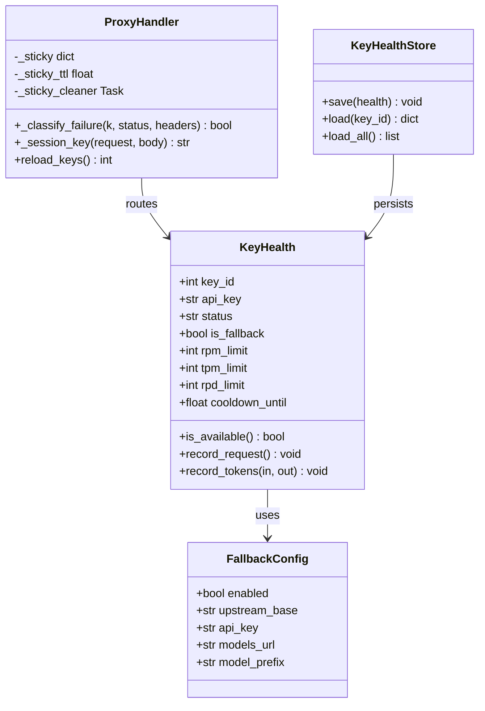
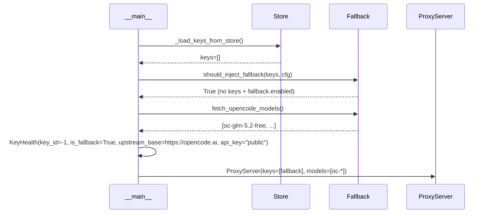

# 系统设计: OpenCode Free 兜底 + 9 项优化

## 实现方案

### 1. OpenCode Free 兜底上游
- 在 `config.py` 新增 `FallbackConfig`：`enabled`/`upstream_base`/`api_key`/`models_url`/`model_prefix`
- 在 `__main__.py` 的 `_load_keys_from_store` 后，若 keys 为空且 `fallback.enabled`，注入一个兜底 `KeyHealth`
- 兜底 key 的 `key_id = -1`（哨兵值），`is_fallback = True` 标志位
- `scheduler.score()` 对 `is_fallback` 的 key 大幅降权（×0.1），只在所有正常 key 不可用时使用
- 启动时异步拉取 `https://opencode.ai/zen/v1/models`，把 `-free` 后缀模型注入 `/v1/models` 列表
- 兜底 key 的 `upstream_path_override = "/zen/v1/chat/completions"`，`upstream_base = "https://opencode.ai"`

### 2. 优化点实现

#### 优化点1: scheduler.score() 利用 status + TPM
```python
def score(k):
    if not k.is_available(): return -1.0
    # 状态降权
    status_weight = {healthy:1.0, error:0.3, rate_limited:0.5}.get(k.status, 0.5)
    # TPM 使用率
    tpm_factor = 1.0 - (k.tpm_window.current_usage()/k.tpm_limit) if tpm_limit>0 else 1.0
    # fallback 降权
    fallback_penalty = 0.1 if k.is_fallback else 1.0
    return base_score * status_weight * fallback_penalty * (0.7+0.3*tpm_factor)
```

#### 优化点2: 提取 _classify_failure
在 `handler.py` 新增静态方法 `_classify_failure(k, status, headers)`，返回是否可重试。非流式和流式共用。

#### 优化点3: reload_keys 重置 invalid
在 `reload_keys()` 中，新 keys 列表的 status 重置为 healthy（因为是从 DB 重新加载，假设 key 已修复）。保留 `learn_rate_limits` 学到的 rpm/tpm 限额。

#### 优化点4: 健康状态持久化
新增 `key_health` 表：`(key_id, status, cooldown_until, rpm_limit, tpm_limit, success_count, failure_count, updated_at)`。
- 每 30 秒异步快照一次
- reload_keys 时从表恢复 status/cooldown/学到的限额

#### 优化点5: Sticky session 定时清理
在 ProxyHandler 启动一个后台 asyncio.Task，每 5 分钟清理过期 sticky 条目。

#### 优化点6: learn_rate_limits lowercase dict
`_header_get` 改为 `{k.lower(): v for k,v in headers.items()}` 一次构建。

#### 优化点7: _round_robin_counters 清理
`pick_group_model` 调用前删除不存在的 group_id 计数器。

#### 优化点8: 429 响应带 X-Zhongzhuan-Reason 头
"all keys exhausted" 时根据 keys 状态返回 `X-Zhongzhuan-Reason: all_invalid | all_rate_limited | all_error | no_keys`。

#### 优化点9: 单元测试
新增 `test_health_state.py`（状态机）、`test_learn_rate_limits.py`、`test_sticky_session.py`。

## 框架选型理由
- 复用现有 aiohttp + httpx + SQLite 架构，不引入新依赖
- 健康状态持久化用现有 Store 抽象，SQLite/TiDB 双后端自动兼容

## 完整文件列表（相对路径）

### 新增文件
- `src/zhongzhuan/store/key_health.py` — 健康状态持久化 CRUD
- `tests/test_health_state.py` — 状态机测试
- `tests/test_learn_rate_limits.py` — 429 头学习测试
- `tests/test_sticky_session.py` — Sticky session 测试

### 修改文件
- `src/zhongzhuan/config/config.py` — 新增 FallbackConfig + 字段
- `src/zhongzhuan/proxy/ratelimit.py` — KeyHealth 增加 is_fallback 字段
- `src/zhongzhuan/proxy/scheduler.py` — score() 利用 status+TPM+fallback；_round_robin_counters 清理
- `src/zhongzhuan/proxy/retry.py` — _header_get 改为 lowercase dict
- `src/zhongzhuan/proxy/handler.py` — _classify_failure 提取；sticky 定时清理；429 原因头；reload 重置
- `src/zhongzhuan/proxy/server.py` — 启动 sticky 清理任务
- `src/zhongzhuan/store/schema.py` — 新增 key_health 表
- `src/zhongzhuan/store/store.py` — 创建 key_health 表
- `src/zhongzhuan/__main__.py` — 兜底 key 注入 + 模型拉取 + 健康状态恢复

## Mermaid classDiagram



## Mermaid sequenceDiagram（兜底注入流程）



## 任务列表（按依赖排序）

1. **基础设施**：config.py 新增 FallbackConfig + schema.py 新增 key_health 表 + store.py 建表
2. **数据层**：key_health.py 持久化 CRUD
3. **核心逻辑**：ratelimit.py (is_fallback) + scheduler.py (score 优化) + retry.py (lowercase dict)
4. **兜底注入**：__main__.py 兜底 key 注入 + 模型拉取
5. **handler 重构**：_classify_failure 提取 + sticky 清理 + 429 原因头 + reload 重置
6. **server 集成**：启动 sticky 清理任务 + 健康状态快照任务
7. **测试**：3 个新测试文件
8. **QA 验证**：运行全部测试
