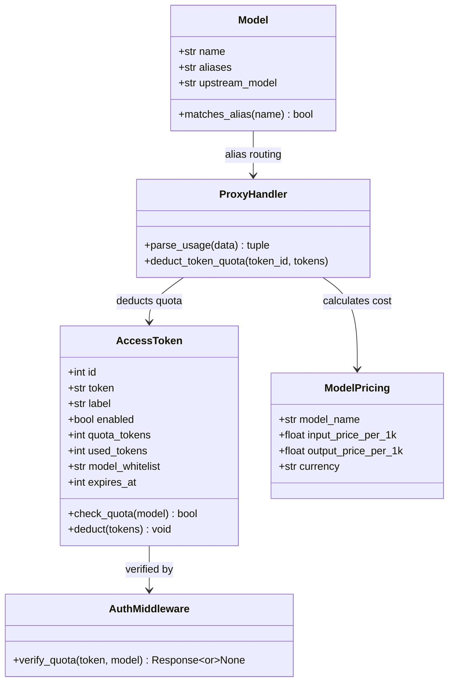
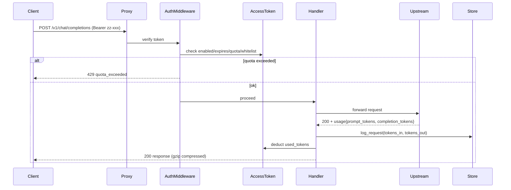

# zhongzhuan 优化 v2 系统设计

## 实现方案

### 1. Token 用量统计与成本估算
- **数据流**：handler 成功响应后解析 `usage.prompt_tokens/completion_tokens`，传给 `log_request()` 写入 `request_logs.tokens_in/tokens_out`
- **定价表**：新增 `model_pricing` 表（`model_name`, `input_price_per_1k`, `output_price_per_1k`, `currency`）
- **聚合查询**：`api_stats.py` 新增 `/api/stats/usage` 端点，按时间范围聚合 `SUM(tokens_in), SUM(tokens_out)`，JOIN pricing 算费用
- **仪表盘**：前端 ECharts 折线图展示趋势，KPI 卡片展示今日数据

### 2. 令牌配额管理
- **表扩展**：`access_tokens` 新增 `quota_tokens`（-1=无限）/`used_tokens`（默认0）/`model_whitelist`（逗号分隔，空=全部允许）/`expires_at`（0=永不过期）
- **校验流程**：`proxy/auth.py` 中间件在请求前：1) 验证 token 有效 2) 检查 expires_at 3) 检查 model_whitelist 4) 检查 used_tokens < quota_tokens
- **扣减流程**：handler 成功响应后异步 `UPDATE access_tokens SET used_tokens = used_tokens + ? WHERE id=?`
- **超限响应**：429 + `{"error":{"type":"quota_exceeded","message":"token quota exceeded"}}`

### 3. Gzip 压缩 + CORS
- **Gzip**：proxy server 的 `web.Application` 添加内置中间件，对非流式 JSON 响应自动压缩（`Content-Type: application/json` 且 >1KB）
- **CORS**：新增 `proxy/cors.py` 中间件，处理 OPTIONS 预检 + 给所有响应加 `Access-Control-Allow-Origin: *` 等头

### 4. Key 测试连通性
- **端点**：`POST /api/keys/{id}/test` → 用该 key 向上游发 `GET /v1/models`，返回 `{"ok":bool, "latency_ms":int, "status":int, "error":str}`
- **UI**：密钥表格每行加「测试」按钮

### 5. 模型别名映射
- **表扩展**：`models` 新增 `aliases` 字段（TEXT，逗号分隔多个别名）
- **路由**：handler `_resolve_candidates()` 中，若 `requested_model` 不直接匹配 `model_name`，则遍历所有 model 的 aliases 字段匹配
- **UI**：模型编辑表单加「别名」输入框

### 6. 优雅关闭
- **实现**：`__main__.py` 注册 SIGTERM/SIGINT 信号处理器，调用 `app.shutdown()` → 等待现有请求完成（超时30秒）→ `app.cleanup()`
- **aiohttp**：`web.run_app()` 已内置 SIGINT 处理，需自定义 SIGTERM 触发同样流程

### 7. UI 重做
- **技术**：单文件 HTML，内嵌 CSS Variables + 原生 JS + ECharts CDN
- **布局**：CSS Grid（sidebar + topbar + main），侧边栏可折叠
- **页面**：仪表盘/模型/密钥/分组/令牌/日志/设置
- **组件**：卡片、表格、模态框、Toast、徽章、滑块

## 框架选型理由
- **ECharts CDN**：new-api/VoAPI 都用 ECharts，中文文档完善，主题定制强
- **纯手写 CSS**：单文件 HTML 约束，避免引入构建工具，CSS Variables 足够实现 GitHub Dark
- **aiohttp 内置中间件**：Gzip 用 aiohttp 自带，CORS 自己写中间件（<50行）

## 完整文件列表

### 新增文件
| 路径 | 说明 |
|------|------|
| `src/zhongzhuan/proxy/cors.py` | CORS 中间件 |
| `src/zhongzhuan/store/pricing.py` | 模型定价 CRUD |
| `src/zhongzhuan/admin/api_usage.py` | 用量统计 API |
| `tests/test_cors.py` | CORS 中间件测试 |
| `tests/test_token_quota.py` | 令牌配额测试 |
| `tests/test_usage_stats.py` | 用量统计测试 |

### 修改文件
| 路径 | 改动 |
|------|------|
| `src/zhongzhuan/store/schema.py` | 新增 model_pricing 表 + access_tokens/models 字段扩展 + 迁移 |
| `src/zhongzhuan/store/access_tokens.py` | 扩展 AccessToken dataclass + 配额校验/扣减函数 |
| `src/zhongzhuan/store/models.py` | Model dataclass 加 aliases 字段 |
| `src/zhongzhuan/proxy/handler.py` | 解析 usage 传给 log_request + 别名路由 + 配额扣减 |
| `src/zhongzhuan/proxy/auth.py` | 配额校验逻辑 |
| `src/zhongzhuan/proxy/server.py` | 注册 Gzip + CORS 中间件 |
| `src/zhongzhuan/admin/api_keys.py` | 新增测试端点 |
| `src/zhongzhuan/admin/api_stats.py` | 新增用量统计端点 |
| `src/zhongzhuan/admin/api_tokens.py` | 配额字段管理 |
| `src/zhongzhuan/admin/server.py` | 注册 usage 路由 |
| `src/zhongzhuan/admin/ui.py` | **完全重写** — GitHub Dark + 侧边栏 + ECharts |
| `src/zhongzhuan/__main__.py` | SIGTERM 优雅关闭 |
| `tests/test_proxy_retry.py` | 修复 flaky test |

## Mermaid classDiagram

## Mermaid sequenceDiagram

## 任务列表（按依赖排序）

### 任务1：基础设施 — schema 扩展 + pricing CRUD
文件：`store/schema.py`, `store/pricing.py`, `store/models.py`, `store/access_tokens.py`
- 扩展 schema + 迁移语句
- 新增 model_pricing 表
- AccessToken dataclass 加 quota_tokens/used_tokens/model_whitelist/expires_at
- Model dataclass 加 aliases

### 任务2：配额校验 — auth 中间件 + handler 扣减
文件：`proxy/auth.py`, `proxy/handler.py`, `admin/api_tokens.py`
- auth 中间件加配额校验
- handler 成功后异步扣减 used_tokens
- api_tokens 端点支持配额字段 CRUD

### 任务3：用量统计 — handler 解析 usage + 聚合 API
文件：`proxy/handler.py`, `admin/api_usage.py`, `admin/api_stats.py`, `admin/server.py`
- handler 解析 usage 传给 log_request
- 新增 api_usage.py：/api/stats/usage 返回趋势 + 费用
- api_stats.py 扩展聚合查询

### 任务4：Gzip + CORS + 优雅关闭
文件：`proxy/cors.py`, `proxy/server.py`, `__main__.py`
- 新增 CORS 中间件
- proxy server 注册 Gzip + CORS
- __main__.py SIGTERM 处理

### 任务5：Key 测试 + 模型别名
文件：`admin/api_keys.py`, `proxy/handler.py`, `admin/api_models.py`
- api_keys 新增测试端点
- handler _resolve_candidates 加别名匹配
- api_models 支持 aliases 字段

### 任务6：UI 重做 — 单文件 HTML
文件：`admin/ui.py`
- 完全重写：GitHub Dark + 侧边栏 + ECharts 看板
- 所有现有页面迁移到新布局
- 新增仪表盘页面（KPI + 图表）

### 任务7：测试 + 修复
文件：`tests/test_cors.py`, `tests/test_token_quota.py`, `tests/test_usage_stats.py`, `tests/test_proxy_retry.py`
- 新增 3 个测试文件
- 修复 flaky test_proxy_rotates_key_on_429
