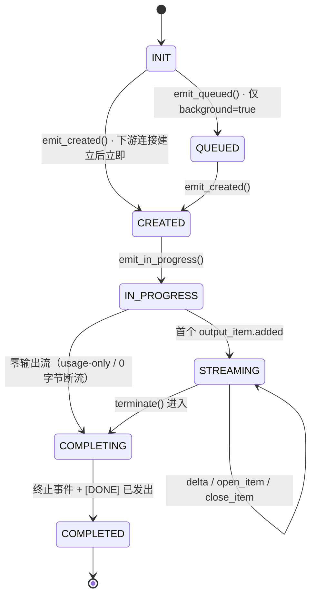
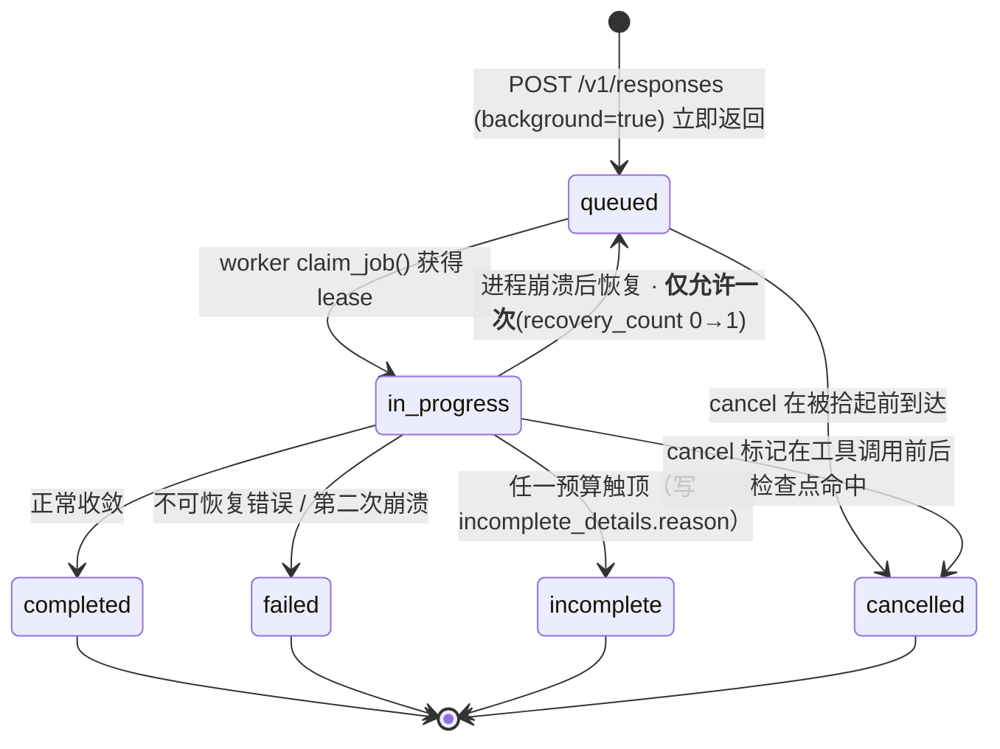
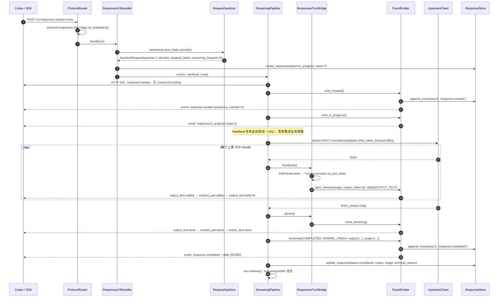
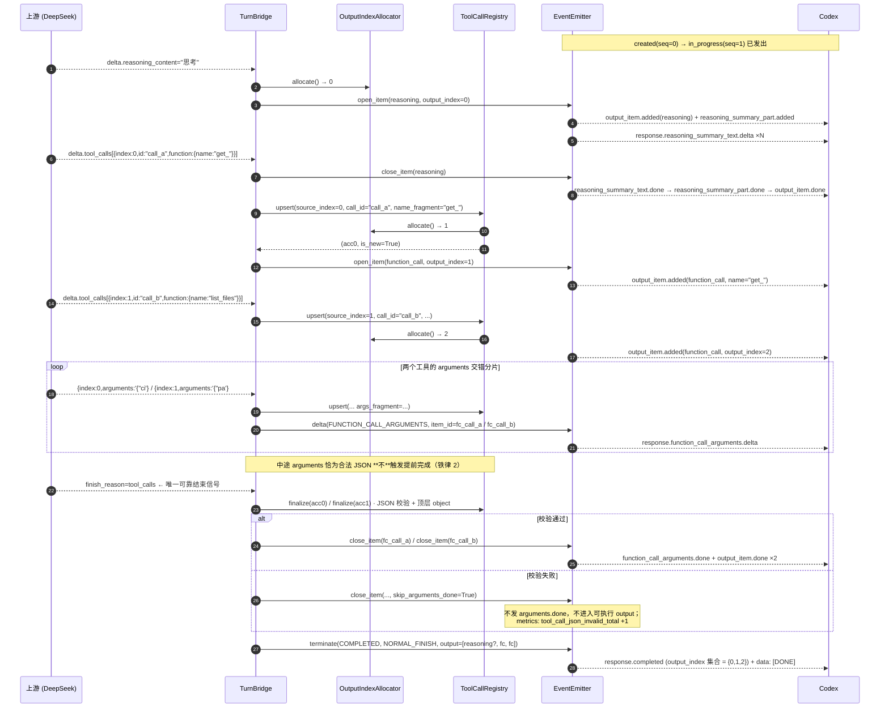
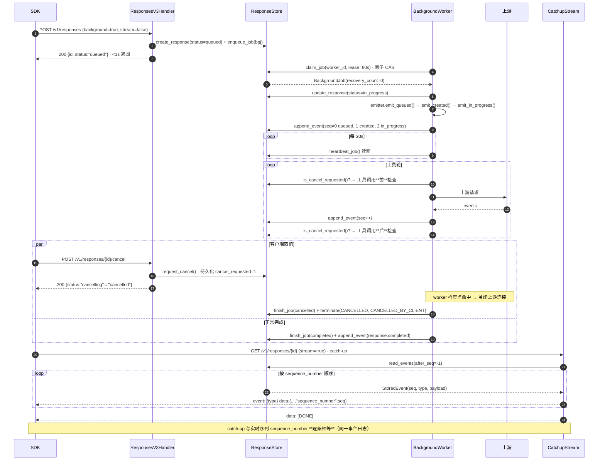
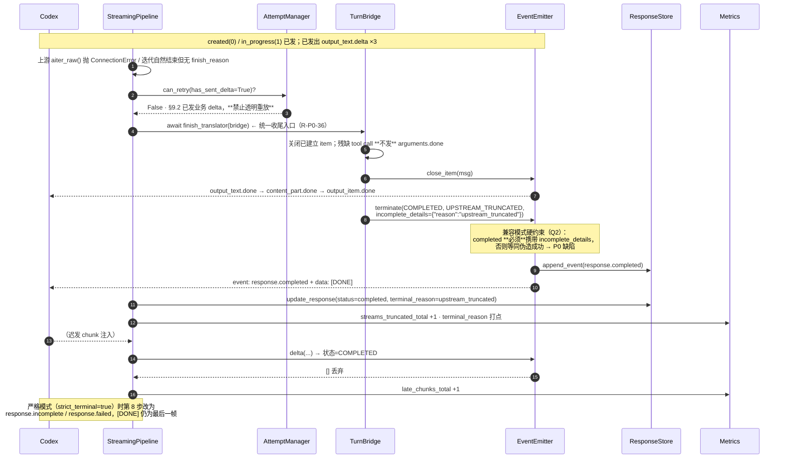
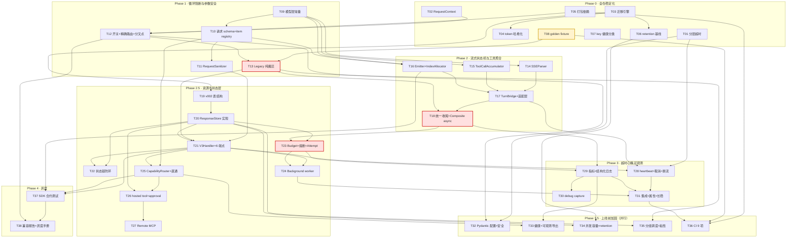

# zhongzhuan Responses Bridge v3 — 架构设计与任务分解

| 项 | 内容 |
|---|---|
| 文档类型 | 系统架构设计 + 有序任务分解（工程师直接消费） |
| 版本 | v1.0 |
| 编写人 | 高见远（架构师） |
| 权威输入 | `docs/v3/00-交付决策记录.md`（**最高优先级**）> `docs/v3/01-PRD-需求池.md` > `docs/zhongzhuan Responses Bridge v3 开发文档 ….md` > 代码审计实证 |
| 回归基线 | **179 个测试全绿**（`./.venv3/Scripts/python.exe -m pytest -q --ignore=tests/test_proxy_live.py --ignore=tests/test_real_e2e.py --ignore=tests/test_real_agnes.py -p no:cacheprovider`） |
| 交付范围 | Phase 0 → 3.5 全量 + Phase 4 机制；需求池 136 条 |

> **本文档只做设计与分解，不含实现代码**（接口签名、DDL、常量表除外）。
> 所有改造点均落到现有代码的**具体行号**。与 PRD 冲突处以 §0 的偏差记录为准。

---

## 0. 与上游文档的偏差与裁定（工程师必读）

| # | 冲突/缺口 | 裁定 | 依据 |
|---|---|---|---|
| B1 | PRD §5.2 表格与 §4-Q10 仍写「默认 `enabled: false`」 | **作废**。`responses_bridge.enabled` 默认 **`true`** | 决策记录 D3.1 |
| B2 | PRD 用表名 `response_event_log`，交付简报用 `response_events` | 统一为 **`response_events`** | 简化；本文 §4 为唯一 DDL 事实源 |
| B3 | R-P0-24 要求「翻译器公开签名不变」，R-P0-37/R-P1-65 要求 `CompositeStreamTranslator.finish_safely()` 改 async | **豁免 Composite**。现同步版 100% 抛 `TypeError`（`responses.py:634-640`），无可用调用方，改 async 不构成行为回归。`ResponsesStreamTranslator` / `StreamO2A` / `StreamA2O` 三者签名**严格不变** | D4 只点名三个类 |
| B4 | R-P0-38 只要求 output_index「互不相同」，R-P1-10 要求集合为 `{0,1,2,3}` | 取**更严**者：官方语义下 `output_index` 是 `output` 数组下标，必须**从 0 连续递增** | OpenAI 官方 schema |
| B5 | R-P0-27 把 `max_wall_time_seconds=900` 写成唯一值，Q8 又规定 background = 3600 | 拆为**两个预算实例**：`SYNC_BUDGET`(900s) / `BACKGROUND_BUDGET`(3600s)。R-P0-27 验收限定同步路径 | Q8 |
| B6 | §4.2.9 `capabilities` 只列 8 项，§3.3 #10 又要求 `tool_search` 走能力路由 | capability 枚举补第 **9** 项 `tool_search` | §3.3 |
| B7 | R-P0-08 extras 只分 `sqlite/tidb/admin/build`，但 R-P2-13 要 ruff/mypy/hypothesis/bandit | 补 `test` 与 `lint` 两组 extras | R-P2-13 |
| B8 | R-P0-21 要求「静默上游 120s 收到 ≥7 个 heartbeat」，但现有 `handler.py:751-762` 的 keepalive 在上游就绪时（`:893`）即被 cancel，**转发期间零 heartbeat** | heartbeat 必须由 `StreamingPipeline` 在**整个流生命周期**持续发送；旧协议保持现有 10s 等待期 keepalive 不变（D4） | 审计实证 |
| B9 | R-P0-30（重放熔断，Phase 2.5）实际依赖 AttemptManager，而 AttemptManager 属 R-P1-57（Phase 3.5 簇 K）→ **依赖成环** | **handler 拆分前移到 Phase 1（T13）**，解环 | 见 §6 |
| B10 | 文档 §5.5 建议 `async def feed(chunk)` | `SSEParser.feed()` 设计为**同步纯函数**（零 await），另提供 `afeed()` 薄包装满足文档口径。理由：R-P1-65 明令「禁止同步方法调用 async feed」，把纯 CPU 解析器做成 sync 从根上消除该类缺陷 | R-P1-65 |

---

## Part A · 系统设计

## 1. 实现路线与总体架构

### 1.1 核心技术难点

| # | 难点 | 解法 |
|---|---|---|
| 1 | 在**通配路由 + 371 行巨型 `__call__`** 上切出 v3 而不动旧协议 | 精确路由前置注册 + `RequestContext` + **纯搬迁式**拆分（T13 commit 内零逻辑变更） |
| 2 | 保留 `ResponsesStreamTranslator` 外部签名的同时彻底重写内核 | **门面 + 组合**：`ResponsesStreamTranslator` 退化为 `ResponsesTurnBridge` 的适配壳（§2.10） |
| 3 | 任意字节分片下工具名/arguments 完整重组 | 字节级 `SSEParser`（不做 chunk 级 decode）+ 双索引 `ToolCallRegistry` + 结束信号才 finalize |
| 4 | 流式收尾不得依赖翻译器可选属性 | 统一 `StreamTranslator` Protocol + 模块级 `finish_translator()` 助手，handler **永不**触碰翻译器内部字段 |
| 5 | 实时流与 catch-up 流共用同一 `sequence_number` | `ResponsesEventEmitter` 是**唯一**编号来源，写下游与写 `response_events` 同一次调用完成 |
| 6 | 有限终止（任意故障预算内收敛） | `ExecutionBudget` + `BudgetLedger` + 熔断六步执行器，挂在 response 生命周期层（不可被 HTTP 超时旁路） |
| 7 | SQLite 单连接 + 每 execute 即 commit vs. 事件日志高频写 | `WriterQueue` 批量落盘 + 显式事务；多实例强制 TiDB |

### 1.2 分层架构

```
                       ┌──────────────── aiohttp app ────────────────┐
  Codex / OpenAI SDK   │  cors → gzip → proxy_auth  (middlewares)     │
        │              └──────────────────────┬──────────────────────┘
        ▼                                     ▼
  ╔═ 精确路由（新注册，位于通配路由之前）═╗   ╔═ 通配路由 /v1/{tail:.*} ═╗
  ║  POST   /v1/responses                 ║   ║  ProxyHandler.__call__   ║
  ║  GET    /v1/responses/{id}            ║   ║  （唯一分叉点）           ║
  ║  DELETE /v1/responses/{id}            ║   ╚═══════════╤══════════════╝
  ║  POST   /v1/responses/{id}/cancel     ║               │
  ║  POST   /v1/responses/compact         ║   RequestContextBuilder
  ║  GET    /v1/responses/{id}/input_items║               │
  ║  GET    /v1/models                    ║      inbound=="responses"
  ╚═══════════════════╤═══════════════════╝       && flags.v3_enabled()
                      │                            ╱            ╲
                      └────────────────────────► 是              否
                                                  │               │
                                    ResponsesV3Handler   LegacyProtocolHandler
                                                  │        （行为逐字节冻结）
        ┌─────────────────────────────────────────┼──────────────────────────┐
        ▼                 ▼                       ▼            ▼             ▼
  RequestSanitizer  CapabilityRouter        AttemptManager  ResponseStore  Background
  ├ allowlist       ├ native 直通             ├ 重试白名单    ├ responses     Worker
  ├ reasoning 丢弃  ├ emulate 本地            ├ 重放熔断      ├ input_items   ├ lease
  ├ item 标准化     └ translate 降级          └ circuit open  ├ events        ├ heartbeat
  └ call_id 归一化                                            ├ bg_jobs       └ catch-up
                                 StreamingPipeline            ├ tool_exec
                                 ├ heartbeat(15s)             └ idempotency
                                 ├ 分层超时/取消
                                 └ ResponsesTurnBridge
                                    ├ SSEParser（字节级）
                                    ├ TurnAccumulator
                                    │   ├ TextAccumulator
                                    │   ├ EphemeralReasoningAccumulator
                                    │   └ ToolCallRegistry
                                    ├ OutputIndexAllocator
                                    └ ResponsesEventEmitter（状态机 + seq）
                                          └─► EventSink → response_events
```

**核心原则（§4 总体架构）**：解析 / 状态累积 / 事件生成三者严格分离。`ResponsesTurnBridge` 只做编排，不含分帧与索引逻辑。

---

## 2. 完整文件清单

> 图例：🆕 新建 · ✏️ 修改 · ❌ 删除。行数为**预估上限**。

### 2.1 协议层 `src/zhongzhuan/proxy/protocol/`

| 状态 | 路径 | 职责 | 行数 |
|---|---|---|---|
| 🆕 | `responses_models.py` | 全部 dataclass / StrEnum / 常量：`SanitizedRequest`、`NormalizedItem`、`OutputItem`、`EmitterState`、`TerminalReason`、`ErrorClass`、`Capability`、`ExecutionMode`、`DeltaKind` | 280 |
| 🆕 | `responses_errors.py` | 14 类错误 → 官方 `error` 对象 + HTTP 状态码映射 + 敏感串脱敏 | 190 |
| 🆕 | `responses_schema.py` | **版本化请求 schema**（§4.2.7 全量正式字段）+ 两步处理（先校验后按执行模式决定直通/消费/模拟/转换） | 430 |
| 🆕 | `item_registry.py` | **版本化 item registry**，18 类官方 item 的 `parse/serialize/redact` | 350 |
| 🆕 | `event_registry.py` | **版本化 streaming event registry**，事件族 → payload 构造器 + 生命周期校验 | 310 |
| 🆕 | `responses_request.py` | `RequestSanitizer`：allowlist 构造、reasoning 丢弃、instructions 合并、content block / function call / tools 转换 | 520 |
| 🆕 | `sse_parser.py` | 通用**字节级** SSE 分帧（`\n\n`/`\r\n\r\n`、多行 data、UTF-8 边界、comment/event/id/retry、坏帧计数） | 220 |
| 🆕 | `tool_accumulator.py` | `ToolCallAccumulator` + `ToolCallRegistry`（双索引、延迟 call_id 绑定、名称追加、finalize 校验、completed TTL 集合） | 310 |
| 🆕 | `turn_accumulator.py` | `TurnAccumulator` + `TextAccumulator` + `EphemeralReasoningAccumulator`（仅内存、流终止即释放） | 290 |
| 🆕 | `responses_emitter.py` | `OutputIndexAllocator` + `ResponsesEventEmitter`（显式状态机、`sequence_number`、heartbeat、幂等 `terminate()`、迟发拒绝） | 560 |
| 🆕 | `responses_bridge.py` | `ResponsesTurnBridge`：组合 parser/accumulator/allocator/emitter，对外只暴露 `feed`/`afinish` | 340 |
| 🆕 | `translator_base.py` | `StreamTranslator` Protocol + `async finish_translator(tr)` 统一收尾助手（**R-P0-36 的载体**） | 90 |
| ✏️ | `responses.py` | 瘦身为**对外兼容门面**：仅保留 `convert_responses_request_to_chatcompletions` / `chatcompletions_to_responses` / `ResponsesStreamTranslator` / `CompositeStreamTranslator` 四个公开符号，全部委托新模块；删除 `:37-44` 死代码、`:115-140` reasoning 回灌 | 646 → **≤300** |
| ✏️ | `detect.py` | `detect_inbound_protocol()` 返回值改为 `InboundProtocol` StrEnum（保留 `str` 子类，`:5-36` 行为不变） | 36 → 60 |

### 2.2 代理层 `src/zhongzhuan/proxy/`

| 状态 | 路径 | 职责 | 行数 |
|---|---|---|---|
| ✏️ | `handler.py` | 瘦身为**装配 + 唯一分叉点**；现 `:347-717`(`__call__`) 与 `:719-1051`(`_stream_proxy`) 整体搬迁 | 1118 → **≤300** |
| 🆕 | `context.py` | `RequestContext` + `RequestContextBuilder`（请求体全局**只解析一次**） | 230 |
| 🆕 | `route_registry.py` | `RouteRegistry`：keys / groups / client cache / sticky 的**唯一持有者**，legacy 与 v3 共享 | 200 |
| 🆕 | `router.py` | `ProtocolRouter`：`/v1/responses` 子路径**精确**解析为 `ResponsesEndpoint`；未知子路径返回官方 404（替代 `handler.py:387` 的 405） | 200 |
| 🆕 | `legacy_handler.py` | `LegacyProtocolHandler`：现有 Chat/Anthropic 逻辑**逐字节搬迁**，行为冻结 | 800 |
| 🆕 | `accounting.py` | `AccountingService`：请求日志、token 计费、key 用量（收编 `handler.py:1053+` 的 `_log_and_deduct`） | 170 |
| 🆕 | `concurrency.py` | 分层 semaphore（global / tenant / model / bg-worker / tool-pool）+ 排队上限 + 429/503 快速失败 | 190 |
| ✏️ | `retry.py` | `classify_failure()` 请求侧 4xx 不再 `mark_failure()`（`:168-170`）；`failure_count` 拆 `total_failures`/`consecutive_failures`；`mark_success()` 重置 consecutive | +80 |
| ✏️ | `scheduler.py` | `pick_group_model()` 接入真实调用链；`weighted` 改**平滑加权轮询**（可测试） | +90 |
| ✏️ | `ratelimit.py` | `KeyHealth` 增 `total_failures` / `consecutive_failures` / `capabilities` / `upstream_mode` 字段 | +40 |
| ✏️ | `server.py` | `:75` 通配路由**之前**注册 7 条精确路由；`:78` 死路由 `GET /v1/models` 与 handler 版合一；gzip 中间件对 `text/event-stream` 显式跳过 | +60 |
| ✏️ | `cors.py` | 默认 `*` → 可配置 allowlist（`:12`） | +40 |
| ❌ | `stream.py` | 死代码，零调用者（R-P2-22） | −全部 |

### 2.3 v3 子包 `src/zhongzhuan/proxy/responses_v3/`

| 状态 | 路径 | 职责 | 行数 |
|---|---|---|---|
| 🆕 | `__init__.py` | 导出 `ResponsesV3Handler` | 15 |
| 🆕 | `handler.py` | `ResponsesV3Handler`：6 端点分派 + response 生命周期编排 | 430 |
| 🆕 | `endpoints.py` | retrieve / delete / cancel / compact / input_items 的具体实现（分页、租户隔离、404 语义） | 390 |
| 🆕 | `pipeline.py` | `StreamingPipeline`：上游读取 → bridge → 下游写；heartbeat、first_token/read_idle/total 三类超时、客户端断开传播 | 470 |
| 🆕 | `attempt.py` | `AttemptManager`：4 类可重试白名单、首字节前最多 2 次切换、delta 后禁止重放、同位置反复断流 circuit open | 290 |
| 🆕 | `capability.py` | `CapabilityRouter`：三级优先级路由 + 启动期能力缺口报告 + fail-closed | 310 |
| 🆕 | `budget.py` | `ExecutionBudget` / `BudgetLedger` / `CircuitBreaker`（熔断六步执行器） | 330 |
| 🆕 | `chain.py` | 状态链恢复与防环（自引用、祖先环、深度 64、恢复 items/token 上限、compact 边界） | 250 |
| 🆕 | `background.py` | `BackgroundWorker`：claim/lease/heartbeat、cancel 检查点、崩溃后**只恢复一次**、独立预算 | 490 |
| 🆕 | `catchup.py` | catch-up 流：按 `sequence_number` 重放 `response_events`，与实时流逐条相等 | 150 |
| 🆕 | `passthrough.py` | 原生 Responses 直通：只做鉴权替换 / 模型映射 / 租户策略 / 审计，**不改写** output item | 270 |
| 🆕 | `hosted_tools.py` | hosted tool 识别、持久化、`unsupported_tool` 标准错误、approval 往返、幂等键 | 330 |
| 🆕 | `mcp_client.py` | Remote MCP client（唯一完整实现的 hosted tool 执行器） | 430 |

### 2.4 存储层 `src/zhongzhuan/store/`

| 状态 | 路径 | 职责 | 行数 |
|---|---|---|---|
| 🆕 | `migration_engine.py` | 迁移引擎：`schema_migrations` 版本表、事务化、错误码白名单（duplicate column/index）、SQLite 迁移前备份<br>**主理人裁定**：原设计名 `migrations.py` 与 `migrations/` 包同名会被遮蔽，改此名 | 270 |
| 🆕 | `migrations/__init__.py` | 迁移注册表（有序） | 45 |
| 🆕 | `migrations/v001_baseline.py` | 现有 10 表 + 15 条 ALTER 收编为基线（存量库自动标记已应用） | 130 |
| 🆕 | `migrations/v002_responses.py` | 6 张 Responses 表 + 索引（SQLite / MySQL 双版本） | 310 |
| 🆕 | `migrations/v003_token_hash.py` | `access_tokens` 明文 → `token_prefix + keyed_hash` 一次性哈希化 | 95 |
| 🆕 | `responses_store.py` | `ResponseStore` 实现（Protocol 见 §3.8） | 630 |
| 🆕 | `event_log.py` | append-only 事件日志（无 UPDATE/DELETE 路径，回收只走 `purge_expired`） | 210 |
| 🆕 | `background_jobs.py` | job 表访问：原子 claim、heartbeat 续租、终态写入 | 250 |
| 🆕 | `tool_executions.py` | 工具执行审计 + 幂等键唯一约束 | 190 |
| 🆕 | `idempotency.py` | `idempotency_records` 预留/落定/冲突 | 150 |
| 🆕 | `writer_queue.py` | 批量写队列（request_logs / response_events），显式事务 | 210 |
| 🆕 | `retention.py` | 各表独立 TTL + 容量上限 + 磁盘水位保护 + 定时调度 | 230 |
| ✏️ | `schema.py` | `SQLITE_SCHEMA`/`MYSQL_SCHEMA` 迁入 `migrations/v001`；移除 `:6-22`/`:24-40` 硬编码 ALTER；修掉 `:269` MySQL `CREATE INDEX IF NOT EXISTS` | 271 → 60 |
| ✏️ | `sqlite_store.py` | `:31-37` 吞异常改走迁移引擎；`:41-44` 每次 commit 改显式事务 + `transaction()` 上下文；连接改 `aiosqlite` 池化 + 写锁 | +120 |
| ✏️ | `tidb_store.py` | `:49-58` 同上；`CREATE INDEX` 走引擎（容忍 errno 1061） | +90 |
| ✏️ | `access_tokens.py` | `:75-89` 列表只回 `prefix + 掩码`；校验用常量时间比较；增 rotation/last_used_at/created_by/revoke audit | +110 |
| ✏️ | `logs.py` | `cleanup_old_logs()`（`:103`）接入 `retention.py` 调度 | +10 |

### 2.5 配置层 `src/zhongzhuan/config/`

| 状态 | 路径 | 职责 | 行数 |
|---|---|---|---|
| 🆕 | `timeouts.py` | `TimeoutPolicy` 六项 + 下限强校验（`first_token`/`read_idle` ≥ 300s） | 140 |
| 🆕 | `responses_bridge.py` | `responses_bridge.*` 完整配置段（§15 全部键） | 230 |
| 🆕 | `feature_flags.py` | 四级灰度求值（env > key > model > group > global > default） | 160 |
| 🆕 | `schema.py` | Pydantic 严格 schema：类型/范围/未知字段报错（Phase 3.5 替换 `_merge()`） | 490 |
| 🆕 | `effective.py` | 启动期打印 effective config + 来源标注（default/YAML/env/DB）+ 脱敏 | 150 |
| ✏️ | `config.py` | `LimitsConfig.proxy_request_timeout`(`:39`) 标记 deprecated；`_merge()`(`:90-98`) 交给 pydantic；`StorageConfig.__post_init__` 绕过问题修复 | +70 |

### 2.6 可观测性 `src/zhongzhuan/observability/`

| 状态 | 路径 | 职责 | 行数 |
|---|---|---|---|
| 🆕 | `metrics.py` | 13 个 Responses 指标 + 熔断/能力路由指标；Prometheus exporter | 320 |
| 🆕 | `logfields.py` | 14 字段结构化日志构造器 + 敏感模式过滤器 | 190 |
| 🆕 | `capture.py` | 匿名化 debug capture + 离线 replay 入口 | 250 |
| 🆕 | `tracing.py` | OpenTelemetry span（TTFT / 每事件延迟 / 重试原因 / 能力路由 / 熔断原因） | 170 |
| 🆕 | `health.py` | `/healthz` 分层：liveness / readiness / dependency | 210 |

### 2.7 测试与工程 `tests/` · 根目录

| 状态 | 路径 | 职责 | 行数 |
|---|---|---|---|
| 🆕 | `tests/support/sse_assert.py` | `assert_lifecycle()` 统一断言器（created→…→terminal→[DONE] 各一次） | 210 |
| 🆕 | `tests/support/mock_responses_upstream.py` | 可编程 mock 上游（分片策略、延迟、断流、429/5xx 注入） | 290 |
| 🆕 | `tests/golden/legacy/*.sse` | ≥12 条旧协议**字节级**基线 | — |
| 🆕 | `tests/test_legacy_golden.py` | golden 对比 job | 180 |
| 🆕 | `tests/property/test_sse_split.py` | Hypothesis 5 类分片场景，min examples ≥200 | 250 |
| 🆕 | `tests/contract/python/`、`tests/contract/typescript/` | OpenAI SDK 合约测试 | 520 |
| 🆕 | `tests/test_responses_*.py` ×14 | 单元/集成用例（§12.1 全 17 项 + §12.3 全 9 项） | ~2700 |
| ✏️ | `tests/seed_admin_api.py` | 删除 `:10` 硬编码真实 API key | −5 |
| ❌➡️ | `tests/test_proxy_live.py` | 移至 `scripts/live_check.py`（模块级 `asyncio.run` 中断 collection） | — |
| 🆕 | `README.md` | 补齐（`pyproject.toml` `readme=` 已引用但缺失） | — |
| 🆕 | `.github/workflows/ci.yml` | 9 项 required check | 240 |
| ✏️ | `pyproject.toml` | 依赖唯一事实源 + 6 组 extras | +45 |
| ✏️ | `.gitignore` | 覆盖 `data.db-wal`/`data.db-shm`/构建产物 | +6 |

**汇总：新建 ≈ 71 个文件，修改 ≈ 17 个，删除 2 个。**

---

## 3. 核心数据结构与接口

> 以下签名工程师可直接照抄。全部位于 `responses_models.py` 除非另有标注。

### 3.1 枚举与常量

```python
class InboundProtocol(str, Enum):
    OPENAI = "openai"; ANTHROPIC = "anthropic"; RESPONSES = "responses"

class ResponsesEndpoint(str, Enum):
    CREATE = "create"                 # POST   /v1/responses
    RETRIEVE = "retrieve"             # GET    /v1/responses/{id}
    DELETE = "delete"                 # DELETE /v1/responses/{id}
    CANCEL = "cancel"                 # POST   /v1/responses/{id}/cancel
    COMPACT = "compact"               # POST   /v1/responses/compact
    INPUT_ITEMS = "input_items"       # GET    /v1/responses/{id}/input_items

class ResponseStatus(str, Enum):
    QUEUED = "queued"; IN_PROGRESS = "in_progress"; COMPLETED = "completed"
    FAILED = "failed"; INCOMPLETE = "incomplete"; CANCELLED = "cancelled"

class EmitterState(str, Enum):
    INIT = "init"; QUEUED = "queued"; CREATED = "created"
    IN_PROGRESS = "in_progress"; STREAMING = "streaming"
    COMPLETING = "completing"; COMPLETED = "completed"

class ExecutionMode(str, Enum):
    NATIVE = "native"; EMULATE = "emulate"; TRANSLATE = "translate"

class Capability(str, Enum):                       # 9 项（B6 补 tool_search）
    STATEFUL_RESPONSES = "stateful_responses"; BACKGROUND = "background"
    WEB_SEARCH = "web_search"; FILE_SEARCH = "file_search"
    COMPUTER = "computer"; CODE_INTERPRETER = "code_interpreter"
    IMAGE_GENERATION = "image_generation"; REMOTE_MCP = "remote_mcp"
    TOOL_SEARCH = "tool_search"

class DeltaKind(str, Enum):
    OUTPUT_TEXT = "output_text"; REFUSAL = "refusal"
    REASONING_SUMMARY_TEXT = "reasoning_summary_text"
    REASONING_TEXT = "reasoning_text"
    FUNCTION_CALL_ARGUMENTS = "function_call_arguments"

class ErrorClass(str, Enum):                       # 14 类（12 + Q4 新增 2）
    INVALID_CLIENT_REQUEST = "invalid_client_request"
    UNSUPPORTED_INPUT_BLOCK = "unsupported_input_block"
    UPSTREAM_CONNECT_ERROR = "upstream_connect_error"
    UPSTREAM_RATE_LIMITED = "upstream_rate_limited"
    UPSTREAM_SERVER_ERROR = "upstream_server_error"
    FIRST_TOKEN_TIMEOUT = "first_token_timeout"
    READ_IDLE_TIMEOUT = "read_idle_timeout"
    UPSTREAM_TRUNCATED = "upstream_truncated"
    INVALID_SSE_FRAME = "invalid_sse_frame"
    INVALID_TOOL_ARGUMENTS = "invalid_tool_arguments"
    CLIENT_DISCONNECTED = "client_disconnected"
    INTERNAL_TRANSLATION_ERROR = "internal_translation_error"
    UNSUPPORTED_TOOL_CAPABILITY = "unsupported_tool_capability"
    CAPABILITY_ROUTE_UNAVAILABLE = "capability_route_unavailable"

class TerminalReason(str, Enum):
    NORMAL_FINISH = "normal_finish"
    # —— §9.4 十类熔断 ——
    MAX_TOOL_ROUNDS = "max_tool_rounds"
    MAX_TOTAL_TOOL_CALLS = "max_total_tool_calls"
    REPEATED_TOOL_CALL = "repeated_tool_call"
    REPEATED_TOOL_FAILURE = "repeated_tool_failure"
    MAX_RESPONSE_TIME = "max_response_time"
    MAX_OUTPUT_BUDGET = "max_output_budget"
    RESPONSE_CHAIN_CYCLE = "response_chain_cycle"
    RESPONSE_CHAIN_TOO_DEEP = "response_chain_too_deep"
    RETRY_BUDGET_EXHAUSTED = "retry_budget_exhausted"
    BACKGROUND_BUDGET_EXHAUSTED = "background_budget_exhausted"
    # —— 非熔断终止 ——
    UPSTREAM_TRUNCATED = "upstream_truncated"
    CAPABILITY_ROUTE_UNAVAILABLE = "capability_route_unavailable"
    CLIENT_DISCONNECTED = "client_disconnected"
    UPSTREAM_ERROR = "upstream_error"
    CANCELLED_BY_CLIENT = "cancelled_by_client"
```

### 3.2 `RequestContext`（`proxy/context.py`）

```python
@dataclass
class RequestContext:
    request_id: str
    workspace_id: str = "default"
    inbound_protocol: InboundProtocol = InboundProtocol.OPENAI
    endpoint: ResponsesEndpoint | None = None     # 仅 responses 路径非空
    response_id_param: str = ""                   # 路径参数 {response_id}
    method: str = ""
    path: str = ""
    raw_body: bytes = b""
    json_body: dict | None = None                 # 全局唯一一次解析（R-P1-63）
    requested_model: str = ""
    stream: bool = False
    background: bool = False
    store_enabled: bool = True
    idempotency_key: str = ""
    session_id_hash: str = ""                     # 首轮稳定指纹，不含 reasoning
    client_disconnected: asyncio.Event = field(default_factory=asyncio.Event)
    started_at: float = 0.0
    v3_enabled: bool = False
    log: "LogAccumulator" = field(default_factory=LogAccumulator)

class RequestContextBuilder:
    def __init__(self, flags: FeatureFlags, router: ProtocolRouter) -> None: ...
    async def build(self, request: web.Request) -> RequestContext: ...
```

### 3.3 `SanitizedRequest`（`responses_request.py`）

```python
@dataclass
class NormalizedItem:
    id: str
    seq: int
    item_type: str                 # message / function_call / reasoning / ...
    role: str = ""
    payload: dict = field(default_factory=dict)
    redacted: bool = False         # reasoning 项恒为 True，payload 只留元数据

@dataclass
class HostedToolSpec:
    tool_type: str                 # web_search / code_interpreter / mcp / ...
    raw: dict
    required_capability: Capability
    param_path: str                # "tools[2].type"，用于错误体 param 字段

@dataclass
class SanitizedRequest:
    # —— 文档 §5.1 规定的四字段（签名不变）——
    payload: dict                          # allowlist 构造的上游请求体
    dropped_fields: list[str]
    normalized_call_ids: dict[str, str]
    warnings: list[str]
    # —— v3 扩展 ——
    input_items: list[NormalizedItem] = field(default_factory=list)
    reasoning_items_dropped: int = 0
    hosted_tools: list[HostedToolSpec] = field(default_factory=list)
    required_capabilities: frozenset[Capability] = frozenset()
    reasoning_event_mode: str = "reasoning_summary_text"
    text_format: dict | None = None        # Q7：消费后转 response_format
    max_output_tokens: int | None = None

CHAT_BASE_ALLOWED: frozenset[str] = frozenset({
    "model","temperature","top_p","max_tokens","stop","stream","tools",
    "tool_choice","response_format","seed","user","reasoning_effort",
})
# 上游只能在此基础上「收窄」，禁止扩张
PROVIDER_CAPABILITIES: dict[str, frozenset[str]] = {...}   # deepseek / openai_compatible / anthropic

class RequestSanitizer:
    def __init__(self, cfg: ResponsesBridgeConfig, schema: ResponsesRequestSchema) -> None: ...
    def sanitize(self, body: dict, *, provider: str,
                 restored_items: Sequence[NormalizedItem] = ()) -> SanitizedRequest: ...
```

> **禁止**出现 `result = dict(body)`（R-P0-19，对应现 `responses.py:107`）；
> **禁止**出现符号 `pending_reasoning` / `pending_reasoning_encrypted` / `attach_pending_reasoning`（R-P0-13，对应现 `responses.py:115-140`）。

### 3.4 `SSEParser`（`sse_parser.py`）

```python
@dataclass(frozen=True)
class SSEEvent:
    event: str = ""            # event: 字段，缺省 ""
    data: str = ""             # 多行 data: 以 "\n" 连接
    id: str = ""
    retry: int | None = None
    comment: str = ""          # ": " 开头的注释行
    raw_bytes: int = 0

class SSEParser:
    """字节级分帧。缓冲区是 bytes，**不做** chunk 级 decode —— 这是 UTF-8 边界正确性的前提。"""
    def __init__(self, *, max_event_bytes: int = 8 * 1024 * 1024) -> None: ...
    def feed(self, chunk: bytes) -> list[SSEEvent]: ...      # 同步纯函数（B10）
    def finish(self) -> list[SSEEvent]: ...                  # 冲刷残留缓冲
    async def afeed(self, chunk: bytes) -> list[SSEEvent]: ...   # 文档口径薄包装
    @property
    def invalid_frames(self) -> int: ...                     # 坏帧计数（R-P1-12）
    @property
    def pending_bytes(self) -> int: ...
```

### 3.5 `ToolCallAccumulator` / `ToolCallRegistry`（`tool_accumulator.py`）

```python
@dataclass
class ToolCallAccumulator:
    source_index: int
    output_index: int
    call_id: str = ""
    synthetic_call_id: str = ""     # call_{response_id}_{source_index}
    name: str = ""
    arguments: str = ""
    item_added: bool = False
    arguments_done: bool = False
    item_done: bool = False
    fragments: int = 0

    @property
    def effective_call_id(self) -> str:      # call_id or synthetic_call_id
        ...

@dataclass
class FinalizeResult:
    ok: bool
    parsed: dict | None
    error: ErrorClass | None                 # INVALID_TOOL_ARGUMENTS

class ToolCallRegistry:
    tools_by_call_id: dict[str, ToolCallAccumulator]
    tools_by_source_index: dict[int, ToolCallAccumulator]
    completed_call_ids: dict[str, float]     # 短 TTL 重放检测（R-P0-33）

    def __init__(self, response_id: str, allocator: "OutputIndexAllocator",
                 *, completed_ttl_seconds: float = 300.0) -> None: ...

    def upsert(self, *, source_index: int, call_id: str = "",
               name_fragment: str = "", args_fragment: str = "") -> tuple[ToolCallAccumulator, bool]:
        """三级匹配优先级：已有 call_id → 已有 source_index → 新建。
        返回 (acc, is_new)。is_new=True 时调用方须发 output_item.added。"""

    def bind_late_call_id(self, acc: ToolCallAccumulator, call_id: str) -> None: ...
    def finalize(self, acc: ToolCallAccumulator, *,
                 require_json_object: bool = True) -> FinalizeResult: ...
    def is_replay(self, call_id: str) -> bool: ...
    def open_accumulators(self) -> list[ToolCallAccumulator]: ...
```

**函数名合并规则（R-P1-08 / R-P1-72，替换现 `responses.py:565-567` 的覆盖式赋值）**

| 输入 | 处理 |
|---|---|
| `acc.name == ""` | `acc.name = frag` |
| `frag == acc.name` | 忽略（重复完整值） |
| `acc.name.endswith(frag) and len(frag) >= len(acc.name)` | 忽略 |
| 其余 | `acc.name += frag`（分片追加） |

**arguments 规则**：每个非空 fragment **原样追加**；delta 可实时发；**结束信号前不发 `.done`**；结束时 `json.loads` 校验且默认要求顶层为 object；失败 → 不创建可执行 function call + `responses_tool_call_json_invalid_total` +1。

### 3.6 `EphemeralReasoningAccumulator` / `TurnAccumulator`（`turn_accumulator.py`）

```python
@dataclass
class EphemeralReasoningAccumulator:
    output_index: int
    item_id: str
    text: str = ""
    added: bool = False
    done: bool = False
    def release(self) -> None:
        """流终止后立即调用：清空 text 并断开引用（R-P1-04）。禁止持久化 text。"""

@dataclass
class TextAccumulator:
    output_index: int
    item_id: str
    text: str = ""
    item_added: bool = False
    part_added: bool = False
    item_done: bool = False

class TurnAccumulator:
    """当轮状态聚合。只做状态，不发事件、不分帧。"""
    def __init__(self, response_id: str, allocator: "OutputIndexAllocator") -> None: ...
    text: TextAccumulator | None
    reasoning: EphemeralReasoningAccumulator | None
    tools: ToolCallRegistry
    def on_reasoning_delta(self, text: str) -> ...
    def on_text_delta(self, text: str) -> ...
    def on_tool_delta(self, *, source_index, call_id, name, arguments) -> ...
    def snapshot_output(self) -> list[dict]:     # 供 response.completed 的 output 数组
    def release(self) -> None:                   # 释放 reasoning，供 R-P1-04 验收
```

### 3.7 `OutputIndexAllocator` / `ResponsesEventEmitter`（`responses_emitter.py`）

```python
class OutputIndexAllocator:
    """message / reasoning / function_call 共用同一全局索引空间。
    替换现 responses.py:365 / :541 / :572 三处各自为政的索引来源。"""
    def __init__(self) -> None: self._next = 0
    def allocate(self) -> int: ...          # 从 0 起连续递增（B4）
    @property
    def allocated(self) -> int: ...

class EventSink(Protocol):
    async def append_event(self, response_id: str, workspace_id: str,
                           seq: int, event_type: str, payload: dict) -> None: ...

class ResponsesEventEmitter:
    def __init__(self, *, response_id: str, model: str, created_at: int,
                 background: bool = False,
                 reasoning_event_mode: str = "reasoning_summary_text",
                 compatibility_terminal_event: str = "completed",
                 sink: EventSink | None = None,
                 metrics: "Metrics | None" = None) -> None: ...

    # —— 状态（补上 handler.py:949 期望但不存在的属性）——
    @property
    def state(self) -> EmitterState: ...
    @property
    def sequence_number(self) -> int: ...        # 下一个将分配的编号，首个为 0（R-P1-74）
    @property
    def terminated(self) -> bool: ...
    @property
    def rejected_transitions(self) -> int: ...
    @property
    def late_chunks(self) -> int: ...

    # —— 生命周期 ——
    def emit_queued(self) -> list[bytes]: ...    # 仅 background=true（Q9）
    def emit_created(self) -> list[bytes]: ...   # 下游连接建立后立即调用，不等上游
    def emit_in_progress(self) -> list[bytes]: ...
    def open_item(self, item: "OutputItem") -> list[bytes]: ...
    def delta(self, item_id: str, kind: DeltaKind, text: str, *,
              content_index: int = 0, summary_index: int = 0) -> list[bytes]: ...
    def close_item(self, item_id: str) -> list[bytes]: ...
    def heartbeat(self) -> bytes: ...            # b": hb\n\n"，不改变状态（R-P0-21）
    def terminate(self, status: ResponseStatus, *,
                  terminal_reason: TerminalReason,
                  incomplete_details: dict | None = None,
                  error: dict | None = None,
                  usage: dict | None = None,
                  output: list[dict] | None = None) -> list[bytes]:
        """幂等。第二次及以后调用返回 []。
        恰好发出 1 个终止事件 + 1 个 `data: [DONE]`（R-P0-18）。
        completed payload 必须含 output 数组与 usage（R-P1-73）。"""
```

### 3.8 `ResponseStore`（`store/responses_store.py`）

```python
@dataclass
class Page(Generic[T]):
    data: list[T]; has_more: bool; first_id: str; last_id: str

@dataclass
class ChainResolution:
    items: list[NormalizedItem]
    depth: int
    visited: list[str]
    error: ErrorClass | None = None
    terminal_reason: TerminalReason | None = None

class ResponseStore(Protocol):
    # responses
    async def create_response(self, rec: ResponseRecord) -> None: ...
    async def update_response(self, response_id: str, ws: str, **fields) -> None: ...
    async def get_response(self, response_id: str, ws: str) -> ResponseRecord | None: ...
    async def delete_response(self, response_id: str, ws: str) -> bool: ...
    # input items
    async def put_input_items(self, response_id: str, ws: str,
                              items: Sequence[NormalizedItem]) -> None: ...
    async def list_input_items(self, response_id: str, ws: str, *, limit: int = 20,
                               after: str = "", before: str = "",
                               order: str = "asc") -> Page[NormalizedItem]: ...
    # append-only event log（无 update/delete 路径）
    async def append_event(self, response_id: str, ws: str, seq: int,
                           event_type: str, payload: dict) -> None: ...
    async def read_events(self, response_id: str, ws: str, *,
                          after_seq: int = -1, limit: int = 1000) -> list[StoredEvent]: ...
    # 状态链
    async def resolve_chain(self, response_id: str, ws: str, *, max_depth: int = 64,
                            max_items: int = 2000,
                            max_tokens: int = 200_000) -> ChainResolution: ...
    # background
    async def enqueue_job(self, job: BackgroundJob) -> None: ...
    async def claim_job(self, worker_id: str, *, lease_seconds: int = 60) -> BackgroundJob | None: ...
    async def heartbeat_job(self, job_id: str, worker_id: str, *, lease_seconds: int = 60) -> bool: ...
    async def finish_job(self, job_id: str, status: ResponseStatus, **fields) -> None: ...
    async def request_cancel(self, response_id: str, ws: str) -> bool: ...
    async def is_cancel_requested(self, response_id: str, ws: str) -> bool: ...
    # 工具与幂等
    async def record_tool_execution(self, rec: ToolExecutionRecord) -> ToolExecutionRecord: ...
    async def reserve_idempotency(self, ws: str, key: str, digest: str) -> IdempotencyOutcome: ...
    # 保留
    async def purge_expired(self, now: int, limits: RetentionLimits) -> PurgeReport: ...
```

### 3.9 `CapabilityRouter`（`responses_v3/capability.py`）

```python
@dataclass(frozen=True)
class CapabilityGap:
    capability: Capability
    reason: str                 # "no upstream declares capability" / "route unavailable"
    param_path: str = ""

@dataclass(frozen=True)
class RouteDecision:
    mode: ExecutionMode
    key: KeyHealth
    upstream_path: str          # /v1/responses | /v1/chat/completions | /v1/messages
    granted: frozenset[Capability]
    gaps: tuple[CapabilityGap, ...] = ()
    reason: str = ""

class CapabilityRouter:
    def __init__(self, registry: RouteRegistry, cfg: ResponsesBridgeConfig) -> None: ...
    def route(self, req: SanitizedRequest,
              candidates: Sequence[KeyHealth]) -> RouteDecision | CapabilityError:
        """三级优先级：NATIVE（原生直通）> EMULATE（本地完整模拟）> TRANSLATE（等价降级）。
        无任何路由承载 required_capabilities → 返回 CapabilityError(UNSUPPORTED_TOOL_CAPABILITY)。
        有声明但当前不可用（熔断/限流/宕机）→ CAPABILITY_ROUTE_UNAVAILABLE。"""
    def startup_gap_report(self) -> list[CapabilityGap]: ...
    def assert_startup_ok(self, *, strict: bool) -> None:
        """strict=True（生产默认）且存在缺口 → 抛异常 fail closed；否则 WARN。"""
```

### 3.10 `ExecutionBudget`（`responses_v3/budget.py`）

```python
@dataclass(frozen=True)
class ExecutionBudget:
    max_tool_rounds: int = 32
    max_calls_per_tool: int = 8
    max_identical_call_repeats: int = 2
    max_total_tool_calls: int = 64
    max_wall_time_seconds: int = 900          # 不可为 0/None（Q8），否则启动报错
    max_output_tokens_total: int = 200_000
    max_chain_depth: int = 64
    max_upstream_switches: int = 2            # 首字节前最多切换次数（§9.2）

SYNC_BUDGET       = ExecutionBudget()                                  # 900s
BACKGROUND_BUDGET = ExecutionBudget(max_wall_time_seconds=3600)        # Q8 / B5

@dataclass
class BudgetLedger:
    budget: ExecutionBudget
    started_at: float
    tool_rounds: int = 0
    total_tool_calls: int = 0
    calls_per_tool: dict[str, int] = field(default_factory=dict)
    identical_signatures: dict[str, int] = field(default_factory=dict)
    failure_signatures: dict[str, int] = field(default_factory=dict)
    output_tokens: int = 0
    upstream_switches: int = 0

    def charge_round(self) -> TerminalReason | None: ...
    def charge_tool_call(self, name: str, args_canonical: str) -> TerminalReason | None: ...
    def charge_tool_result(self, signature: str, failed: bool) -> TerminalReason | None: ...
    def charge_output_tokens(self, n: int) -> TerminalReason | None: ...
    def charge_upstream_switch(self) -> TerminalReason | None: ...
    def check_wall_time(self, now: float) -> TerminalReason | None: ...

def tool_signature(name: str, arguments: str, result_or_error: str = "") -> str:
    """sha256(tool_name + canonical_json(arguments) + normalized_result_or_error)。
    canonical_json：键序排序、无多余空白、call_id 剔除 → 仅空白/键序/call_id 差异视为同一调用。"""
```

**熔断六步执行器（R-P0-32，顺序不可变）**

```python
class CircuitBreaker:
    async def trip(self, reason: TerminalReason, ctx: RequestContext,
                   pipeline: StreamingPipeline, emitter: ResponsesEventEmitter,
                   turn: TurnAccumulator, store: ResponseStore) -> None:
        # 1. 停止读取 / 取消上游
        # 2. 停止调度新工具
        # 3. 回滚未提交副作用，或记录不可回滚项到 tool_executions
        # 4. 关闭已开启的 output item（残缺 tool call 不发 arguments.done）
        # 5. emitter.terminate(...) —— 且仅一个终止事件 + [DONE]
        # 6. 写结构化日志 + 指标 + 审计事件
```

### 3.11 统一收尾接口（`translator_base.py`）—— R-P0-36 的载体

```python
class StreamTranslator(Protocol):
    async def feed(self, chunk: bytes) -> list[bytes]: ...
    @property
    def done(self) -> bool: ...
    @property
    def usage(self) -> dict: ...

async def finish_translator(tr: object) -> list[bytes]:
    """所有收尾的唯一入口。handler / pipeline **禁止**直接访问 .state / .finish_safely。
    优先 afinish()（async），退回 finish_safely()（sync）。
    任何异常都被吞掉并记录，最低限度保证返回 [b"data: [DONE]\\n\\n"]。"""
```

> `handler.py:943-953` 现直接读 `stream_translator.state` → `AttributeError` → 客户端永收不到 `completed`/`[DONE]`。
> **改法**：整段替换为 `closing = await finish_translator(stream_translator)`，日志改打 `getattr(tr, "state", "n/a")`。

---

## 4. 状态机

### 4.1 Responses SSE 发射器状态机



**合法转换全表**

| # | From | To | 触发 | 备注 |
|---|---|---|---|---|
| 1 | INIT | QUEUED | `emit_queued()` | 仅 `background=true`（Q9） |
| 2 | INIT | CREATED | `emit_created()` | 同步流式唯一入口 |
| 3 | QUEUED | CREATED | `emit_created()` | worker 拾起任务时 |
| 4 | CREATED | IN_PROGRESS | `emit_in_progress()` | 必经 |
| 5 | IN_PROGRESS | STREAMING | 首个 `open_item()` | |
| 6 | IN_PROGRESS | COMPLETING | `terminate()` | 零输出路径（R-P0-40） |
| 7 | STREAMING | STREAMING | `delta()`/`open_item()`/`close_item()` | 自环 |
| 8 | STREAMING | COMPLETING | `terminate()` | |
| 9 | COMPLETING | COMPLETED | 内部：终止事件 + `[DONE]` 写出后 | 原子 |
| — | 任意 | 任意 | `heartbeat()` | **不改变状态**（R-P0-21） |

**必须拒绝的非法转换**（记 `responses_illegal_transitions_total` + WARN 日志，**不抛异常中断流**）

| # | 非法转换 | 处理 |
|---|---|---|
| 1 | `INIT → COMPLETED` | 拒绝；强制补发 created + in_progress 后再终止 |
| 2 | `INIT/QUEUED → STREAMING` | 拒绝；丢弃该 item 事件 |
| 3 | `CREATED → COMPLETED`（跳过 IN_PROGRESS） | 拒绝；自动补发 `in_progress` |
| 4 | `COMPLETED → delta/open_item/close_item` | 丢弃 + `responses_late_chunks_total` +1（R-P0-31） |
| 5 | 同一 `item_id` 重复 `open_item()` | 丢弃第二次 |
| 6 | `close_item()` 后对同 item 再 `delta()` | 丢弃 + late_chunks +1 |
| 7 | 重复 `terminate()` | 返回 `[]`（幂等，R-P0-18） |
| 8 | 未 `open_item()` 直接 `delta()` | 拒绝 + 记 `internal_translation_error` |
| 9 | `close_item()` 未开启的 item | 拒绝 |

### 4.2 Background task 状态机



| 规则 | 说明 |
|---|---|
| lease | `claim_job()` 原子 CAS：`status='queued' AND lease_expires_at < now` → 置 `in_progress` + `lease_owner` + `lease_expires_at = now+60`。避免多实例重复执行 |
| heartbeat | worker 每 20s 续租；lease 过期即视为崩溃，可被重新 claim |
| 恢复一次 | `recovery_count >= 1` 的 job 不再回 `queued`，直接 `failed`（R-P1-37，防 crash-restart 循环） |
| cancel | `cancel_requested=1` 持久化；worker 在**每次工具调用前后**检查；同时向上游传播（关闭连接） |
| 终态不可逆 | 四个终态无出边；重复 cancel 返回当前状态，不产生额外事件 |
| catch-up | 终态后客户端可用 `stream=true` 重连，从 `response_events` 按 `sequence_number` 重放 |

---

## 5. 数据库 Schema

### 5.1 迁移引擎

```python
@dataclass(frozen=True)
class Migration:
    version: int
    name: str
    sqlite_sql: tuple[str, ...]
    mysql_sql: tuple[str, ...]

# 只忽略「经错误码确认」的两类（R-P0-05）
IGNORABLE = {
    "sqlite": ("duplicate column name", "index ... already exists", "table ... already exists"),
    "mysql":  (1060,   # ER_DUP_FIELDNAME
               1061,   # ER_DUP_KEYNAME  ← 修掉 schema.py:269 在 TiDB 上炸启动
               1050),  # ER_TABLE_EXISTS_ERROR
}

class MigrationRunner:
    async def current_version(self) -> int: ...
    async def run_all(self, migrations: Sequence[Migration]) -> int:
        """每条迁移在**独立事务**内执行，成功后写 schema_migrations。
        非白名单异常 → 输出 version + SQL 原文 → 进程退出码 ≠ 0。
        SQLite：run_all 前自动 `data.db` → `data.db.bak.{version}.{ts}`。"""
```

### 5.2 `schema_migrations`

```sql
-- SQLite
CREATE TABLE IF NOT EXISTS schema_migrations (
    version     INTEGER PRIMARY KEY,
    name        TEXT    NOT NULL,
    sql_digest  TEXT    NOT NULL,
    applied_at  INTEGER NOT NULL,
    duration_ms INTEGER NOT NULL DEFAULT 0,
    status      TEXT    NOT NULL DEFAULT 'applied'
);
-- MySQL / TiDB
CREATE TABLE IF NOT EXISTS schema_migrations (
    version     INT PRIMARY KEY,
    name        VARCHAR(128) NOT NULL,
    sql_digest  VARCHAR(64)  NOT NULL,
    applied_at  BIGINT       NOT NULL,
    duration_ms INT          NOT NULL DEFAULT 0,
    status      VARCHAR(16)  NOT NULL DEFAULT 'applied'
) ENGINE=InnoDB DEFAULT CHARSET=utf8mb4;
```

> **v001 基线策略**：若库中已存在 `models` 表但无 `schema_migrations`，则建表后直接插入 `version=1, status='baselined'`，**不重跑** DDL —— 保证存量库无损升级。

### 5.3 `responses`

```sql
-- SQLite
CREATE TABLE IF NOT EXISTS responses (
    id                      TEXT    PRIMARY KEY,
    workspace_id            TEXT    NOT NULL DEFAULT 'default',
    object                  TEXT    NOT NULL DEFAULT 'response',
    status                  TEXT    NOT NULL,
    model                   TEXT    NOT NULL DEFAULT '',
    previous_response_id    TEXT    NOT NULL DEFAULT '',
    conversation_id         TEXT    NOT NULL DEFAULT '',
    chain_depth             INTEGER NOT NULL DEFAULT 0,
    store                   INTEGER NOT NULL DEFAULT 1,
    background              INTEGER NOT NULL DEFAULT 0,
    stream                  INTEGER NOT NULL DEFAULT 0,
    request_json            TEXT    NOT NULL DEFAULT '{}',
    output_json             TEXT    NOT NULL DEFAULT '[]',
    usage_json              TEXT    NOT NULL DEFAULT '{}',
    error_json              TEXT    NOT NULL DEFAULT '',
    incomplete_details_json TEXT    NOT NULL DEFAULT '',
    terminal_reason         TEXT    NOT NULL DEFAULT '',
    execution_mode          TEXT    NOT NULL DEFAULT '',
    route_model_id          INTEGER NOT NULL DEFAULT 0,
    route_key_id            INTEGER NOT NULL DEFAULT 0,
    idempotency_key         TEXT    NOT NULL DEFAULT '',
    created_at              INTEGER NOT NULL,
    started_at              INTEGER NOT NULL DEFAULT 0,
    completed_at            INTEGER NOT NULL DEFAULT 0,
    expires_at              INTEGER NOT NULL
);
CREATE INDEX IF NOT EXISTS idx_responses_ws_created ON responses(workspace_id, created_at DESC);
CREATE INDEX IF NOT EXISTS idx_responses_prev       ON responses(previous_response_id);
CREATE INDEX IF NOT EXISTS idx_responses_expires    ON responses(expires_at);
CREATE INDEX IF NOT EXISTS idx_responses_status     ON responses(status, expires_at);

-- MySQL / TiDB
CREATE TABLE IF NOT EXISTS responses (
    id                      VARCHAR(64)  PRIMARY KEY,
    workspace_id            VARCHAR(64)  NOT NULL DEFAULT 'default',
    object                  VARCHAR(32)  NOT NULL DEFAULT 'response',
    status                  VARCHAR(16)  NOT NULL,
    model                   VARCHAR(128) NOT NULL DEFAULT '',
    previous_response_id    VARCHAR(64)  NOT NULL DEFAULT '',
    conversation_id         VARCHAR(64)  NOT NULL DEFAULT '',
    chain_depth             INT          NOT NULL DEFAULT 0,
    store                   TINYINT      NOT NULL DEFAULT 1,
    background              TINYINT      NOT NULL DEFAULT 0,
    stream                  TINYINT      NOT NULL DEFAULT 0,
    request_json            LONGTEXT     NOT NULL,
    output_json             LONGTEXT     NOT NULL,
    usage_json              TEXT         NOT NULL,
    error_json              TEXT         NULL,
    incomplete_details_json TEXT         NULL,
    terminal_reason         VARCHAR(48)  NOT NULL DEFAULT '',
    execution_mode          VARCHAR(16)  NOT NULL DEFAULT '',
    route_model_id          INT          NOT NULL DEFAULT 0,
    route_key_id            INT          NOT NULL DEFAULT 0,
    idempotency_key         VARCHAR(128) NOT NULL DEFAULT '',
    created_at              BIGINT       NOT NULL,
    started_at              BIGINT       NOT NULL DEFAULT 0,
    completed_at            BIGINT       NOT NULL DEFAULT 0,
    expires_at              BIGINT       NOT NULL,
    KEY idx_responses_ws_created (workspace_id, created_at),
    KEY idx_responses_prev       (previous_response_id),
    KEY idx_responses_expires    (expires_at),
    KEY idx_responses_status     (status, expires_at)
) ENGINE=InnoDB DEFAULT CHARSET=utf8mb4;
```

> **铁律 1 落库约束**：`request_json` / `output_json` 中 `type=reasoning` 的项**只保留** `{id,type,status,summary_count,encrypted_ref}` 元数据，`summary[].text` / `content[].text` / `encrypted_content` **一律不落盘**（R-P0-14 / R-P1-29 / R-P1-40）。

### 5.4 `response_input_items`

```sql
-- SQLite
CREATE TABLE IF NOT EXISTS response_input_items (
    id           TEXT    NOT NULL,
    response_id  TEXT    NOT NULL,
    workspace_id TEXT    NOT NULL DEFAULT 'default',
    seq          INTEGER NOT NULL,
    item_type    TEXT    NOT NULL,
    role         TEXT    NOT NULL DEFAULT '',
    payload_json TEXT    NOT NULL DEFAULT '{}',
    redacted     INTEGER NOT NULL DEFAULT 0,
    created_at   INTEGER NOT NULL,
    PRIMARY KEY (response_id, seq),
    FOREIGN KEY (response_id) REFERENCES responses(id) ON DELETE CASCADE
);
CREATE INDEX IF NOT EXISTS idx_input_items_id ON response_input_items(workspace_id, id);

-- MySQL / TiDB
CREATE TABLE IF NOT EXISTS response_input_items (
    id           VARCHAR(80) NOT NULL,
    response_id  VARCHAR(64) NOT NULL,
    workspace_id VARCHAR(64) NOT NULL DEFAULT 'default',
    seq          INT         NOT NULL,
    item_type    VARCHAR(48) NOT NULL,
    role         VARCHAR(16) NOT NULL DEFAULT '',
    payload_json LONGTEXT    NOT NULL,
    redacted     TINYINT     NOT NULL DEFAULT 0,
    created_at   BIGINT      NOT NULL,
    PRIMARY KEY (response_id, seq),
    KEY idx_input_items_id (workspace_id, id)
) ENGINE=InnoDB DEFAULT CHARSET=utf8mb4;
```

> `seq` 即分页游标；`after`/`before` 先由 `id` 解析出 `seq` 再范围扫描 → 保证 50 条分 3 页无重无漏（R-P1-32）。
> TTL 随父 response **联动**（`ON DELETE CASCADE` + retention 按 `responses.expires_at` 级联，Q3）。

### 5.5 `response_events`（append-only）

```sql
-- SQLite
CREATE TABLE IF NOT EXISTS response_events (
    response_id     TEXT    NOT NULL,
    sequence_number INTEGER NOT NULL,
    workspace_id    TEXT    NOT NULL DEFAULT 'default',
    event_type      TEXT    NOT NULL,
    payload_json    TEXT    NOT NULL,
    created_at_ms   INTEGER NOT NULL,
    expires_at      INTEGER NOT NULL,
    PRIMARY KEY (response_id, sequence_number)
);
CREATE INDEX IF NOT EXISTS idx_events_expires ON response_events(expires_at);

-- MySQL / TiDB
CREATE TABLE IF NOT EXISTS response_events (
    response_id     VARCHAR(64) NOT NULL,
    sequence_number INT         NOT NULL,
    workspace_id    VARCHAR(64) NOT NULL DEFAULT 'default',
    event_type      VARCHAR(64) NOT NULL,
    payload_json    LONGTEXT    NOT NULL,
    created_at_ms   BIGINT      NOT NULL,
    expires_at      BIGINT      NOT NULL,
    PRIMARY KEY (response_id, sequence_number),
    KEY idx_events_expires (expires_at)
) ENGINE=InnoDB DEFAULT CHARSET=utf8mb4;
```

| 约束 | 实现 |
|---|---|
| append-only | `event_log.py` **只暴露** `append_event()` / `read_events()`；无 UPDATE/DELETE 函数。CI lint 规则：该文件内禁止出现 `UPDATE response_events` / `DELETE FROM response_events`（`purge_expired` 例外，在 `retention.py`） |
| 严格递增无空洞 | `sequence_number` 由 `ResponsesEventEmitter` **单一来源**分配，从 **0** 起（R-P1-74）；主键唯一约束兜底 |
| 实时/catch-up 同源 | 实时写下游与 `append_event()` 在同一次 `emit` 调用内完成 → catch-up 逐条相等（R-P1-36） |
| TTL | 7 天 / 500 万行（Q3） |

### 5.6 `background_jobs`

```sql
-- SQLite
CREATE TABLE IF NOT EXISTS background_jobs (
    id                TEXT    PRIMARY KEY,
    response_id       TEXT    NOT NULL UNIQUE,
    workspace_id      TEXT    NOT NULL DEFAULT 'default',
    status            TEXT    NOT NULL,
    cancel_requested  INTEGER NOT NULL DEFAULT 0,
    lease_owner       TEXT    NOT NULL DEFAULT '',
    lease_expires_at  INTEGER NOT NULL DEFAULT 0,
    heartbeat_at      INTEGER NOT NULL DEFAULT 0,
    recovery_count    INTEGER NOT NULL DEFAULT 0,
    checkpoint_json   TEXT    NOT NULL DEFAULT '{}',
    budget_json       TEXT    NOT NULL DEFAULT '{}',
    incomplete_reason TEXT    NOT NULL DEFAULT '',
    created_at        INTEGER NOT NULL,
    started_at        INTEGER NOT NULL DEFAULT 0,
    finished_at       INTEGER NOT NULL DEFAULT 0,
    expires_at        INTEGER NOT NULL
);
CREATE INDEX IF NOT EXISTS idx_bgj_claim ON background_jobs(status, lease_expires_at);
CREATE INDEX IF NOT EXISTS idx_bgj_ws    ON background_jobs(workspace_id, status);

-- MySQL / TiDB
CREATE TABLE IF NOT EXISTS background_jobs (
    id                VARCHAR(64) PRIMARY KEY,
    response_id       VARCHAR(64) NOT NULL UNIQUE,
    workspace_id      VARCHAR(64) NOT NULL DEFAULT 'default',
    status            VARCHAR(16) NOT NULL,
    cancel_requested  TINYINT     NOT NULL DEFAULT 0,
    lease_owner       VARCHAR(64) NOT NULL DEFAULT '',
    lease_expires_at  BIGINT      NOT NULL DEFAULT 0,
    heartbeat_at      BIGINT      NOT NULL DEFAULT 0,
    recovery_count    INT         NOT NULL DEFAULT 0,
    checkpoint_json   LONGTEXT    NOT NULL,
    budget_json       TEXT        NOT NULL,
    incomplete_reason VARCHAR(48) NOT NULL DEFAULT '',
    created_at        BIGINT      NOT NULL,
    started_at        BIGINT      NOT NULL DEFAULT 0,
    finished_at       BIGINT      NOT NULL DEFAULT 0,
    expires_at        BIGINT      NOT NULL,
    KEY idx_bgj_claim (status, lease_expires_at),
    KEY idx_bgj_ws    (workspace_id, status)
) ENGINE=InnoDB DEFAULT CHARSET=utf8mb4;
```

原子 claim（双后端同 SQL 形态）：
```sql
UPDATE background_jobs
   SET status='in_progress', lease_owner=?, lease_expires_at=?, started_at=?,
       recovery_count = recovery_count + CASE WHEN status='in_progress' THEN 1 ELSE 0 END
 WHERE id = (SELECT id FROM (
        SELECT id FROM background_jobs
         WHERE workspace_id=? AND (
               (status='queued')
            OR (status='in_progress' AND lease_expires_at < ? AND recovery_count = 0))
         ORDER BY created_at LIMIT 1) t)
```

### 5.7 `tool_executions`

```sql
-- SQLite
CREATE TABLE IF NOT EXISTS tool_executions (
    id               TEXT    PRIMARY KEY,
    response_id      TEXT    NOT NULL,
    workspace_id     TEXT    NOT NULL DEFAULT 'default',
    call_id          TEXT    NOT NULL,
    tool_type        TEXT    NOT NULL,
    tool_name        TEXT    NOT NULL DEFAULT '',
    round_index      INTEGER NOT NULL DEFAULT 0,
    idempotency_key  TEXT    NOT NULL,
    signature        TEXT    NOT NULL DEFAULT '',
    status           TEXT    NOT NULL,
    approval_state   TEXT    NOT NULL DEFAULT 'not_required',
    arguments_digest TEXT    NOT NULL DEFAULT '',
    result_digest    TEXT    NOT NULL DEFAULT '',
    error_code       TEXT    NOT NULL DEFAULT '',
    side_effect      INTEGER NOT NULL DEFAULT 0,
    rollback_state   TEXT    NOT NULL DEFAULT 'n/a',
    attempts         INTEGER NOT NULL DEFAULT 0,
    created_at       INTEGER NOT NULL,
    finished_at      INTEGER NOT NULL DEFAULT 0,
    expires_at       INTEGER NOT NULL
);
CREATE UNIQUE INDEX IF NOT EXISTS uq_tool_exec_idem ON tool_executions(workspace_id, idempotency_key);
CREATE INDEX IF NOT EXISTS idx_tool_exec_resp    ON tool_executions(response_id, round_index);
CREATE INDEX IF NOT EXISTS idx_tool_exec_expires ON tool_executions(expires_at);

-- MySQL / TiDB：类型对照同上（TEXT→VARCHAR(64/128)、INTEGER→INT/BIGINT），
-- UNIQUE KEY uq_tool_exec_idem (workspace_id, idempotency_key)
```

TTL 90 天 / 50 万行（Q3，审计属性保留期长于业务数据）。

### 5.8 `idempotency_records`

```sql
-- SQLite
CREATE TABLE IF NOT EXISTS idempotency_records (
    workspace_id    TEXT    NOT NULL DEFAULT 'default',
    idempotency_key TEXT    NOT NULL,
    request_digest  TEXT    NOT NULL,
    response_id     TEXT    NOT NULL DEFAULT '',
    status_code     INTEGER NOT NULL DEFAULT 0,
    state           TEXT    NOT NULL DEFAULT 'in_flight',   -- in_flight|done|conflict
    created_at      INTEGER NOT NULL,
    expires_at      INTEGER NOT NULL,
    PRIMARY KEY (workspace_id, idempotency_key)
);
CREATE INDEX IF NOT EXISTS idx_idem_expires ON idempotency_records(expires_at);
```
TTL 24h / 10 万行（Q3）。`request_digest` 不同而 key 相同 → 返回 409 `conflict`（§9.4）。

### 5.9 TTL / 容量总表（`RetentionLimits` 默认值）

| 表 | TTL | 行数上限 | 配置键 |
|---|---|---|---|
| `responses` | 30d | 200,000 | `responses_bridge.retention.responses_days` |
| `response_input_items` | 随父级联 | — | — |
| `response_events` | 7d | 5,000,000 | `responses_bridge.retention.events_days` |
| `background_jobs` | 30d | 10,000 | `responses_bridge.retention.background_days` |
| `tool_executions` | 90d | 500,000 | `responses_bridge.retention.tool_audit_days` |
| `idempotency_records` | 24h | 100,000 | `responses_bridge.retention.idempotency_hours` |
| `request_logs` | 14d | — | `responses_bridge.retention.request_logs_days` |
| debug capture | 24h | 按大小 | `responses_bridge.debug_capture.ttl_hours` |
| SQLite DB 软上限 | — | **8 GB** | `responses_bridge.retention.sqlite_soft_limit_gb` |

---

## 6. 时序图

### 6.1 正常文本流（同步流式）



### 6.2 reasoning + 并行工具调用



### 6.3 Background 创建 + cancel + catch-up



### 6.4 上游断流 —— 兼容模式收尾（默认）



---

## 7. 改动隔离方案（D4 硬约束落地）

### 7.1 现状风险

| 位置 | 现状 | 风险 |
|---|---|---|
| `server.py:75` | `add_route("*", "/v1/{tail:.*}", handler)` | aiohttp `UrlDispatcher` **按注册顺序线性匹配**，通配路由吃掉一切 `/v1/*` |
| `server.py:78` | `add_get("/v1/models", ...)` 在 75 行**之后** | 死路由，永不执行（活教材） |
| `handler.py:347-717` | `__call__` 371 行 | 三链路共用，改 Responses 极易回归旧协议 |
| `handler.py:467-517` / `808-859` | 几乎逐行重复的翻译逻辑 | 改一处漏一处 |
| `handler.py:387` | 非 POST `/v1/responses` 一律 405 | `POST /{id}/cancel` 被当空 body 转发上游 → 400 → 经 `:876` 污染 key 健康度 |

### 7.2 五步改造（每步独立 commit，每步后 179 测试必须全绿）

**Step 1 · 提取 `RequestContext`（T02，零行为变更）**
- 新建 `proxy/context.py`。
- `handler.py:347-378` 的 body 读取 / `detect_inbound_protocol` / model 提取 / 日志，整体替换为 `ctx = await self._ctx_builder.build(request)`。
- 其余 340 行全部改为从 `ctx` 取值（纯变量替换）。
- 判据：`git diff --stat` 只增 `context.py` + `handler.py` 顶部；179 全绿。

**Step 2 · 精确路由前置注册（T12）**
```python
# server.py app()：必须在 add_route("*", "/v1/{tail:.*}") 之前
app.router.add_get   ("/v1/models",                          handler)   # 收编 :78 死路由
app.router.add_post  ("/v1/responses/compact",               handler)   # 先于 {response_id}
app.router.add_post  ("/v1/responses",                       handler)
app.router.add_get   ("/v1/responses/{response_id}",         handler)
app.router.add_delete("/v1/responses/{response_id}",         handler)
app.router.add_post  ("/v1/responses/{response_id}/cancel",  handler)
app.router.add_get   ("/v1/responses/{response_id}/input_items", handler)
app.router.add_route ("*", "/v1/{tail:.*}", handler)   # 保持不变，兜底
```
- **全部指向同一个 `handler`**：`ProxyHandler.__call__(request)` 签名不变（`tests/test_proxy.py` 等直接构造并 `await handler(request)`）。
- `ProtocolRouter.parse(path, method, match_info) -> ResponsesEndpoint | None`。
- `handler.py:387` 的 405 分支**删除**，替换为：路径以 `/v1/responses` 开头但 `endpoint is None` → 返回官方 404 error 对象，**不产生任何上游调用**（R-P0-39）。

**Step 3 · Legacy 纯搬迁（T13，本方案最高风险步骤）**
- 新建 `proxy/route_registry.py`：把 `_keys` / `_groups` / `_client_cache` / `_sticky` / `_lock` 从 `ProxyHandler` 搬出，成为**唯一持有者**，legacy 与 v3 共享同一实例。
- 新建 `proxy/legacy_handler.py`：`handler.py:347-717` 与 `:719-1051` **整体剪切粘贴**为 `LegacyProtocolHandler.handle(ctx)` / `._stream_proxy(...)`。
- **本 commit 内禁止任何逻辑修改**（禁止顺手修 bug、禁止改命名、禁止调格式）。只允许：`self.` → `self._registry.`、参数改为从 `ctx` 取。
- `handler.py` 剩余内容：`make_handler()` + `ProxyHandler.__init__` + `__call__`（唯一分叉点）+ `start/stop_background_tasks` + `reload_keys` ≤ 300 行。
- 判据：`git diff` 中 `legacy_handler.py` 新增行与 `handler.py` 删除行**逐行可对齐**；179 + 12 条 golden fixture 全绿。

**Step 4 · 唯一分叉点（R-P0-22）**
```python
async def __call__(self, request: web.Request) -> web.Response:
    ctx = await self._ctx_builder.build(request)
    if ctx.inbound_protocol is InboundProtocol.RESPONSES and ctx.v3_enabled:
        return await self._v3.handle(ctx)
    return await self._legacy.handle(ctx)
```
CI 静态检查：全仓 `responses_bridge` / `v3_enabled` 相关条件判断只允许出现在 `handler.py` 与 `feature_flags.py` 两个文件（R-P0-22 验收）。

**Step 5 · v3 分支独立开发（T14+）**
- v3 只往 `proxy/responses_v3/` 与 `protocol/responses_*.py` 写代码。
- 任何需要修改 `legacy_handler.py` 的需求，**必须**单独立 task 并跑旧协议专项回归（R-P0-23/24/26、A5）。

### 7.3 隔离边界检查清单（CI 强制）

| 检查项 | 手段 |
|---|---|
| RequestSanitizer / allowlist 不作用于 `/v1/chat/completions`、`/v1/messages` | 单测：Chat→Chat 透传含 `reasoning_content` 的请求，断言字段原样到达上游 |
| OutputIndexAllocator / Responses 状态机不进入 legacy | grep：`legacy_handler.py` 内禁止 import `responses_emitter` / `responses_request` |
| call ID 归一化不改写旧 Chat 原始 ID | 单测 + golden fixture |
| heartbeat 只写 Responses SSE | grep：`legacy_handler.py` 的 keepalive 保持 10s 原实现不变；`pipeline.py` 独有 15s heartbeat |
| 三个翻译器签名不变 | `inspect.signature` 快照测试对比 golden |
| v3 判断散落 | 静态检查（Step 4） |

### 7.4 风险点与缓解

| 风险 | 影响 | 缓解 |
|---|---|---|
| **R1** Step 3 搬迁时手滑改了逻辑 | 旧协议静默回归 | 搬迁 commit 强制 review「diff 可逐行对齐」；先做 T08 的 12 条字节级 golden fixture 再搬 |
| **R2** 精确路由与通配路由顺序写反 | 新端点永不生效（与 `:78` 同款） | 单测 `test_route_priority`：断言 `GET /v1/responses/{id}` 命中 v3 而非通配 |
| **R3** `RouteRegistry` 抽取后 legacy 与 v3 各持一份 sticky/client cache | 连接池翻倍、粘性失效 | Registry 单例由 `make_handler()` 注入，构造函数禁止默认值 |
| **R4** gzip 中间件（`server.py:101-152`）压缩 SSE | 事件边界破坏（R-P1-27） | 中间件已跳过 `StreamResponse`，但需补：显式跳过 `Content-Type: text/event-stream` 的 `web.Response` |
| **R5** 现有测试直接 `make_handler(..., proxy_timeout=300.0)` | 引入 `TimeoutPolicy` 后签名不兼容 | `make_handler` / `UpstreamClient` 保留 `timeout: float` 关键字（映射到 `read_idle` + `total`），新增 `timeouts: TimeoutPolicy` 可选参数 |
| **R6** `POST /v1/responses/compact` 与 `GET /v1/responses/{id}` 路由形状冲突 | compact 被当成 response_id | 注册顺序上 `compact` 在 `{response_id}` **之前**；且方法不同 |
| **R7** `proxy_auth` middleware 对新端点未覆盖 | 越权访问 | middleware 在 app 级，天然覆盖；补接口测试 |

---

## 8. 特性开关设计

### 8.1 配置形态

```yaml
responses_bridge:
  version: v3
  enabled: true               # ← D3.1 裁定：默认 true（B1 已作废 PRD 的 false）
  rollout:
    groups: {}                # {"prod-group": false}
    models: {}                # {"deepseek-r1": true, "gpt-4o": false}
    keys:   {}                # {12: false}    key_id -> bool
```

### 8.2 求值优先级（首个命中即返回）

| 层级 | 来源 | 说明 |
|---|---|---|
| 1 | `ZHONGZHUAN_RESPONSES_BRIDGE_V3` = `1`/`0` | **env 全局硬覆盖**，秒级回滚通道（D3.1） |
| 2 | `rollout.keys[key_id]` | key 级；在 `AttemptManager` 候选过滤阶段生效（见下） |
| 3 | `rollout.models[requested_model]` | model 级 |
| 4 | `rollout.groups[group_name]` | group 级 |
| 5 | `responses_bridge.enabled` | 全局 YAML |
| 6 | `True` | 默认值 |

> **DB `system_config` 表**（`__main__.py:252-261`）当前优先级高于 env —— 属于第五配置源，**v3 开关不接入该通道**，避免与「env > YAML > 默认」冲突。若需运行时热切，走 `POST /api/reload`。

### 8.3 key 级灰度的落地语义（重要）

key 选择发生在路由**之后**，因此 key 级开关不能决定「走不走 v3 handler」。实际语义：

```python
class FeatureFlags:
    def v3_enabled(self, ctx: RequestContext) -> bool:
        """层级 1/3/4/5/6 —— 在 handler 分叉点求值（不含 key 级）。"""
    def v3_key_allowed(self, key_id: int) -> bool:
        """层级 2 —— 在 AttemptManager 过滤候选 key 时求值。"""
```
- v3 分支内，`rollout.keys[key_id] is False` 的 key 从候选集中剔除。
- 若剔除后候选集为空 → **回落 legacy 路径**并记 `responses_v3_fallback_total{reason="all_keys_excluded"}`。

### 8.4 作用域硬约束（D4）

| 约束 | 检查 |
|---|---|
| 作用域**仅** `inbound_protocol == "responses"` | Step 4 的静态检查 |
| `enabled: false` 立即回退现有 Responses 实现（`ResponsesStreamTranslator` 门面路径） | 集成测试：运行时改配置 + `/api/reload` → 下一请求走 v2 |
| Chat→Chat、Chat↔Anthropic 完全不受影响 | A1/A2/A3/A4 golden 回归 |
| 回滚方式写入交付说明 | T38 |

---

## Part B · 任务分解

## 9. 依赖包清单

### 9.1 `pyproject.toml` extras 分组

```toml
dependencies = [                       # 运行时必需（当前缺 3 个）
  "aiohttp>=3.9,<4", "httpx>=0.27,<1", "pyyaml>=6.0", "loguru>=0.7",
  "aiosqlite>=0.19",                   # ← 代码已用，未声明
  "cryptography>=42",                  # ← 代码已用，未声明
  "python-dotenv>=1.0",                # ← 代码已用，未声明
  "pydantic>=2.6,<3",                  # 🆕 R-P1-62 严格配置 schema
]

[project.optional-dependencies]
sqlite = []                            # 已在 core，占位保持 CLI 一致性
tidb   = ["aiomysql>=0.2"]
admin  = ["PyJWT>=2.8", "bcrypt>=4.1"]
build  = ["pyinstaller>=6.0"]
mcp    = ["mcp>=1.2"]                  # 🆕 Remote MCP client（T27）
metrics= ["prometheus-client>=0.20",   # 🆕 R-P2-09
          "opentelemetry-sdk>=1.24",
          "opentelemetry-exporter-otlp>=1.24"]
test   = ["pytest>=7.4", "pytest-asyncio>=0.23", "pytest-cov>=4.1",
          "hypothesis>=6.98",          # 🆕 R-P1-68 属性测试
          "respx>=0.21"]               # 🆕 httpx mock
lint   = ["ruff>=0.4", "mypy>=1.9", "bandit>=1.7", "pip-audit>=2.7"]
dev    = ["zhongzhuan[test,lint,tidb,admin,metrics,mcp]"]
```

### 9.2 新增依赖理由

| 包 | 用途 | 需求 |
|---|---|---|
| `pydantic>=2.6` | 配置严格 schema、范围校验、未知字段报错 | R-P1-62 |
| `hypothesis>=6.98` | SSE 任意分片属性测试（min examples ≥200） | R-P1-68 |
| `prometheus-client` | `/metrics` 导出 | R-P2-09 |
| `opentelemetry-sdk` + otlp exporter | TTFT / 事件延迟 / 熔断原因 tracing | R-P2-09 |
| `mcp>=1.2` | Remote MCP client（唯一完整实现的 hosted tool） | R-P1-46/47、§3.3 #4 |
| `respx>=0.21` | httpx 层 mock 上游，替代真实网络 | R-P2-19 |
| `pip-audit` / `bandit` | 依赖漏洞扫描 + 静态安全 | R-P0-09、R-P2-13 |

> **同时必须**：补 `README.md`（`pyproject.toml` `readme=` 已引用但文件不存在 → `pip install .` 直接失败）；`requirements.txt` / `requirements-vps.txt` 收敛为「从 pyproject 生成」的派生物或删除。

---

## 10. 共享知识（跨文件强制约定）

### 10.1 命名规范

| 对象 | 规则 | 示例 |
|---|---|---|
| response id | `resp_` + 26 位 base32 | `resp_01hq3k…` |
| message item id | `msg_{response_id}_{output_index}` | `msg_resp_01hq_0` |
| reasoning item id | `rs_{response_id}_{output_index}` | `rs_resp_01hq_0` |
| function call item id | `fc_{call_id}` | `fc_call_abc` |
| 合成 call_id | `call_{response_id}_{source_index}` | `call_resp_01hq_0`（R-P1-07） |
| background job id | `bgj_` + 26 位 base32 | |
| tool execution id | `te_` + 26 位 base32 | |
| worker id | `{hostname}:{pid}:{uuid4[:8]}` | |
| 模块内私有函数 | `_` 前缀 | |
| 新增测试文件 | `tests/test_responses_{主题}.py` | `test_responses_emitter.py` |
| golden fixture | `tests/golden/legacy/{链路}_{场景}.sse` | `chat2anthropic_toolcall_stream.sse` |

### 10.2 错误码常量（`responses_errors.py`）

| ErrorClass | HTTP | 官方 `error.type` | 官方 `error.code` |
|---|---|---|---|
| `invalid_client_request` | 400 | `invalid_request_error` | `invalid_request` |
| `unsupported_input_block` | 400 | `invalid_request_error` | `unsupported_input_block` |
| `unsupported_tool_capability` | 400 | `invalid_request_error` | `unsupported_tool` |
| `capability_route_unavailable` | 503 | `server_error` | `capability_route_unavailable` |
| `invalid_tool_arguments` | 400 | `invalid_request_error` | `invalid_tool_arguments` |
| `upstream_connect_error` | 502 | `server_error` | `upstream_connect_error` |
| `upstream_rate_limited` | 429 | `rate_limit_error` | `rate_limit_exceeded` |
| `upstream_server_error` | 502 | `server_error` | `upstream_error` |
| `first_token_timeout` | 504 | `server_error` | `first_token_timeout` |
| `read_idle_timeout` | 504 | `server_error` | `read_idle_timeout` |
| `upstream_truncated` | 200 SSE | — | `incomplete_details.reason` |
| `invalid_sse_frame` | 502 | `server_error` | `invalid_sse_frame` |
| `client_disconnected` | 499 | — | — |
| `internal_translation_error` | 500 | `server_error` | `internal_error` |

统一错误体：
```json
{"error":{"type":"invalid_request_error","code":"unsupported_tool",
          "param":"tools[2].type","message":"..."}}
```
`message` 生成前**必须**过 `redact()`：剔除 `sk-*`、`Bearer *`、`x-api-key` 值、完整 reasoning 文本、tool output 原文（R-P1-52）。

### 10.3 事件类型常量（`event_registry.py`）

```
response.queued | created | in_progress | completed | failed | incomplete
response.output_item.added | .done
response.content_part.added | .done
response.output_text.delta | .done
response.refusal.delta | .done
response.output_text.annotation.added
response.reasoning_summary_part.added | .done
response.reasoning_summary_text.delta | .done
response.reasoning_text.delta | .done
response.function_call_arguments.delta | .done
response.web_search_call.in_progress | .searching | .completed
response.file_search_call.in_progress | .searching | .completed
response.computer_call.in_progress | .completed
response.code_interpreter_call.in_progress | .interpreting | .completed
response.code_interpreter_call_code.delta | .done
response.image_generation_call.in_progress | .generating | .partial_image | .completed
response.mcp_call.in_progress | .arguments.delta | .arguments.done | .completed | .failed
response.mcp_list_tools.in_progress | .completed | .failed
response.output_item.approval_request           (mcp_approval_request)
error
```
终止帧恒为 `data: [DONE]\n\n`。heartbeat 恒为 `: hb\n\n`（SSE comment，客户端忽略、不改状态）。

### 10.4 结构化日志字段（`logfields.py`，14 键必填）

```
request_id · session_id_hash · model · upstream_protocol · upstream_key_id
stream · attempt · first_token_ms · duration_ms · dropped_fields
reasoning_history_items_dropped · tool_call_count · terminal_reason · client_disconnected
```
v3 扩展（选填）：`response_id` · `workspace_id` · `execution_mode` · `output_items` · `sequence_max` · `heartbeats` · `background` · `chain_depth` · `budget_hit`。

**禁止落盘**：API key、Authorization header、完整 reasoning 文本、（默认）完整 tool arguments / output。

### 10.5 指标名（`metrics.py`，13 项必备）

```
responses_requests_total{endpoint,status}
responses_streams_completed_total{terminal_reason}
responses_streams_truncated_total{terminal_reason}
responses_unknown_params_dropped_total{field}
responses_reasoning_history_dropped_total
responses_tool_calls_total{tool_type}
responses_tool_call_json_invalid_total
responses_duplicate_tool_chunks_total
responses_late_chunks_total
responses_first_token_seconds            (histogram)
responses_stream_duration_seconds        (histogram)
responses_heartbeat_total
responses_client_disconnect_total
```
v3 扩展：`responses_illegal_transitions_total{transition}` · `responses_invalid_sse_frames_total` · `responses_budget_trips_total{reason}` · `responses_capability_route_total{mode,capability}` · `responses_background_jobs{status}` · `responses_v3_fallback_total{reason}`。

### 10.6 配置键路径（唯一权威 schema）

```yaml
responses_bridge:
  version: v3
  enabled: true
  compatibility_profile: openai_responses_full
  native_passthrough_preferred: true
  state_store_enabled: true
  background_enabled: true
  hosted_tools_enabled: true
  strict_capability_startup: true         # 生产默认 true → fail closed (Q4)
  drop_unknown_params: true
  discard_historical_reasoning: true      # 生产模式下为 false 时启动失败 (R-P0-35)
  reasoning_event_mode: reasoning_summary_text   # | reasoning_text | disabled  (Q1)
  rollout: {groups: {}, models: {}, keys: {}}
  stream:
    heartbeat_seconds: 15
    compatibility_terminal_event: completed      # Q2
    strict_terminal: false
    disable_compression: true                    # R-P1-27
  timeout:                                       # 六项独立（R-P0-01）
    connect_seconds: 15
    pool_seconds: 15
    write_seconds: 60
    first_token_seconds: 300                     # 下限 300，低于则启动报错
    read_idle_seconds: 300                       # 下限 300
    total_seconds: 900                           # 0/null = 关闭硬限制（允许）
  execution_budget:                              # Q8：不可关闭
    max_tool_rounds: 32
    max_calls_per_tool: 8
    max_identical_call_repeats: 2
    max_total_tool_calls: 64
    max_wall_time_seconds: 900                   # 0/null → 启动报错
    max_output_tokens_total: 200000
    max_chain_depth: 64
    max_upstream_switches: 2
  background:
    max_wall_time_seconds: 3600
    max_concurrent: 8
    lease_seconds: 60
    heartbeat_seconds: 20
    ttl_days: 30
  tools:
    require_json_object_arguments: true
    synthesize_missing_call_id: true
    reject_incomplete_on_finish: true
    max_output_bytes: 262144
  retention:
    responses_days: 30
    events_days: 7
    background_days: 30
    tool_audit_days: 90
    idempotency_hours: 24
    request_logs_days: 14
    sqlite_soft_limit_gb: 8
  debug_capture: {enabled: false, redact_content: true, ttl_hours: 24}
```
Env 覆盖前缀：`ZHONGZHUAN_` + 大写下划线路径（如 `ZHONGZHUAN_RESPONSES_BRIDGE_TIMEOUT_FIRST_TOKEN_SECONDS`）；特性开关另有短别名 `ZHONGZHUAN_RESPONSES_BRIDGE_V3`。

### 10.7 编码约定

| 约定 | 规则 |
|---|---|
| 请求体解析 | 全链路**只在** `RequestContextBuilder` 解析一次；其余处一律读 `ctx.json_body`（R-P1-63） |
| 上游请求体构造 | **只允许** allowlist 白名单构造；全仓禁止 `dict(body)` 后 `pop`（CI grep） |
| JSON 序列化 | 跨轮稳定性场景一律 `json.dumps(obj, ensure_ascii=False, sort_keys=True, separators=(",",":"))` |
| 时间 | 存储用 UNIX 秒（事件日志用毫秒）；对外 `created_at` 为秒 |
| 异步 | 纯 CPU 函数保持 sync；async 只在 IO 边界。**禁止**同步方法调用 async 函数（R-P1-65） |
| 列表遍历 | **禁止**边遍历边向同一列表追加（`responses.py:638` 的死循环源） |
| 收尾 | 全仓**唯一**收尾入口 `await finish_translator(tr)`；禁止直接访问 `.state` / `.finish_safely()` |
| 敏感串 | 落盘/出网前一律过 `redact()` |

---

## 11. 任务列表（38 个，按实现顺序）

> 工作量：**S** ≤ 0.5 人日 · **M** 1–2 人日 · **L** 3–5 人日
> 每个任务的完成判据均隐含 **「179 基线测试 + 已建立的 golden fixture 全绿」**，不再逐条重复。

### Phase 0 · 全仓稳定化（T01–T08）

| ID | 标题 | 涉及文件 | 覆盖需求 | 依赖 | 完成判据 | 量 |
|---|---|---|---|---|---|---|
| **T01** | 六项分层超时与生效链路 | 🆕`config/timeouts.py`<br>✏️`config/config.py:39,131-133`<br>✏️`upstream/client.py:16-28`<br>✏️`proxy/server.py:19,29,63`<br>✏️`proxy/handler.py:41,94,102,265`<br>✏️`__main__.py:344,363` | R-P0-01、R-P0-02 | — | ① 注入 YAML `first_token_seconds: 30` 断言启动抛配置异常；② 启动日志打印六项**最终生效值 + 来源**（default/YAML/env）；③ mock 上游首 token 延迟 120s 请求成功；④ `UpstreamClient(base_url, timeout=30.0)` 旧签名仍可用 | M |
| **T02** | RequestContext 与请求体单次解析 | 🆕`proxy/context.py`<br>✏️`proxy/handler.py:347-378` | R-P1-63（前半）、R-P0-22（前置） | — | ① 注入解析计数器断言 `json.loads` 调用 =1；② `git diff` 仅触及两文件；③ 零行为变更 | S |
| **T03** | 版本化迁移引擎 + `schema_migrations` | 🆕`store/migrations.py`<br>🆕`store/migrations/__init__.py`<br>🆕`store/migrations/v001_baseline.py`<br>✏️`store/schema.py:6-40,269`<br>✏️`store/sqlite_store.py:31-37`<br>✏️`store/tidb_store.py:49-58` | R-P0-04、R-P0-05 | — | ① 连续启动两次断言迁移只执行一次且版本表递增；② 注入只读磁盘/锁冲突断言进程退出码 ≠0 且日志含 version + SQL 原文；③ SQLite 迁移前生成 `.bak`；④ 存量库（有 models 无 migrations）自动 baseline 不重跑；⑤ TiDB `CREATE INDEX` 容忍 errno 1061 | L |
| **T04** | access_token 哈希化与凭据日志脱敏 | 🆕`store/migrations/v003_token_hash.py`<br>✏️`store/access_tokens.py:75-89`<br>✏️`proxy/auth.py`<br>✏️`admin/api_tokens.py`<br>✏️`__main__.py:291` | R-P0-06、R-P0-07 | T03 | ① 创建 token 后查库断言无明文子串；② `test_constant_time_compare`；③ 捕获全部日志断言不含 token 全文；④ 列表接口只回 `prefix + 掩码`；⑤ 存量明文 token 一次性哈希化；⑥ 新增 rotation / last_used_at / created_by / revoke audit 字段 | M |
| **T05** | 打包依赖统一 + README + clean-install | ✏️`pyproject.toml`<br>🆕`README.md`<br>✏️`requirements*.txt`<br>🆕`.github/workflows/ci.yml`(job `clean-install`) | R-P0-08、R-P0-09 | — | ① clean venv 下 `pip install .` 与 `pip install .[tidb,admin]` 成功；② `python -c "import zhongzhuan"` 成功；③ `zhongzhuan --help` 退出码 0；④ wheel 与 sdist 均通过 | S |
| **T06** | retention 基线：日志清理回归 + 定时调度 | 🆕`store/retention.py`<br>✏️`store/logs.py:103`<br>🆕`tests/test_retention_logs.py` | R-P0-03、R-P1-71 | T03 | ① SQLite/TiDB 双后端各插 100 行跨 30 天数据，`cleanup(14)` 后断言剩余行数；② 调度器启动后过期日志被实际清理；③ 模块导入检查进 CI | S |
| **T07** | key 健康度分类修正 | ✏️`proxy/retry.py:147-170`<br>✏️`proxy/ratelimit.py`<br>✏️`proxy/handler.py:876` | R-P1-58、R-P1-59、R-P0-39（部分） | — | ① 400/404/409/413/422 五个状态码断言 `key_health` 各维度不变；② 认证/限流/5xx/网络四类断言生效；③ 失败 3 次后成功 1 次断言 `consecutive_failures=0`、`total_failures=3`、退避恢复；④ `handler.py:876` 使用 `classify_failure` 返回值决定是否换 key | S |
| **T08** | 旧协议 golden fixture 与测试基建 | 🆕`tests/support/sse_assert.py`<br>🆕`tests/support/mock_responses_upstream.py`<br>🆕`tests/golden/legacy/*.sse`(≥12)<br>🆕`tests/test_legacy_golden.py`<br>➡️`tests/test_proxy_live.py`→`scripts/`<br>✏️`tests/seed_admin_api.py:10`<br>✏️`.gitignore` | R-P0-26、R-P2-19、R-P2-20、R-P2-14 | — | ① Chat→Chat / Chat→Anthropic / Anthropic→Chat 各 ≥4 条**字节级**基线（流式/非流式/文本/工具/错误）；② `pytest --collect-only` 零错误；③ secret scan 通过；④ `data.db-wal`/`-shm` 从 git 移除 | L |

### Phase 1 · 循环阻断与参数安全（T09–T13）

| ID | 标题 | 涉及文件 | 覆盖需求 | 依赖 | 完成判据 | 量 |
|---|---|---|---|---|---|---|
| **T09** | 模型层常量：dataclass / 枚举 / 错误映射 | 🆕`protocol/responses_models.py`<br>🆕`protocol/responses_errors.py`<br>✏️`protocol/detect.py` | R-P0-32（枚举）、R-P1-51、R-P1-52、§10.2 | — | ① 14 类 `ErrorClass` 各 1 例断言分类值与 HTTP 映射；② 10 类 `TerminalReason` 枚举齐全；③ 构造含密钥的上游错误，断言下游响应体不含密钥子串 | M |
| **T10** | 版本化请求 schema + item registry | 🆕`protocol/responses_schema.py`<br>🆕`protocol/item_registry.py` | R-P1-41、R-P1-39、R-P1-03、Q7 | T09 | ① 官方字段传入**不进** `dropped_fields`，虚构字段进；非法值返回 400；② 18 类 item 各一个 fixture，序列化/反序列化与官方 SDK 兼容；③ `text.format` 被识别为「消费后转 `response_format`」而非丢弃（Q7）；④ 13 个 Responses 专有字段全传，断言上游 payload 均不含 | L |
| **T11** | RequestSanitizer（allowlist + reasoning 丢弃 + 转换规则） | 🆕`protocol/responses_request.py`<br>✏️`protocol/responses.py:102-223`（委托） | R-P0-12/13/14/19/20/35、R-P1-01/02/03/15/16/17/18/19 | T10 | ① 构造含 4 种 reasoning 形态的 input，断言上游 payload JSON 中无对应字符串；② grep 断言 `pending_reasoning`/`pending_reasoning_encrypted`/`attach_pending_reasoning` **0 命中**；③ 注入 20 个虚构字段断言上游 key 集合 ⊆ allowlist 且返回 200 + 指标 +N；④ `input=[]` 不绕过净化；⑤ 三种 provider 各断言 payload key 集合；⑥ instructions 无 system/有 system/重复调用三例合并顺序稳定；⑦ `env=production` + `discard_historical_reasoning: false` 断言启动异常 | L |
| **T12** | 特性开关 + 精确路由 + 唯一分叉点 | 🆕`config/feature_flags.py`<br>🆕`config/responses_bridge.py`<br>🆕`proxy/router.py`<br>✏️`proxy/server.py:75-79`<br>✏️`proxy/handler.py:381-391` | R-P0-22、R-P0-25、R-P0-39、R-P2-21 | T02、T05 | ① `test_route_priority`：`GET /v1/responses/{id}` 命中精确路由而非通配；② `POST /{id}/cancel` **不产生任何上游调用**、key 健康度不变；③ 四级开关矩阵各 1 例；④ env 覆盖 YAML；⑤ `GET /v1/models` 返回结果唯一且经可用性过滤；⑥ 静态检查：v3 条件判断仅出现在 ≤1 处路由函数 | M |
| **T13** | handler 拆分：Legacy 纯搬迁 + RouteRegistry | 🆕`proxy/route_registry.py`<br>🆕`proxy/legacy_handler.py`<br>🆕`proxy/accounting.py`<br>✏️`proxy/handler.py`（→≤300 行） | R-P0-23、R-P0-24、R-P1-57（第一步）、B9 解环 | T08、T12 | ① 搬迁 commit 内**零逻辑变更**，diff 逐行可对齐（review 强制项）；② `handler.py` ≤300 行；③ 12 条 golden fixture 逐字节全绿；④ 三个翻译器 `inspect.signature` 快照不变；⑤ Chat→Chat 透传含 `reasoning_content` 请求，字段原样到达上游 | L |

### Phase 2 · 流式状态机与工具聚合（T14–T18）

| ID | 标题 | 涉及文件 | 覆盖需求 | 依赖 | 完成判据 | 量 |
|---|---|---|---|---|---|---|
| **T14** | 字节级 SSEParser | 🆕`protocol/sse_parser.py`<br>🆕`tests/property/test_sse_split.py` | R-P1-11、R-P1-12、R-P1-68 | T09 | ① 支持 `\n\n`/`\r\n\r\n`、单事件多行 `data:`、注释行、`event`/`id`/`retry`；② Hypothesis 同一流随机切分 ≥200 次输出语义恒等；③ UTF-8 多字节字符跨 chunk 边界不产生替换字符；④ 畸形 JSON 帧指标 +1 且流仍能正确终止 | M |
| **T15** | ToolCallAccumulator 与双索引 registry | 🆕`protocol/tool_accumulator.py` | R-P0-15、R-P0-16、R-P0-33、R-P1-06/07/08/09、R-P1-72 | T09 | ① 属性测试：同一工具流按 1 字节切分，`.done` 恰好 1 次且 arguments 逐字节一致；② `{"a":1}` 后追加 `,"b":2}` 只在结束时完成一次；③ 并行 2 工具交错分片不混流；④ 相同 source index 不同 call_id 的异常上游行为有确定处理；⑤ call_id 延迟 3 chunk 出现可绑定；全程缺失时合成值稳定可复现；⑥ 函数名 `get_`+`weather` 分片与 `get_weather`×3 重复，均得 `get_weather`；⑦ 同 call_id 完整分片流重放两遍只有 1 个完成 item，`duplicate_tool_chunks_total` 计数 | M |
| **T16** | OutputIndexAllocator + ResponsesEventEmitter + event registry | 🆕`protocol/responses_emitter.py`<br>🆕`protocol/event_registry.py` | R-P0-18、R-P0-31、R-P0-38、R-P1-10/13/14/42/43/73/74、R-P0-40 | T09、T10 | ① reasoning + 2 工具 + message 混合流，`output_index` 集合恰为 `{0,1,2,3}`；② 首个事件 `sequence_number == 0`；③ 5 类非法转换各 1 例断言拒绝 + 日志 + 指标；④ 对同一流连续 `terminate()` 三次事件计数不变；⑤ completed 后注入 5 个 delta，下游零输出且 `late_chunks_total` +5；⑥ `response.completed` payload 含 `output` 数组与 `usage`；⑦ 仅有 `[DONE]` 无终止事件的上游流判定为 `incomplete`；⑧ 每个事件族一个 fixture，OpenAI Python SDK `responses.stream()` 反序列化零异常 | L |
| **T17** | TurnAccumulator + TurnBridge + 兼容适配层 | 🆕`protocol/turn_accumulator.py`<br>🆕`protocol/responses_bridge.py`<br>✏️`protocol/responses.py`（→≤300 行） | R-P1-04、R-P1-05、R-P1-66、R-P0-17、R-P0-24 | T14、T15、T16 | ① `ResponsesStreamTranslator.__init__(model="")` / `done` / `feed` / `usage` 签名与行为不变，旧测试零修改通过；② `responses.py` 行数较基线 646 下降 ≥50%；③ 流结束后 reasoning buffer 字段清空（内存增长测试）；④ `reasoning_event_mode` 三档各断言下游事件类型；⑤ mock 上游立即断开，事件序列首个为 `response.created` | L |
| **T18** | 统一收尾接口 + Composite async 修复 + 死代码清理 | 🆕`protocol/translator_base.py`<br>✏️`protocol/responses.py:615-646`<br>✏️`proxy/legacy_handler.py`（原 `handler.py:943-953`）<br>❌`proxy/stream.py`<br>❌`responses.py:37-44` | R-P0-36、R-P0-37、R-P1-65、R-P2-22 | T17、T13 | ① 注入「上游无 finish_reason 直接断流」，客户端收到 `response.completed` + `[DONE]`，日志含 `terminal_reason=upstream_truncated`，**无 AttributeError**；② Anthropic 上游 + Responses 入站，正常流与截断流均正确收尾（原 100% 崩溃）；③ 并发 finish 无 `RuntimeWarning`；④ 静态检查无同步调用 async 点、无未引用模块；⑤ 全仓 grep：`.finish_safely()` 直接调用点仅存在于 `translator_base.py` | M |

### Phase 2.5 · Responses 资源与状态层（T19–T27）

| ID | 标题 | 涉及文件 | 覆盖需求 | 依赖 | 完成判据 | 量 |
|---|---|---|---|---|---|---|
| **T19** | ResponseStore 表结构（v002 迁移，双后端 DDL） | 🆕`store/migrations/v002_responses.py`<br>✏️`store/schema.py` | R-P0-10 | T03 | ① SQLite / TiDB 双后端 6 张表建表成功；② schema 快照测试；③ 全表含 `workspace_id` 租户键、索引与 `expires_at`；④ 迁移可重复执行幂等 | M |
| **T20** | ResponseStore 实现 + event log + 批量写队列 | 🆕`store/responses_store.py`<br>🆕`store/event_log.py`<br>🆕`store/writer_queue.py`<br>✏️`store/sqlite_store.py:41-44` | R-P0-11、R-P1-29、R-P1-64、R-P1-14 | T19 | ① 并发写 1000 事件后 `sequence_number` 连续唯一无空洞；② `event_log.py` 内无 UPDATE/DELETE 路径（CI lint）；③ 1000 条日志写入的 commit 次数 ≤ 批次数；④ 8 类持久化内容各断言可读回；⑤ **查库断言 reasoning 文本列为空/仅元数据**；⑥ TiDB 幂等约束集成测试 | L |
| **T21** | ResponsesV3Handler 骨架 + 6 个资源端点 | 🆕`responses_v3/__init__.py`<br>🆕`responses_v3/handler.py`<br>🆕`responses_v3/endpoints.py`<br>🆕`responses_v3/pipeline.py` | R-P1-28、R-P1-30、R-P1-32、R-P1-33、R-P0-40 | T11、T12、T13、T20 | ① 6 端点各返回官方 schema 对象，断言无 405，OpenAI Python SDK 直调通过；② `store=false` 后 GET 返回官方 404 语义；③ 50 条 items 分 3 页取回无重复无遗漏；④ 跨租户 retrieve 返回 404；⑤ 上游 0 字节即断，事件序列为 `created → in_progress → completed → [DONE]` | L |
| **T22** | 状态链恢复与防环 + previous_response_id | 🆕`responses_v3/chain.py`<br>✏️`responses_v3/handler.py` | R-P0-29、R-P1-31、R-P1-40 | T20、T21 | ① 自引用 / A→B→A / A→B→C→A / 65 层深链 / 跨租户 parent 各 1 例，断言标准 Responses 错误码（**不降级为无状态**）；② 三轮会话断言第三轮上游 payload 含第一轮 user 文本但**无任何 reasoning**；③ instructions 未继承；④ 删父后子引用返回标准错误；⑤ retrieve 返回 reasoning item 占位但下一轮上游 payload 无其文本 | M |
| **T23** | ExecutionBudget + 熔断六步 + AttemptManager | 🆕`responses_v3/budget.py`<br>🆕`responses_v3/attempt.py` | R-P0-27、R-P0-28、R-P0-30、R-P0-32、R-P0-34 | T20、T18 | ① 6 个阈值各 1 例故障注入，断言终止且 `incomplete_details.reason` 正确；② 同一工具连调 3 次相同参数熔断；变更 JSON 键序 / 空白 / call_id 后仍判为重复；③ 10 个熔断原因各 1 例断言枚举值 + **六步顺序断言器**；④ 首字节前失败 3 次断言第 3 次不再重试；delta 后断流断言无第二次上游请求；⑤ 同位置反复断流进入 circuit open；⑥ 四类可重试 + 400/422/客户端取消不可重试共 7 例；⑦ `max_wall_time_seconds: 0` 启动报错 | L |
| **T24** | Background worker（lease / heartbeat / cancel / catch-up / 恢复一次） | 🆕`responses_v3/background.py`<br>🆕`responses_v3/catchup.py`<br>🆕`store/background_jobs.py` | R-P1-34~38、R-P0-32（bg 预算） | T20、T21、T23 | ① 5 个终态各 1 例；create 响应 <1s 返回且 `status=queued`；② 运行中 cancel 断言上游连接关闭且最终 `status=cancelled`；③ catch-up 事件序列与实时序列 `sequence_number` **逐条相等**；④ `kill -9` 后重启任务恢复**恰好一次**，第二次崩溃标记 failed；⑤ 5 类预算各 1 例断言 `incomplete` + reason；⑥ 双 worker 并发 claim 同一 job 只有一个成功 | L |
| **T25** | CapabilityRouter + 原生 Responses 直通 | 🆕`responses_v3/capability.py`<br>🆕`responses_v3/passthrough.py`<br>✏️`proxy/ratelimit.py`（capabilities 字段）<br>✏️`store/models.py` | R-P1-44、R-P1-45 | T10、T21 | ① 三种执行模式各 1 例路由断言；② 配置 `upstream_mode: responses_native` 后**抓包**断言请求路径为 `/v1/responses` 且 output item 未被改写；③ 原生模式**不先降级**为 Chat Completions；④ 启动期打印能力缺口清单；⑤ 生产模式 + `strict_capability_startup: true` + 存在缺口 → 拒绝启动 | L |
| **T26** | hosted tool 识别/持久化/标准错误 + approval + 工具幂等 | 🆕`responses_v3/hosted_tools.py`<br>🆕`store/tool_executions.py`<br>🆕`store/idempotency.py` | R-P1-46、R-P1-47、R-P1-48、Q4 | T25、T20 | ① 7 类 hosted tool 各 1 例断言**未被静默丢弃**（请求侧被 schema 识别、校验、持久化）；② 无能力时返回 400 `unsupported_tool` 且 `param` 指向 `tools[N].type`，**不是** 200 + 普通文本；③ approval 往返 1 例；④ 同一幂等键重复请求不二次执行；⑤ 4 种 `tool_choice` + 并行 3 工具各 1 例；⑥ 运行期才暴露的不可执行 hosted tool call 走 SSE 收尾，`terminal_reason=capability_route_unavailable` | M |
| **T27** | Remote MCP client | 🆕`responses_v3/mcp_client.py` | R-P1-39（mcp item）、R-P1-46、R-P1-47、§3.3 #4 | T26 | ① `mcp_list_tools` / `mcp_call` / `mcp_approval_request` / `mcp_approval_response` 四类 item 与对应事件族端到端可用；② 工具副作用具备审批、幂等键、超时、审计、租户隔离；③ 超时/失败映射为官方 `mcp_call` failed 事件而非静默丢弃 | L |

### Phase 3 · 超时、心跳与可观测性（T28–T31）

| ID | 标题 | 涉及文件 | 覆盖需求 | 依赖 | 完成判据 | 量 |
|---|---|---|---|---|---|---|
| **T28** | heartbeat + 客户端取消传播 + 超时归类 + 断流双模式 | ✏️`responses_v3/pipeline.py`<br>✏️`proxy/server.py`（gzip 跳过 SSE） | R-P0-21、R-P1-22~27 | T01、T17、T21 | ① 静默上游 120s 断言收到 **≥7 个 heartbeat** 且状态仍为 STREAMING（B8：heartbeat 贯穿转发期）；② 客户端 2s 断开，上游连接 ≤1s 内关闭；③ 客户端取消**不调用** `mark_failure()`，`key_health` 各维度不变，`client_disconnect_total` +1；④ 四类超时 `terminal_reason` 互不相同；⑤ SSE 响应无 `Content-Encoding`，heartbeat 到达间隔 ≤16s；⑥ 文本中途断流 / 工具参数中途断流各 1 例断言兼容模式四项（安全关闭 item、不发残缺 arguments done、completed + `[DONE]`、`terminal_reason` + `incomplete_details`）；⑦ 严格模式同场景发 `failed`/`incomplete`，`[DONE]` 仍为最后一帧；⑧ 部署文档写入反代 `proxy_read_timeout` > 应用 read timeout | L |
| **T29** | 13 项指标 + 14 字段结构化日志 + 脱敏 | 🆕`observability/metrics.py`<br>🆕`observability/logfields.py` | R-P1-53、R-P1-54、R-P1-55、R-P2-12 | T18、T23 | ① 13 个指标各 1 例断言存在并可被触发；`/metrics` 快照测试；② 解析一条完整请求日志 JSON 断言 14 键齐全；③ 全量日志捕获后正则断言零命中敏感模式（key / Authorization / reasoning 全文）；④ 超长与含敏感模式内容落盘后被截断/脱敏；⑤ 10 类熔断原因 + 14 类错误分类各触发一次，指标与 `terminal_reason` 可反查 | M |
| **T30** | 匿名化 debug capture + 离线 replay | 🆕`observability/capture.py` | R-P1-56 | T29 | ① capture 后断言无明文内容（只留事件类型/时间/索引/ID 哈希/fragment 长度）；② replay 入口可复现事件序列；③ 大小与 TTL 上限生效 | S |
| **T31** | 集成兼容矩阵 + 属性测试 + 长稳 nightly | 🆕`tests/test_responses_integration_*.py`<br>🆕`tests/test_soak_*.py` | R-P1-67、R-P1-68、R-P1-69、R-P1-70 | T24、T28、T29 | ① §12.1 全 17 项各 ≥1 用例，CI 断言用例名覆盖清单；② Hypothesis 5 类分片场景 min examples ≥200；③ 9 项集成矩阵全绿（mock 上游 + 真机各一套）；④ nightly：单会话 100 轮 / 1000 次工具调用 / 10–50 并发 / 随机注入 429·5xx·断流·延迟，断言 RSS 增长 <10%、重复工具执行数 =0、无未终止 response、reasoning grep 零命中 | L |

### Phase 3.5 · 上线前加固（与 Phase 1–3 并行，T32–T36）

| ID | 标题 | 涉及文件 | 覆盖需求 | 依赖 | 完成判据 | 量 |
|---|---|---|---|---|---|---|
| **T32** | Pydantic 严格配置 + effective config + 安全默认收紧 | 🆕`config/schema.py`<br>🆕`config/effective.py`<br>✏️`config/config.py:90-98`<br>✏️`proxy/cors.py:12`<br>✏️`admin/auth.py` | R-P1-62、R-P2-01~06 | T01、T12 | ① 类型错误 / 越界值 / 未知字段各断言启动失败；② effective config 快照无密钥且标注来源；③ allowlist 内外来源各 1 例；④ `env=production` 且鉴权关闭断言启动失败；⑤ 生产模式缺 JWT secret 启动失败，轮换后旧 token 宽限期内有效；⑥ 无有效 key 时生产模式启动失败；⑦ 默认配置下 OpenCode fallback 未注册 | L |
| **T33** | 分层健康检查 + Prometheus/OTel 导出 | 🆕`observability/health.py`<br>🆕`observability/tracing.py`<br>✏️`proxy/server.py:76`<br>✏️`admin/server.py` | R-P2-07、R-P2-08、R-P2-09、R-P2-03 | T29、T25 | ① 迁移未完成时 readiness 返回 503；三层（liveness / readiness / dependency）各断言字段；② 响应体正则断言无 URL / 密钥模式；③ `/metrics` 可被 Prometheus 抓取；trace span 含 5 类属性；④ 无 CSRF token 的写操作 403；连续登录失败触发限速；HSTS/X-Content-Type-Options/X-Frame-Options/CSP 响应头断言 | M |
| **T34** | 并发治理 + 容量水位 + 全表 retention | 🆕`proxy/concurrency.py`<br>✏️`store/retention.py` | R-P2-10、R-P2-11、R-P2-15~18 | T06、T20 | ① 超限并发被排队而非全部放行；global/tenant/model 三层 semaphore 各 1 例；② 队列超时返回 429 且含 `Retry-After`；③ 工具池打满时模型流请求成功率 >95%；④ 注入 500ms DB 延迟，P99 响应延迟增幅 <50ms；⑤ 各表按各自 TTL 清理；⑥ 磁盘占用超阈值触发提前回收 + 告警；⑦ SQLite 多实例配置检测 → 启动报错 | M |
| **T35** | 分组调度策略生效 + 粘性会话稳定指纹 | ✏️`proxy/scheduler.py:104-155`<br>✏️`proxy/route_registry.py`<br>✏️`proxy/legacy_handler.py:145-151,175-187` | R-P1-60、R-P1-61、R-P0-14 | T13、T20 | ① round_robin / weighted / failover 各断言 100 次调用分布；failover 严格遵守 `ord` 顺序；② weighted 使用**可测试的平滑加权轮询**（非随机）；③ 10 轮会话内容各异，断言 fingerprint 恒定、命中同一 key；④ 同一会话两轮 reasoning 不同但 session hash 相同；⑤ Responses 在 ResponseStore 持久化 session→route binding（TTL + 能力校验 + 故障迁移记录）；⑥ sticky 仅在选定模型健康且能力兼容时生效 | M |
| **T36** | CI 9 项 required check | ✏️`.github/workflows/ci.yml` | R-P2-13 | T05、T08、T31 | ruff/format · mypy 或 pyright · pytest+coverage · Hypothesis 属性测试 · bandit + 依赖漏洞扫描 · wheel/sdist clean install · SQLite/TiDB 双后端集成 · Windows/Linux 启停 · 旧协议 golden fixtures ——全部为 required check，PR 无法绕过 | M |

### Phase 4 · 灰度与兼容宣称（T37–T38）

| ID | 标题 | 涉及文件 | 覆盖需求 | 依赖 | 完成判据 | 量 |
|---|---|---|---|---|---|---|
| **T37** | OpenAI SDK 合约测试（Python + TypeScript） | 🆕`tests/contract/python/`<br>🆕`tests/contract/typescript/`<br>✏️`.github/workflows/ci.yml`(job `sdk-contract`) | R-P1-49 | T16、T21、T25 | ① Python 与 TypeScript SDK 各跑 create/retrieve/delete/cancel/compact/input_items，**零供应商特定代码**；② store / previous_response / background 多轮；③ 全量 streaming event schema；④ 与原生 OpenAI 的 differential test | L |
| **T38** | 版本化兼容报告 + v2/v3 差异记录 + 灰度手册 | 🆕`docs/v3/03-兼容报告.md`（生成物）<br>🆕`scripts/gen_compat_report.py`<br>🆕`docs/v3/04-灰度与回滚手册.md` | R-P1-50、R-P0-25（灰度验证） | T37、T12 | ① 报告列出目标 OpenAI API/SDK 版本、全部端点/字段/item/事件状态，每项 ∈ `{通过, 直通可用, 无执行器-标准错误, 本次不交付（v3.1）}`；**禁止**出现「部分支持/基本可用/已适配」；② CI 校验报告覆盖度；③ 同步记录 v2/v3 结果差异且不重复调用真实工具；④ 手册写明 `enabled: false` / `ZHONGZHUAN_RESPONSES_BRIDGE_V3=0` 秒级回滚步骤 | M |

### 11.1 阶段汇总

| Phase | 任务数 | 工作量（S/M/L） | 关键门槛 |
|---|---|---|---|
| 0 全仓稳定化 | 8 | 3S / 2M / 3L | 179 全绿 + 12 条 golden 字节级一致 |
| 1 循环阻断与参数安全 | 5 | 0S / 2M / 3L | 抓包证明历史 reasoning 无法进入任何上游 payload |
| 2 流式状态机与工具聚合 | 5 | 0S / 3M / 2L | Hypothesis ≥200 examples + output_index 全局唯一 + sequence 从 0 严格单调 |
| 2.5 资源与状态层 | 9 | 0S / 3M / 6L | 6 端点 SDK 直调通过 + background 重启恢复 + 任意故障有限终止 |
| 3 超时心跳可观测 | 4 | 1S / 1M / 2L | 120s 首 token + 断流 + 100 轮会话 |
| 3.5 上线前加固 | 5 | 0S / 4M / 1L | 公网安全基线 + CI 9 项 required |
| 4 灰度与兼容宣称 | 2 | 0S / 1M / 1L | 兼容报告无「未支持」项 |
| **合计** | **38** | **4S / 16M / 18L** | ≈ 78–110 人日（单工程师串行） |

---

## 12. 任务依赖图



**关键路径**：`T03 → T19 → T20 → T21 → T24 → T31 → T36`（约 30 人日）
**红色高风险**：T13（纯搬迁，回归风险最高）· T18（修复当前 100% 崩溃点）· T23（有限终止承诺的载体）
**黄色前置门**：T08（不先建 golden fixture 就搬 T13 = 裸奔）

---

## 13. 需求覆盖矩阵

| 需求区间 | 任务 |
|---|---|
| R-P0-01, 02 | T01 |
| R-P0-03 | T06 |
| R-P0-04, 05 | T03 |
| R-P0-06, 07 | T04 |
| R-P0-08, 09 | T05 |
| R-P0-10 | T19 |
| R-P0-11 | T20 |
| R-P0-12, 13, 14, 19, 20, 35 | T11（R-P0-14 会话指纹部分 → T35） |
| R-P0-15, 16, 33 | T15 |
| R-P0-17 | T17 |
| R-P0-18, 31, 38, 40 | T16 |
| R-P0-21 | T28 |
| R-P0-22, 25, 39 | T12 |
| R-P0-23, 24 | T13 |
| R-P0-26 | T08 |
| R-P0-27, 28, 30, 32, 34 | T23 |
| R-P0-29 | T22 |
| R-P0-36, 37 | T18 |
| R-P1-01, 02, 03, 15~19 | T11 |
| R-P1-04, 05, 66 | T17 |
| R-P1-06~09, 72 | T15 |
| R-P1-10, 13, 14, 42, 43, 73, 74 | T16 |
| R-P1-11, 12 | T14 |
| R-P1-20, 21 | T16 + T31（golden 序列） |
| R-P1-22~27 | T28 |
| R-P1-28, 30, 32, 33 | T21 |
| R-P1-29 | T20 |
| R-P1-31, 40 | T22 |
| R-P1-34~38 | T24 |
| R-P1-39, 41 | T10 |
| R-P1-44, 45 | T25 |
| R-P1-46~48 | T26（MCP 部分 → T27） |
| R-P1-49 | T37 |
| R-P1-50 | T38 |
| R-P1-51, 52 | T09 |
| R-P1-53~56 | T29 + T30 |
| R-P1-57 | T13（拆分主体）+ T21/T23/T25（各组件落位） |
| R-P1-58, 59 | T07 |
| R-P1-60, 61 | T35 |
| R-P1-62 | T32 |
| R-P1-63 | T02（单次解析）+ T34（大小上限/413） |
| R-P1-64 | T20 |
| R-P1-65 | T18 |
| R-P1-67~70 | T31 |
| R-P1-71 | T06 |
| R-P2-01~06 | T32 |
| R-P2-07~09 | T33 |
| R-P2-10, 11, 15~18 | T34 |
| R-P2-12 | T29 |
| R-P2-13 | T36 |
| R-P2-14, 19, 20 | T08 |
| R-P2-21 | T12 |
| R-P2-22 | T18 |

**覆盖度：136 / 136 = 100%**

---

## 14. 未明确事项与假设

| # | 事项 | 本设计的假设 | 若假设不成立的影响 |
|---|---|---|---|
| U1 | `workspace_id` 的来源 | 现有系统无租户概念。假设：从 `access_tokens` 派生（`ws_{token_id}`），无 token 时为 `"default"` | 若需真多租户，需在 `access_tokens` 增 `workspace_id` 列，影响 T04/T19 |
| U2 | `POST /v1/responses/compact` 的官方 schema | 该端点较新。假设：请求体 `{response_id, ...}`，产出一个 `compacted` item 作为状态链新边界；语义以兼容报告锁定的 API 版本为准（Q5） | 官方 schema 变更时通过 registry 版本化升级，不算破坏性变更 |
| U3 | `background=true` 的 worker 部署形态 | 假设：与 proxy **同进程**协程池（`max_concurrent: 8`）。多实例场景靠 `background_jobs` 的 lease 去重 | 若需独立 worker 进程，`background.py` 需抽出独立入口，不影响接口 |
| U4 | 原生 Responses 上游的可获得性 | 假设：轨道 A 验收在 CI 中用 mock 原生上游 + 一套真机（如有 key）。无真机时兼容报告标注「mock 验证」 | 影响 T25/T37 的验收深度，需 team-lead 确认是否配置真实原生 Responses 上游 key |
| U5 | TypeScript SDK 合约测试的 CI runner | 假设：CI 中安装 Node 20 + `openai` npm 包 | 若 CI 不允许 Node，R-P1-49 的 TS 部分需降级为「本地验证 + 记录」 |
| U6 | `sequence_number` 在 background + 实时并存时的编号权威 | 假设：同一 `response_id` 在任一时刻**只有一个** emitter 实例在写（由 lease 保证） | 若允许并发写，需改为 DB 序列生成，性能下降明显 |
| U7 | reasoning item 的「不透明标识」形态 | 假设：`{"id":"rs_...","type":"reasoning","status":"completed","summary":[],"encrypted_ref":"<sha256>"}` —— 只存哈希引用，不存密文本体 | 若客户端要求 encrypted_content 可回放，与铁律 1 冲突，需 team-lead 裁定 |
| U8 | SQLite 并发写锁 | 假设：`WriterQueue` 单写协程 + WAL 足以支撑单实例目标负载（≤32 并发） | 超出后必须迁 TiDB（已在 §3.3 裁定「SQLite = 单实例」） |
